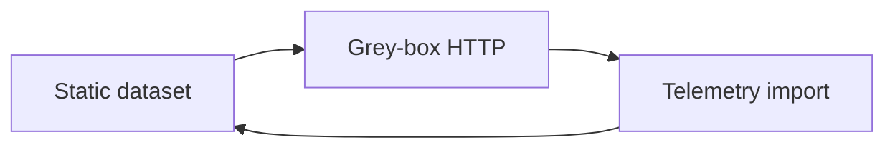

# Evaluation

Use this page when you need to choose how AgentOps should evaluate a RAG or
agent workflow. The goal is simple: pick the path that matches where your
evidence comes from, run the evaluation, and keep the result in a format that
reviewers can trust.

AgentOps supports three evaluation paths:

1. **Static dataset**: use a JSONL file that already contains the prompt,
   expected answer, and optional retrieval context.
2. **Grey-box HTTP**: call an HTTP endpoint and extract both the answer and
   retrieval context from the live response.
3. **Telemetry/trace import**: import production traces into a reviewable
   dataset so real traffic can become future regression coverage.

## Choose a path

| Path | Use it when | Best first step |
|---|---|---|
| Static dataset | You already know the test cases, expected answers, and optionally the target responses. | Create or edit `.agentops/data/*.jsonl`. |
| Grey-box HTTP | Your endpoint can return the answer plus retrieval details for the same request. | Configure `request_field` and `response_fields`. |
| Telemetry/trace import | You want to learn from production traffic before adding new regression rows. | Configure `telemetry_imports`, then run `agentops telemetry preview`. |

The paths build on each other. Most teams start with a static dataset, add
grey-box HTTP when they need retrieval telemetry, then use telemetry import after
the agent is running in production.



## Static dataset

Choose this path when the data you need is already in the dataset file. Each row
is a test case. AgentOps sends `input` to the target, compares the target
response with `expected`, and uses `context` when present to select RAG
evaluators.

By default, `response_source: agent` means AgentOps calls the configured target.
Use `response_source: dataset` only when the dataset already includes the answer
you want to evaluate in a `response`, `prediction`, `output`, or `answer` field.
That is useful for offline review or imported trace rows that should not call a
live endpoint again.

Minimal RAG row:

```json
{"id":"refund-001","input":"What is the refund window?","expected":"Customers can request a refund within 30 days.","context":"Refunds are available for 30 days after purchase."}
```

Minimal config:

```yaml
version: 1
agent: "support-agent:3"
dataset: .agentops/data/rag-smoke.jsonl
response_source: agent

thresholds:
  groundedness: ">=3"
  retrieval: ">=3"
  response_completeness: ">=3"
```

Run it:

```powershell
agentops eval analyze
agentops eval run
```

Use this path for:

- Fast local checks before opening a PR.
- CI gates with stable examples.
- Baseline comparison with `agentops eval run --baseline`.
- Manual review of newly written or newly labeled examples.

## Grey-box HTTP

Choose this path when the endpoint can return more than final text. This is the
best path for RAG services because the evaluator can see what the agent actually
retrieved for the request.

The endpoint response should include:

- the final answer;
- retrieval context, citations, or document chunks;
- optional tool calls or workflow metadata.

Example endpoint response:

```json
{
  "answer": "Customers can request a refund within 30 days.",
  "context": [
    "Refunds are available for 30 days after purchase.",
    "Refunds require the original order number."
  ],
  "citations": ["refund-policy.md"]
}
```

Example config:

```yaml
version: 1
agent: "https://support-dev.example.com/chat"
dataset: .agentops/data/rag-smoke.jsonl

protocol: http-json
request_field: message
response_fields:
  response: answer
  context: context
  citations: citations

thresholds:
  groundedness: ">=3"
  retrieval: ">=3"
  relevance: ">=3"
```

What happens:

1. AgentOps reads each row from the dataset.
2. It sends `row.input` as the HTTP request field named by `request_field`.
3. It extracts the final answer from `response_fields.response`.
4. It extracts retrieval context from `response_fields.context`.
5. RAG evaluators can use the extracted context through `$response.context`,
   `$retrieved_context`, or `$retrieved_context_items`.

Use dot paths when fields are nested:

```yaml
response_fields:
  response: output.text
  context: output.retrieval.chunks
```

Use this path for:

- RAG services where the retrieved chunks matter.
- Debugging why a groundedness or retrieval score changed.
- Endpoint-based agents hosted in Azure Container Apps, AKS, Foundry Hosted
  Agents, or another HTTP host.

## Telemetry import

Choose this path when production traffic has useful examples that are not yet in
your test set. Telemetry import does not make production responses automatically
correct. It creates reviewable dataset candidates.

Configure a named telemetry import in `agentops.yaml`:

```yaml
telemetry_imports:
  - name: prod-rag
    target: application-insights
    resource_id: $APPINSIGHTS_RESOURCE_ID
    time_range:
      lookback_days: 7
    filters:
      customDimensions.agent: support-agent
    fields:
      input: customDimensions.question
      response: customDimensions.answer
      context: customDimensions.retrieved_context
      trace_id: operation_Id
    output:
      path: .agentops/data/prod-rag-candidates.jsonl
      label_mode: pending
```

Validate the import without querying Azure:

```powershell
agentops telemetry validate prod-rag
```

Preview rows from Azure Monitor:

```powershell
agentops telemetry preview prod-rag --rows 10
```

Write the candidate dataset and manifest:

```powershell
agentops telemetry import prod-rag --apply
```

Label modes:

| Mode | What it writes | Use it when |
|---|---|---|
| `pending` | Empty `expected` values with review metadata. | A human must write the correct answer before the row can gate a release. |
| `self-similarity` | The production response becomes `expected`. | You want drift detection against known production behavior. |

Telemetry import keeps lineage metadata such as trace ID, timestamp, replay URL,
and source system when those values exist in the export. If the trace includes
retrieval context, AgentOps writes it as `context` so RAG evaluators can use it
later. Evaluator mappings can also use `$telemetry.trace_id` when a trace ID is
needed for reporting or troubleshooting.

If you already have a local trace export file, `agentops eval promote-traces`
still works. Use `agentops telemetry` when the source is Azure Monitor or
Application Insights.

Use this path for:

- Turning incidents or surprising production answers into regression tests.
- Sampling real traffic for future review.
- Building a trace-to-dataset flywheel without skipping human judgment.

## Input mapping

Evaluator inputs come from three places:

| Source | Placeholder | Example |
|---|---|---|
| Dataset prompt | `$row.input` or `$prompt` | User question sent to the agent. |
| Dataset expected answer | `$row.expected` or `$expected` | Ground truth or acceptance criteria. |
| Agent response | `$response.response` or `$prediction` | Final answer returned by the target. |
| Any response field | `$response.<field>` | Any field extracted through `response_fields`. |
| Extracted retrieval context | `$response.context`, `$retrieved_context`, or `$retrieved_context_items` | Chunks, citations, or grounding text from the live response. |
| Dataset retrieval context | `$row.context` | Static context stored in JSONL. |
| Trace ID | `$telemetry.trace_id` | Azure Monitor or Application Insights operation ID. |

For beginners, the easiest rule is:

- Put known test data in the dataset.
- Put live endpoint outputs under `response_fields`.
- Let AgentOps map the common fields to evaluators.

Only customize evaluator selection when the automatic choice is not enough:

```yaml
evaluators:
  - GroundednessEvaluator
  - RetrievalEvaluator
  - RelevanceEvaluator
```

## Safety notes

- Do not treat production responses as ground truth without review.
- Do not import sensitive trace payloads into a repository dataset.
- Keep secrets in environment variables or `.agentops/.env`, not in JSONL files.
- Prefer `--label-mode pending` when correctness matters.
- Use `self-similarity` only for drift detection.
- Keep trace replay links in metadata so reviewers can investigate the original
  runtime behavior.
