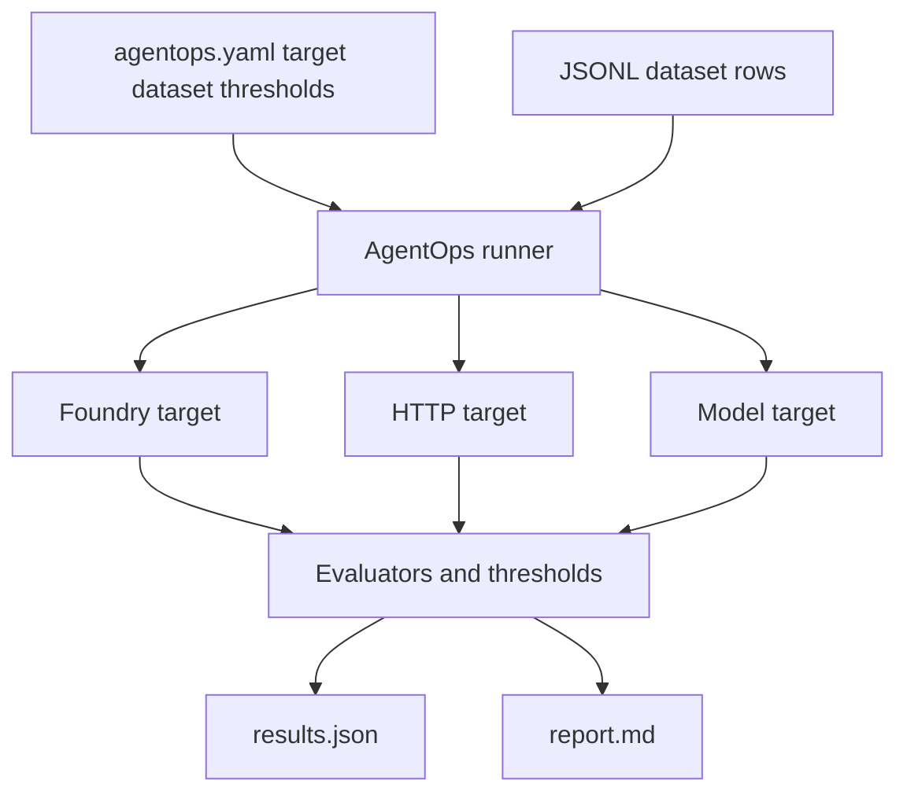

# Evaluation

This is the canonical page for how evaluation works in AgentOps. An evaluation
runs a dataset against a target agent, scores the responses, and gates the
result against thresholds. Foundry operates the agent at runtime; AgentOps turns
that run into repo-side release proof.

If you want a hands-on walkthrough instead of a reference, start with the
[Prompt agent tutorial](tutorial-prompt-agent.md) or the
[HTTP agent tutorial](tutorial-http-agent.md).

## What an evaluation is

An evaluation is defined by one flat file, `agentops.yaml`. It connects three
things: the **agent** (the target to evaluate), the **dataset** (the rows to
send), and the **thresholds** (the quality gates that decide pass or fail).

The minimum config is three lines:

```yaml
version: 1
agent: "travel-agent:1"
dataset: .agentops/data/smoke.jsonl
```

The AgentOps runner reads that config, sends each dataset row to the target,
collects responses, scores them with evaluators, and checks the scores against
your thresholds. It writes two outputs every run: `results.json` for automation
and `report.md` for human review.

## Where evaluations run

By default, `agentops eval run` is a local runner. It runs wherever you execute
the command: your laptop, a dev container, GitHub Actions, or another CI host.
The output is written to that workspace under `.agentops/results/latest/`.

Foundry visibility is opt-in:

| Config | What happens | Foundry surface |
|---|---|---|
| `execution: local` or omitted | AgentOps invokes the target and scores rows locally. | Local `results.json` and `report.md` only. |
| `execution: local` plus `publish: true` | AgentOps keeps the local run as source of truth, then uploads metrics and row results. | Classic Foundry Evaluations. |
| `execution: cloud` | Foundry runs the agent and evaluators server-side. | New Foundry Evaluations. |

`execution: cloud` is currently for Foundry prompt agents declared as
`name:version`. HTTP endpoints use the local runner; if you want those local
results visible in Foundry, use `publish: true`, which targets the Classic
Foundry Evaluations upload path.

If you configure Application Insights, AgentOps also emits telemetry spans so
the run can be inspected through Foundry tracing or Azure Monitor Logs. That is
separate from the Evaluations page.

!!! info "Exit codes are the CI contract"
    The runner returns `0` when every threshold passes, `2` when the run
    succeeded but one or more thresholds failed, and `1` for a runtime or
    configuration error. These three codes are the public gate contract. CI
    treats `2` as a hard fail so a deploy never runs on a regression.



## Target kinds

AgentOps resolves the `agent:` value into one of four target kinds by its shape.
You do not choose a backend by hand; the shape of `agent:` selects both the kind
and the fields that make sense for it.

| `agent:` value | Target kind | Use case |
|---|---|---|
| `"travel-agent:1"` (`name:version`) | Foundry prompt agent | Foundry Agent Service agents |
| `"https://...services.ai.azure.com/.../agents/<id>"` | Foundry hosted agent | A deployed agent endpoint on a Foundry domain |
| `"https://api.example.com/chat"` | HTTP/JSON endpoint | LangGraph, Agent Framework, ACA, AKS, custom REST |
| `"model:gpt-4o-mini"` | Model-direct | Raw model deployment checks |

!!! note "HTTP targets need request and response mapping"
    A custom HTTP endpoint rarely matches AgentOps defaults exactly, so you map
    its request and response shape with top-level fields. Use `request_field`
    and `response_field` (dot-paths) to point at the right JSON keys,
    `tool_calls_field` for tool output, `auth_header_env` to name an env var
    holding a Bearer token, and `extra_fields` for any static body fields.

```yaml
version: 1
agent: https://my-aca-app.eastus2.azurecontainerapps.io/chat
dataset: .agentops/data/qa.jsonl
request_field: message            # default is "message"
response_field: text              # dot-path; default is "text"
auth_header_env: APP_API_TOKEN    # value is sent as a Bearer token
```

## Fill `agentops.yaml` for HTTP endpoints

For HTTP agents, fill `agentops.yaml` from the shape of the request and response.
Start with the defaults, then add only the fields your endpoint needs.

```yaml
version: 1
agent: https://api.example.com/chat
dataset: .agentops/data/qa.jsonl
protocol: http-json
request_field: message
response_field: text
```

| If the endpoint response is... | Use this config |
|---|---|
| JSON, for example `{"text": "answer"}` | `response_mode: json` or omit it. Set `response_field: text` if needed. |
| Plain text, returned all at once | `response_mode: text`. Do not add `stream:`. |
| Plain text, streamed in chunks | `response_mode: text`. Do not add `stream:` unless the first chunk is not part of the answer. |
| Plain text stream with a leading id or token | `response_mode: text` plus `stream.strip_leading_token: true`. |
| Server-Sent Events with `data:` lines | `response_mode: sse`. |
| Server-Sent Events where each `data:` line is JSON | `response_mode: sse` plus `stream.text_field`, for example `stream.text_field: choices.0.delta.content`. |
| Server-Sent Events with a final marker | `response_mode: sse` plus `stream.done_marker`, for example `stream.done_marker: "[DONE]"`. |

Examples:

```yaml
# JSON response: {"answer": "..."}
response_mode: json
response_field: answer
```

```yaml
# Plain text response, streamed or not.
response_mode: text
```

```yaml
# GPT-RAG orchestrator: text stream where the first token is a conversation id.
response_mode: text
stream:
  strip_leading_token: true
```

```yaml
# SSE response with JSON data frames.
response_mode: sse
stream:
  text_field: choices.0.delta.content
  done_marker: "[DONE]"
```

## Datasets and scenarios

A dataset is a plain JSONL file, one evaluation row per line. Each row has an
`input` prompt and usually an `expected` reference answer. Optional fields drive
which evaluators run.

```json
{"id": "1", "input": "What is the refund policy?", "expected": "Refunds within 30 days.", "context": "Our policy: refunds are available within 30 days."}
```

The presence of optional fields tells AgentOps which evaluation scenario you are
running. You do not declare the scenario; the row shape implies it.

| Scenario | Signal in the row | Purpose |
|---|---|---|
| Model quality | `model:<deployment>` target plus `expected` | Direct model checks |
| RAG | `context` | Grounding and retrieval checks |
| Conversational | `input` plus `expected` | Chatbot and Q&A quality |
| Agent workflow | `tool_calls` plus `tool_definitions` | Tool-use quality |
| Content safety | Safety evaluators | Responsible AI checks |

## Evaluators

An evaluator is a scoring function that measures one aspect of a response. They
come in two flavors. **AI-assisted** evaluators use a judge model to score
qualities like coherence, similarity, or groundedness. **Local metrics** are
computed without a judge, such as `avg_latency_seconds` or `F1ScoreEvaluator`
for exact-reference checks.

AgentOps auto-selects evaluators from the target kind and the dataset shape, so a
three-line config still scores the right things. Prompt and hosted agents get
answer-quality judges, `context` rows add the RAG set, and tool rows add the
tool-use set.

!!! note "Override only when you must"
    Set the `evaluators:` list in `agentops.yaml` only when you need to replace
    the auto-selection. It is an escape hatch, not the normal path. For the full
    catalog of evaluator names and their required inputs, see
    [Built-in Evaluators](foundry-evaluation-sdk-built-in-evaluators.md).

## Evaluation path: where the run executes

The `execution:` field decides where the evaluation actually runs. Local is the
default and works for every target. Cloud runs a Foundry prompt agent
server-side. The azd recipe path delegates to an existing `azd ai agent eval`
flow.

| Target | Cloud (`execution: cloud`) | Local runner | Recommended default |
|---|---|---|---|
| Foundry prompt agent (`name:version`) | Yes | Yes | Cloud for official Foundry runs; local for fast feedback |
| Foundry hosted agent URL | No | Yes | Local runner; optionally `publish: true` |
| Generic HTTP/JSON endpoint | No | Yes | Local runner |
| Raw model deployment (`model:<name>`) | No | Yes | Local runner |

For prompt-agent CI pipelines that need a merge or deploy gate, prefer cloud
eval. Foundry executes the managed evaluation and AgentOps enforces thresholds,
baselines, Doctor readiness, and release evidence.

!!! info "Reusing an azd eval recipe"
    If a Foundry project already uses the public-preview `azd ai agent eval`
    recipe, set `execution: azd` and `eval_recipe: eval.yaml`. AgentOps
    delegates execution to azd, normalizes the metrics, binds thresholds, writes
    `results.json`, and fails closed for any threshold that has no emitted
    metric. Rubric evaluator dimensions are treated as first-class metric names.

## Mini-glossary

The tutorials defer to these definitions, so they live here once.

!!! note "Dimension"
    A dimension is a single named axis a rubric or evaluator scores. A Travel
    Agent rubric might score the dimensions `helpfulness`, `safety`, and
    `format_adherence` separately, so one response produces one score per
    dimension rather than a single blended number.

!!! note "Rubric"
    A rubric is an evaluator that scores responses against a written scoring
    guide, usually one score per dimension. For example, a rubric can define
    `helpfulness: 1 to 5` with a short description of what a 1 and a 5 look like,
    and the judge model applies that guide to each row. Rubric dimensions become
    metric names you can put thresholds on.

!!! note "smoke-core"
    A smoke-core is a small, fast smoke dataset plus the minimal evaluator set
    that gates it. It is the quick check you run on every change to catch obvious
    breakage in seconds, before the larger scenario datasets run. Think of it as
    the few rows and one or two evaluators that must always pass.

## Configuration model

`agentops.yaml` is the single source of truth. Keep it small and add only the
fields your target needs. For the complete schema, every top-level field, and
more examples, see [Built-in Evaluators](foundry-evaluation-sdk-built-in-evaluators.md)
for evaluator config and the tutorials for end-to-end setups.

```yaml
version: 1
agent: "https://api.example.com/chat"
dataset: .agentops/data/support.jsonl

request_field: message
response_field: text

thresholds:
  coherence: ">=3"
  avg_latency_seconds: "<=2"
```
