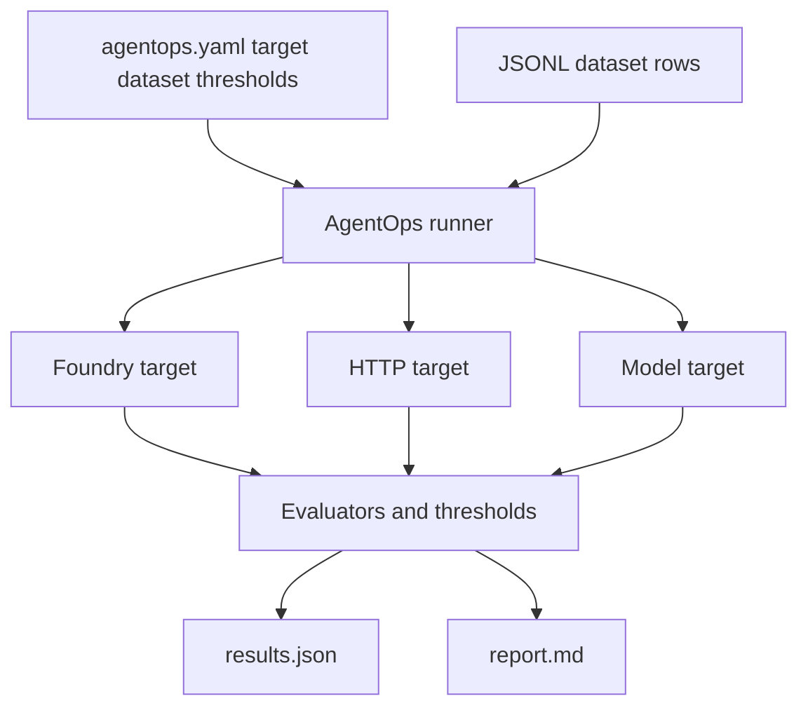

# Evaluation

An evaluation runs a dataset against a target agent, scores the responses, and
gates the result against thresholds. Foundry operates the agent at runtime;
AgentOps turns that run into repo-side release proof.

If you want a hands-on walkthrough instead of a reference, pick a
[tutorial](tutorials.md) and follow it end to end.

## What an evaluation is

An evaluation is defined by one flat file, `agentops.yaml`. It connects three
things: the **agent** (the target to evaluate), the **dataset** (the rows to
send), and the **thresholds** (the quality gates that decide pass or fail).

The minimum config is three lines:

```yaml
version: 1
agent: "travel-agent:1"
dataset: .agentops/data/smoke.jsonl
```

The AgentOps runner reads that config, sends each dataset row to the target,
collects responses, scores them with evaluators, and checks the scores against
your thresholds. It writes two outputs every run: `results.json` for automation
and `report.md` for human review.

### Load a dataset from Azure Storage

`dataset` can be a local JSONL path or one canonical HTTPS object URL:

```yaml
# Azure Blob Storage
dataset: https://examplestorage.blob.core.windows.net/evals/smoke.jsonl

# Azure Data Lake Storage Gen2
dataset: https://examplestorage.dfs.core.windows.net/evals/regression/smoke.jsonl
```

AgentOps downloads one read-only snapshot per analysis or evaluation operation
and applies the same JSONL validation and evaluator selection used for local
files. Remote objects are limited to 100 MiB. Results, reports, telemetry, and
cloud lineage identify the validated Azure Storage URL rather than the temporary
materialization path.

Remote reads reuse the Azure identity already available to AgentOps:

- Run `az login` for local development.
- CI and Azure-hosted runners use their existing federated, workload, managed,
  or service-principal identity.
- Grant that identity `Storage Blob Data Reader`, preferably scoped to the
  container. ADLS Gen2 path ACLs may also be required.

AgentOps does not accept dataset-specific tokens, SAS URLs, storage account
keys, or connection strings. URLs containing query strings, fragments, or
embedded user information are rejected before a network request. A private
storage endpoint must be reachable from the runner; AgentOps does not provision
networking or role assignments.

#### Quickstart: private Blob dataset

The following flow uses one identity from setup through evaluation.

1. Sign in and select the subscription:

    ```powershell
    az login
    az account set --subscription <subscription-id>
    ```

2. Grant read access at the narrowest practical scope. An Azure administrator
   can run:

    ```powershell
    $scope = "/subscriptions/<subscription-id>/resourceGroups/<resource-group>/providers/Microsoft.Storage/storageAccounts/<account>/blobServices/default/containers/<container>"
    az role assignment create `
      --assignee-object-id <user-or-workload-object-id> `
      --assignee-principal-type User `
      --role "Storage Blob Data Reader" `
      --scope $scope
    ```

    Use the actual principal type for automation identities. Role propagation
    can take several minutes.

3. Point `agentops.yaml` at the object:

    ```yaml
    version: 1
    agent: "my-agent:1"
    dataset: "https://<account>.blob.core.windows.net/<container>/smoke.jsonl"
    project_endpoint: "https://<resource>.services.ai.azure.com/api/projects/<project>"
    execution: local
    ```

4. Validate access before running:

    ```powershell
    agentops eval analyze
    agentops eval run
    ```

`eval analyze` reports `dataset_status: ready` when the identity can read and
validate the remote JSONL. A successful run preserves the Blob URL in
`results.json.dataset_path`; the private temporary snapshot is removed after
the operation.

#### Make the evaluation visible in Foundry

Local execution does not create an item on the Foundry **Evaluations** page.
Change only the execution mode when you want Foundry to invoke the prompt agent
and evaluators server-side:

```yaml
version: 1
agent: "my-agent:1"
dataset: "https://<account>.blob.core.windows.net/<container>/smoke.jsonl"
project_endpoint: "https://<resource>.services.ai.azure.com/api/projects/<project>"
execution: cloud
```

Then run `agentops eval run`. On completion AgentOps writes:

- `results.json` and `report.md`;
- `cloud_evaluation.json` with the Foundry evaluation and run IDs;
- `cloud_output_items.json` with the downloaded per-row cloud results;
- a direct HTTPS link to the run in the New Foundry Evaluations experience.

Cloud mode first reads the private object through the runner identity, validates
it, and syncs the content to the selected Foundry project. Foundry then runs the
agent and supported evaluators. Runtime-only metrics such as client-observed
latency are skipped because they cannot be measured by the cloud runner.

#### CI and Azure-hosted runners

Use workload identity federation or managed identity rather than credentials in
repository secrets. Grant that principal `Storage Blob Data Reader` on the
container and access to the Foundry project. The same `agentops.yaml` works
locally and in CI; authentication changes with the hosting environment, not with
the dataset setting.

#### Troubleshooting Azure Storage datasets

| Symptom | Likely cause | Resolution |
|---|---|---|
| `AuthorizationPermissionMismatch` or HTTP 403 | The active identity lacks data-plane access, or RBAC has not propagated. | Confirm the object ID used by `az login`, grant `Storage Blob Data Reader`, and retry after propagation. Generic Azure `Reader` or `Contributor` is insufficient. |
| Message says the request may be blocked by network rules | The runner cannot reach the Storage data-plane endpoint. | Allow the runner through the Storage firewall, run inside the private network, or use an approved Network Security Perimeter rule. |
| DNS or connection timeout with a private endpoint | Private DNS or network routing does not resolve/reach the private endpoint from the runner. | Run AgentOps from the connected VNet or fix private DNS and routing. |
| ADLS Gen2 returns 403 despite Blob Reader | Hierarchical namespace ACL traversal is missing. | Add the required execute/read ACLs on the filesystem and parent paths. |
| URL is rejected before download | The URL contains a query string, fragment, embedded credentials, unsupported host, or does not identify one object. | Use the canonical Blob or DFS HTTPS object URL without SAS or other query parameters. |
| Object exceeds the limit | The remote JSONL is larger than 100 MiB. | Split it into smaller evaluation datasets. |
| Evaluation passes locally but is absent from the portal | `execution` is local or omitted. | Set `execution: cloud` for a New Foundry Evaluation, or `publish: true` for the Classic upload path. |
| Cloud mode cannot resolve the target | The agent is not a Foundry `name:version` target, or the project endpoint points elsewhere. | Use an existing prompt-agent version and its owning Foundry project endpoint. |

## Where evaluations run

By default, `agentops eval run` is a local runner. It runs wherever you execute
the command: your laptop, a dev container, GitHub Actions, or another CI host.
The output is written to that workspace under `.agentops/results/latest/`.

Foundry visibility is opt-in:

| Config | What happens | Foundry surface |
|---|---|---|
| `execution: local` or omitted | AgentOps invokes the target and scores rows locally. | Local `results.json` and `report.md` only. |
| `execution: local` plus `publish: true` | AgentOps keeps the local run as source of truth, then uploads metrics and row results. | Classic Foundry Evaluations. |
| `execution: cloud` | Foundry runs the agent and evaluators server-side. | New Foundry Evaluations. |

`execution: cloud` needs a target Foundry can resolve on its own: a prompt agent
declared as `name:version`, or a hosted agent endpoint whose URL contains
`/agents/<name>/versions/<version>`. AgentOps parses the name and version out of
that URL and builds the server-side target from it, so you do not have to
duplicate the reference. Only the name and version are used. The run is
submitted against the project in `AZURE_AI_FOUNDRY_PROJECT_ENDPOINT`, so that
endpoint must point at the project that holds the agent version. A hosted
endpoint without the versioned path is rejected with a message telling you to
add it or set `agent: <name>:<version>`.

Generic HTTP endpoints and raw model deployments always use the local runner; to
make those results visible in Foundry, use `publish: true`, which targets the
Classic Foundry Evaluations upload path.

If you configure Application Insights, AgentOps also emits telemetry spans so
the run can be inspected through Foundry tracing or Azure Monitor Logs. That is
separate from the Evaluations page.

!!! info "Exit codes are the CI contract"
    The runner returns `0` when every threshold passes, `2` when the run
    succeeded but one or more thresholds failed, and `1` for a runtime or
    configuration error. These three codes are the public gate contract. CI
    treats `2` as a hard fail so a deploy never runs on a regression.

!!! note "The azd dataset remains recipe-owned"
    When `execution: azd` is selected, azd continues to read the dataset declared
    in `eval.yaml`. AgentOps does not rewrite that external recipe from the
    `dataset` value in `agentops.yaml`.


```mermaid
graph TD
    A[agentops.yaml target dataset thresholds]
    B[JSONL dataset rows]
    C[AgentOps runner]
    D[Foundry target]
    E[HTTP target]
    F[Model target]
    G[Evaluators and thresholds]
    H[results.json]
    I[report.md]

    A --> C
    B --> C
    C --> D
    C --> E
    C --> F
    D --> G
    E --> G
    F --> G
    G --> H
    G --> I
```

## Target kinds

AgentOps resolves the `agent:` value into one of four target kinds by its shape.
You do not choose a backend by hand; the shape of `agent:` selects both the kind
and the fields that make sense for it.

| `agent:` value | Target kind | Use case |
|---|---|---|
| `"travel-agent:1"` (`name:version`) | Foundry prompt agent | Foundry Agent Service agents |
| `"https://...services.ai.azure.com/.../agents/<id>"` | Foundry hosted agent | A deployed agent endpoint on a Foundry domain |
| `"https://api.example.com/chat"` | HTTP/JSON endpoint | LangGraph, Agent Framework, ACA, AKS, custom REST |
| `"model:gpt-4o-mini"` | Model-direct | Raw model deployment checks |

!!! note "HTTP targets need request and response mapping"
    A custom HTTP endpoint rarely matches AgentOps defaults exactly, so you map
    its request and response shape with top-level fields. Use `request_field`
    and `response_field` (dot-paths) to point at the right JSON keys,
    `tool_calls_field` for tool output, `auth_header_env` to name an env var
    holding a Bearer token, and `extra_fields` for any static body fields.

```yaml
version: 1
agent: https://my-aca-app.eastus2.azurecontainerapps.io/chat
dataset: .agentops/data/qa.jsonl
request_field: message            # default is "message"
response_field: text              # dot-path; default is "text"
auth_header_env: APP_API_TOKEN    # value is sent as a Bearer token
```

## Configure an HTTP target

For HTTP agents, fill `agentops.yaml` from the shape of the request and response.
Start with the defaults, then add only the fields your endpoint needs.

```yaml
version: 1
agent: https://api.example.com/chat
dataset: .agentops/data/qa.jsonl
protocol: http-json
request_field: message
response_field: text
```

| If the endpoint response is... | Use this config |
|---|---|
| JSON, for example `{"text": "answer"}` | `response_mode: json` or omit it. Set `response_field: text` if needed. |
| Plain text, returned all at once | `response_mode: text`. Do not add `stream:`. |
| Plain text, streamed in chunks | `response_mode: text`. Do not add `stream:` unless the first chunk is not part of the answer. |
| Plain text stream with a leading id or token | `response_mode: text` plus `stream.strip_leading_token: true`. |
| Server-Sent Events with `data:` lines | `response_mode: sse`. |
| Server-Sent Events where each `data:` line is JSON | `response_mode: sse` plus `stream.text_field`, for example `stream.text_field: choices.0.delta.content`. |
| Server-Sent Events with a final marker | `response_mode: sse` plus `stream.done_marker`, for example `stream.done_marker: "[DONE]"`. |

Examples:

```yaml
# JSON response: {"answer": "..."}
response_mode: json
response_field: answer
```

```yaml
# Plain text response, streamed or not.
response_mode: text
```

```yaml
# GPT-RAG orchestrator: text stream where the first token is a conversation id.
response_mode: text
stream:
  strip_leading_token: true
```

```yaml
# SSE response with JSON data frames.
response_mode: sse
stream:
  text_field: choices.0.delta.content
  done_marker: "[DONE]"
```

### Grey-box: score the live retrieved context

`response_field` extracts the final answer. When the endpoint also returns the
chunks it retrieved, capture them with `response_fields` (plural) so RAG
evaluators can score what the agent actually grounded on for that request. Each
entry maps a name to a dot-path into the JSON body, and the captured value
becomes available to evaluator `input_mapping` as `$response.<name>`.

Given an endpoint that answers like this:

```json
{
  "answer": "Customers can request a refund within 30 days.",
  "context": ["Refunds are available for 30 days after purchase."],
  "citations": ["refund-policy.md"]
}
```

Capture the extra fields and point the evaluators at them:

```yaml
version: 1
agent: https://support-dev.example.com/chat
dataset: .agentops/data/rag-smoke.jsonl
protocol: http-json
request_field: message
response_field: answer

response_fields:
  context: context
  citations: citations

evaluators:
  - name: GroundednessEvaluator
    input_mapping:
      query: $prompt
      response: $prediction
      context: $response.context
  - name: RetrievalEvaluator
    input_mapping:
      query: $prompt
      context: $response.context
```

`response_fields` only applies when `response_mode` is `json`. The primary
answer still comes from `response_field`. `input_mapping` is merged onto the
preset defaults, so list only the keys you want to change.

This is the path to use when a groundedness or retrieval score moves and you
need to see whether the agent retrieved the wrong chunks or reasoned badly over
the right ones.

## Datasets and scenarios

A dataset is a plain JSONL file, one evaluation row per line. Each row has an
`input` prompt and usually an `expected` reference answer. Optional fields drive
which evaluators run.

```json
{"id": "1", "input": "What is the refund policy?", "expected": "Refunds within 30 days.", "context": "Our policy: refunds are available within 30 days."}
```

The presence of optional fields tells AgentOps which evaluation scenario you are
running. You do not declare the scenario; the row shape implies it.

| Scenario | Signal in the row | Purpose |
|---|---|---|
| Model quality | `model:<deployment>` target plus `expected` | Direct model checks |
| RAG | `context` | Grounding and retrieval checks |
| Conversational | `input` plus `expected` | Chatbot and Q&A quality |
| Agent workflow | `tool_calls` plus `tool_definitions` | Tool-use quality |
| Content safety | Safety evaluators | Responsible AI checks |

## Evaluators

An evaluator is a scoring function that measures one aspect of a response. They
come in two flavors. **AI-assisted** evaluators use a judge model to score
qualities like coherence, similarity, or groundedness. **Local metrics** are
computed without a judge, such as `avg_latency_seconds` or `F1ScoreEvaluator`
for exact-reference checks.

AgentOps auto-selects evaluators from the target kind and the dataset shape, so a
three-line config still scores the right things. Prompt and hosted agents get
answer-quality judges, `context` rows add the RAG set, and tool rows add the
tool-use set.

Run `agentops eval init` after you create the dataset to see the recommendation.
For HTTP, model, and other local targets, this is recommendation-only: AgentOps
does not call `azd` or create `eval.yaml`. For Foundry prompt agents, the same
command can also delegate to `azd ai agent eval init` to create Foundry-native
eval assets.

!!! note "Override only when you must"
    Set the `evaluators:` list in `agentops.yaml` only when you need to replace
    the auto-selection. It is an escape hatch, not the normal path. For the full
    catalog of evaluator names and their required inputs, see
    [Built-in Evaluators](foundry-evaluation-sdk-built-in-evaluators.md).

## Where the run executes

The `execution:` field decides where the evaluation actually runs. Local is the
default and works for every target. Cloud runs a Foundry agent server-side. The
azd recipe path delegates to an existing `azd ai agent eval` flow.

| Target | Cloud (`execution: cloud`) | Local runner | Recommended default |
|---|---|---|---|
| Foundry prompt agent (`name:version`) | Yes | Yes | Cloud for official Foundry runs; local for fast feedback |
| Foundry hosted agent URL | Yes, when the URL contains `/agents/<name>/versions/<version>` | Yes | Cloud when the endpoint carries the versioned path; otherwise local, optionally `publish: true` |
| Generic HTTP/JSON endpoint | No | Yes | Local runner; optionally `publish: true` |
| Raw model deployment (`model:<name>`) | No | Yes | Local runner |

For prompt-agent CI pipelines that need a merge or deploy gate, prefer cloud
eval. Foundry executes the managed evaluation and AgentOps enforces thresholds,
baselines, Doctor readiness, and release evidence.

!!! info "Reusing an azd eval recipe"
    If a Foundry project already uses the public-preview `azd ai agent eval`
    recipe, set `execution: azd` and `eval_recipe: eval.yaml`. AgentOps
    delegates execution to azd, normalizes the metrics, binds thresholds, writes
    `results.json`, and fails closed for any threshold that has no emitted
    metric. Rubric evaluator dimensions are treated as first-class metric names.

## Input mapping

Every evaluator receives a fixed set of named inputs. `input_mapping` decides
which part of the dataset row or the target response feeds each input. AgentOps
provides a preset per evaluator, so you only list the keys you want to override.

| Token | Resolves to |
|---|---|
| `$prompt` or `$row.input` | The `input` column of the dataset row |
| `$expected` or `$row.expected` | The `expected` column of the dataset row |
| `$prediction` or `$response.response` | The primary answer, read via `response_field` |
| `$response.<name>` | An extra field captured by the target's `response_fields` |
| `$retrieved_context` or `$response.context` | Live retrieved chunks returned by the same call |
| `$retrieved_context_items` | The same chunks as a list, for evaluators that expect items |
| `$context` or `$row.context` | Static context stored in the dataset row |
| `$telemetry.trace_id` | The trace ID of the invocation, when telemetry is available |

Use `$row.context` when the ground truth is fixed and lives in the dataset. Use
`$response.context` when you want to score what the agent retrieved at request
time. Mixing them silently is the most common reason a groundedness score looks
fine while retrieval is broken.

## Import production traces into a dataset

Real traffic is the best source of eval cases, because it contains the questions
users actually ask. `telemetry_imports` declares a named import that reads
Azure Monitor telemetry and writes an AgentOps JSONL dataset. AgentOps generates
the KQL, so you never pass raw query text.

```yaml
version: 1
agent: support-agent:3
dataset: .agentops/data/prod-candidates.jsonl

telemetry_imports:
  - name: prod-candidates
    source: azure-monitor
    target: application-insights
    resource_id: /subscriptions/<sub>/resourceGroups/<rg>/providers/microsoft.insights/components/<ai>
    time_range:
      lookback_days: 7
    filters:
      agent: support-agent
    fields:
      input: customDimensions.prompt
      response: customDimensions.completion
    privacy:
      redact_fields: [authorization, api_key, token, password, secret]
      max_field_length: 4000
    output:
      path: .agentops/data/prod-candidates.jsonl
      label_mode: pending
    max_rows: 200
```

Point `target` at `application-insights` (needs `resource_id`,
`application_id`, or `connection_string`) or `log-analytics` (needs
`workspace_id`). Use either `lookback_days` (1 to 90) or an explicit
`from`/`to` pair, never both.

`fields` overrides the auto-detection for a column. AgentOps already probes the
common shapes (`input`, `prompt`, `customDimensions.prompt`, and so on), so set
it only when your telemetry uses a name AgentOps cannot infer.

Then work the import in three steps, so nothing lands in your dataset unseen:

```bash
agentops telemetry validate prod-candidates        # check config and connectivity
agentops telemetry preview prod-candidates         # show the generated KQL and sample rows
agentops telemetry import prod-candidates --apply  # write the JSONL dataset and manifest
```

`agentops telemetry import` is a dry run without `--apply`. It prints what it
would write and touches nothing, which makes it safe to run on a shared machine.

### Choose a label mode

`output.label_mode` decides what goes into the `expected` column, and it changes
what the resulting dataset can be used for.

| Mode | `expected` is set to | Use it for |
|---|---|---|
| `self-similarity` (default) | The production response | Drift detection: catch when new behavior diverges from known production behavior |
| `pending` | Empty, every row flagged for review | Building human-verified ground truth before gating a release |

`self-similarity` is not human-verified ground truth. It answers "did the answer
change?", not "was the answer correct?". If production was already wrong, the
eval will happily certify the wrong answer. Use `pending` and fill the rows in
before you make the dataset a blocking gate.

Every imported row carries a `telemetry` block (trace ID, turn ID, timestamp,
source, target, and the import name) so you can jump from a failing eval row
back to the original production trace in Foundry or App Insights.

### Safety notes

- Do not treat production output as ground truth without review.
- Do not import payloads that contain personal or regulated data. `privacy.redact_fields`
  redacts on field-name fragments only, so it will not catch secrets embedded in
  free text. Read the `preview` output before you run with `--apply`.
- `privacy.include_raw` is `false` by default. Leave it off unless you have a
  specific reason, because it writes the untouched telemetry record.
- Keep credentials in environment variables. `agentops.yaml` is committed.
- `max_rows` caps the import (1 to 5000). Start small and inspect the result.
- Imported rows carry `metadata.needs_review: true`. Clear that flag deliberately, not in bulk.

## Mini-glossary
The tutorials defer to these definitions, so they live here once.

!!! note "Dimension"
    A dimension is a single named axis a rubric or evaluator scores. A Travel
    Agent rubric might score the dimensions `helpfulness`, `safety`, and
    `format_adherence` separately, so one response produces one score per
    dimension rather than a single blended number.

!!! note "Rubric"
    A rubric is an evaluator that scores responses against a written scoring
    guide, usually one score per dimension. For example, a rubric can define
    `helpfulness: 1 to 5` with a short description of what a 1 and a 5 look like,
    and the judge model applies that guide to each row. Rubric dimensions become
    metric names you can put thresholds on.

!!! note "smoke-core"
    A smoke-core is a small, fast smoke dataset plus the minimal evaluator set
    that gates it. It is the quick check you run on every change to catch obvious
    breakage in seconds, before the larger scenario datasets run. Think of it as
    the few rows and one or two evaluators that must always pass.

## Configuration model

`agentops.yaml` is the single source of truth. Keep it small and add only the
fields your target needs. For the complete schema, every top-level field, and
more examples, see [Built-in Evaluators](foundry-evaluation-sdk-built-in-evaluators.md)
for evaluator config and the tutorials for end-to-end setups.

```yaml
version: 1
agent: "https://api.example.com/chat"
dataset: .agentops/data/support.jsonl

request_field: message
response_field: text

thresholds:
  coherence: ">=3"
  avg_latency_seconds: "<=2"
```

## Try it

Run these five commands in order to go from an empty repo to a gated result.

1. Bootstrap the workspace and a starter `agentops.yaml` with the init wizard.

    ```bash
    agentops init
    ```

2. Inspect the repo and get an evaluator recommendation for your target and dataset.

    ```bash
    agentops eval analyze
    ```

3. Write the recommended eval assets once the plan looks right.

    ```bash
    agentops eval init
    ```

4. Send the dataset to the target, score the responses, and gate them against thresholds.

    ```bash
    agentops eval run
    ```

5. Regenerate the human-readable report from the latest results.

    ```bash
    agentops report generate
    ```

## Run from your coding agent

Install the AgentOps skills so your coding agent can run these steps for you.

```bash
agentops skills install --platform copilot
```

The skills that map to evaluation are:

| Skill | What it helps with |
|---|---|
| `agentops-config` | Generate and edit `agentops.yaml`. |
| `agentops-dataset` | Create JSONL datasets and pick the right scenario. |
| `agentops-eval` | Run evaluations, benchmark, and compare runs. |
| `agentops-report` | Interpret results and regenerate the report. |

## Next

Continue with the [Built-in Evaluators](foundry-evaluation-sdk-built-in-evaluators.md)
catalog, wire the gate into CI on the [Ship](ship.md) page, or pick a
[tutorial](tutorials.md) and follow it end to end.
