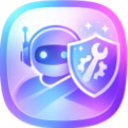
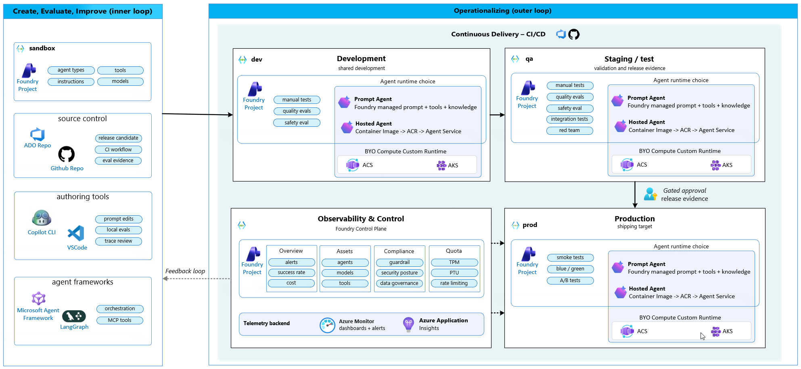

---
hide:
  - navigation
  - toc
---

# AgentOps Accelerator

The open-source AgentOps jumpstart for continuous evaluation, safety testing, observability, and release readiness of Microsoft Foundry agents.

Evaluate. Ship. Observe. Own.

[Latest Release {{ latest_release("Azure/agentops") }} :material-tag:](https://github.com/Azure/agentops/releases/latest){ .md-button--pill }
[PyPI :material-language-python:](https://pypi.org/project/agentops-accelerator/){ .md-button--pill }
[VS Code Extension :material-microsoft-visual-studio-code:](https://marketplace.visualstudio.com/items?itemName=AgentOpsAccelerator.agentops-accelerator){ .md-button--pill }

[Pre-release {{ rc_tag }} :material-tag:]({{ latest_release_candidate_url("Azure/agentops") }}){ data-md-color-accent="orange" .md-button--pill .md-button--pill--rc }


## What AgentOps does

AgentOps turns Foundry evaluation, safety, and observability signals into a
repeatable ship/no-ship workflow. It connects Foundry Evaluations, the ASSERT
safety framework, the PyRIT-backed AI Red Teaming agent, Azure Monitor, and your
CI/CD platform into one release loop, packaging every result into a stable
evidence pack that proves a release is ready for production.

  <iframe
    src="https://www.youtube-nocookie.com/embed/-uYMYzdKCZ4?vq=hd1080&hd=1"
    title="AgentOps Accelerator overview"
    allow="accelerometer; autoplay; clipboard-write; encrypted-media; gyroscope; picture-in-picture; web-share"
    allowfullscreen>
  </iframe>

**New here?** Start with the [Prompt Agent tutorial](tutorial-prompt-agent.md) or
the [HTTP Agent tutorial](tutorial-http-agent.md) to learn the sandbox to dev PR
gate flow end to end.

[Prompt Agent tutorial :material-rocket-launch:](tutorial-prompt-agent.md){ .md-button--pill }
[HTTP Agent tutorial :material-rocket-launch:](tutorial-http-agent.md){ .md-button--pill }

### :material-clipboard-check: Evaluate
Read [Evaluation](evaluation.md) to learn how datasets, evaluators, thresholds,
and rubrics turn an agent into a pass or fail gate.

### :material-source-branch: Ship
[Ship](ship.md) explains the generated PR gate and dev deploy workflows, and how
candidate versions become a release.

### :material-radar: Observe
[Observe](observe.md) covers Foundry traces and Azure Monitor, and how
production signals feed continuous evaluation.

### :material-stethoscope: Own
[Own](own.md) shows how Doctor scores readiness and packages an evidence pack so
you can make the ship or no-ship call.

## Reference architecture

Use this as the mental model for the AgentOps loop: build and learn in a sandbox,
commit the release contract to source control, promote through environments with
evidence, then feed production learning back into the next evaluation set.

{ .agentops-reference-architecture }

| Area | What it owns |
|---|---|
| **Sandbox inner loop** | Create, evaluate, and improve the candidate agent in a safe Foundry project before it is promoted. |
| **AgentOps Accelerator** | Keep release readiness close to the repo: config, datasets, evaluation gates, Doctor diagnostics, Cockpit views, CI workflows, thresholds, and release evidence. |
| **Foundry** | Own managed agent projects, Prompt Agent and HTTP agent runtime options, traces, operate views, guardrails, and evaluations where applicable. |
| **Outer loop delivery** | Move the same reviewed candidate through dev, QA or staging, and production. Production release should be gated by reviewable evidence, not memory or a manual spot check. |
| **Operate and improve** | Watch telemetry, dashboards, alerts, cost, success rate, compliance, quota, security posture, and data governance. Turn production traces into the next regression cases. |

## Contributing

Contributions are welcome. See the project
[repository](https://github.com/Azure/agentops) for guidelines, issues, and the
contribution process.
