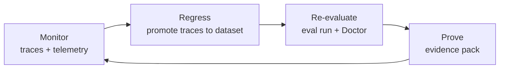

# Operate

This page is about operating an agent over time, not just shipping it once.
Operating is the loop of scoring readiness, proving the ship decision with
evidence, and feeding production learning back into the next evaluation. The
Doctor and the evidence pack are the two tools that make that loop concrete.

For the full check inventory, see the [Doctor checks reference](doctor-checks.md).
For a narrative walkthrough of what the Doctor is and how it reasons, see
[The Doctor, explained](doctor-explained.md).

## Doctor as the readiness scorer

The Doctor is a regular check-up for an agent project. It reads signals that are
already there, eval history, App Insights telemetry, Foundry metadata, and Azure
resource configuration, and emits **findings**: severity-ranked observations
with a recommendation attached.

It does not fix anything and it does not replace Foundry's compliance surface. It
is the complementary half that scores runtime telemetry, identity scope, eval
discipline, and pipeline hygiene.

```
agentops doctor
```

!!! info "Findings, severities, and exit codes"
    Findings are grouped into categories like quality, performance, reliability,
    security, responsible AI, and operational excellence. Severity is
    independent of category, so a quality finding can be critical, warning, or
    info. The Doctor exits `0` when nothing meets the configured
    `--severity-fail` floor, `2` when something does, and `1` if the analyzer
    itself errored.

## The evidence pack as ship/no-ship proof

Adding `--evidence-pack` turns a Doctor run into a release decision artifact:

```bash
agentops doctor --evidence-pack
```

This writes `.agentops/release/latest/evidence.json` and `evidence.md`. The
evidence pack projects signals you already produce, eval results, baselines,
Doctor findings, workflow files, Foundry continuous-eval, monitoring, and
trace-regression manifests, into one readiness summary.

| Artifact | Use it for |
|---|---|
| `evidence.json` | The stable machine-readable contract (`version: 1`) for automation. |
| `evidence.md` | The PR and release-review summary, including the Doctor finding rollup. |

!!! note "Evidence does not add a new gate"
    The readiness states `ready`, `ready_with_warnings`, and `blocked` are
    projections of existing signals. They do not create a second exit-code
    contract: eval and Doctor exit codes stay exactly as they are. A `blocked`
    status tells a reviewer to stop; the underlying Doctor exit code still
    depends only on `--severity-fail`.

## Release readiness

Release readiness is the question the evidence pack answers: is there current,
passing eval evidence, a baseline to judge regressions against, promoted
production traces where they exist, and continuous evaluation wired up. The
Doctor emits operational-excellence findings for each of these so gaps are
visible before a release review, not after.

Generated production workflows append the evidence report to the run summary, so
when a release blocks you can start from the critical and warning finding ids
before opening the full artifact.

## Cockpit

The Cockpit is a local web UI for operating an agent day to day. It browses the
Doctor findings that AgentOps owns end to end, and it deep-links out to Foundry
and Azure Monitor for the runtime views those surfaces own.

```bash
agentops cockpit
```

Start the Cockpit from a configured workspace to review findings, open the
evidence pack, and jump into the traces behind a finding. It reads the same
signals as the Doctor, so what you see matches the gate.

## Assurance and governance

Readiness is not only quality and latency. A production agent also needs safety
and adversarial assurance, so AgentOps runs two checks you can gate on and attach
to the evidence pack.

| Command | What it does |
|---|---|
| `agentops assert run` | Runs the ASSERT safety framework against the agent. |
| `agentops redteam run` | Runs the PyRIT-backed AI Red Teaming agent for adversarial probing. |

```bash
agentops assert run
agentops redteam run
```

Use the `agentops-governance` skill when you want a coding agent to set up
ASSERT, Azure Content Safety, guardrails, and red-team readiness for you.

## The operating loop

Operating an agent means running this loop, not a one-time checklist.



You monitor production behavior, promote reviewed traces into regression rows,
re-evaluate against the hardened dataset, and produce fresh evidence for the next
decision. Each pass makes the gate reflect more of what the agent actually does.

When re-evaluation shows weak grounding or off-topic answers, the cause is often
retrieval. To measure and tune search quality directly, see
[Retrieval optimization](retrieval-optimization.md).

To see the monitoring half of this loop in depth, read [Observe](observe.md).
To see how the gate runs in CI, read [Ship](ship.md).

## Recipe

Score readiness, prove the decision, and add assurance before you promote.

1. Score readiness across quality, performance, reliability, security, and OpEx.

    ```bash
    agentops doctor
    ```

2. Turn the run into a ship or no-ship evidence pack.

    ```bash
    agentops doctor --evidence-pack
    ```

3. Read what a finding means and how the Doctor reasons about it.

    ```bash
    agentops doctor explain
    ```

4. Open the local Cockpit to browse findings and deep-link into Foundry and Azure Monitor.

    ```bash
    agentops cockpit
    ```

5. Add safety and red-team assurance before you promote.

    ```bash
    agentops assert run
    agentops redteam run
    ```

## Use these from Copilot, Claude, or Cursor

Install the AgentOps skills so your coding agent can triage findings and set up
governance for you.

```bash
agentops skills install --platform copilot
```

The skills that map to operating are:

| Skill | What it helps with |
|---|---|
| `agentops-agent` | Watchdog analysis of production health and latency spikes. |
| `agentops-governance` | ASSERT, Azure Content Safety, guardrails, and red-team readiness. |

## Next

Browse the full [Doctor checks reference](doctor-checks.md), watch usage and cost
in the [Foundry operations workbook](foundry-ops-workbook.md), or return to
[Observe](observe.md) for the signal side of the loop.
