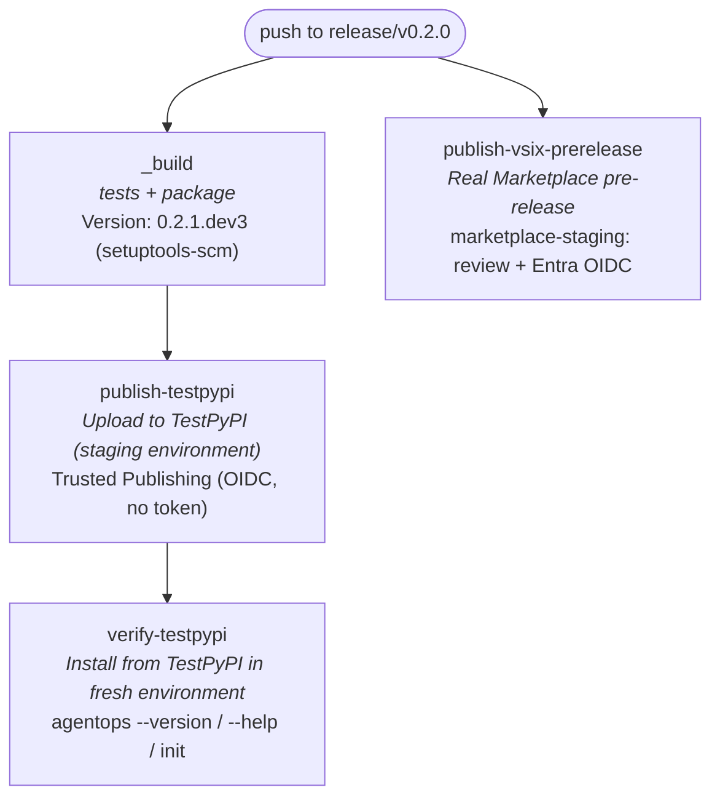
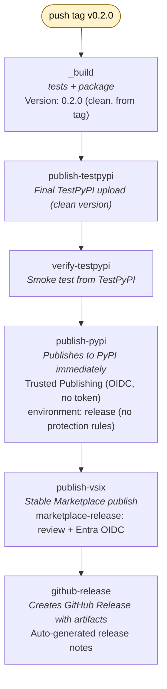
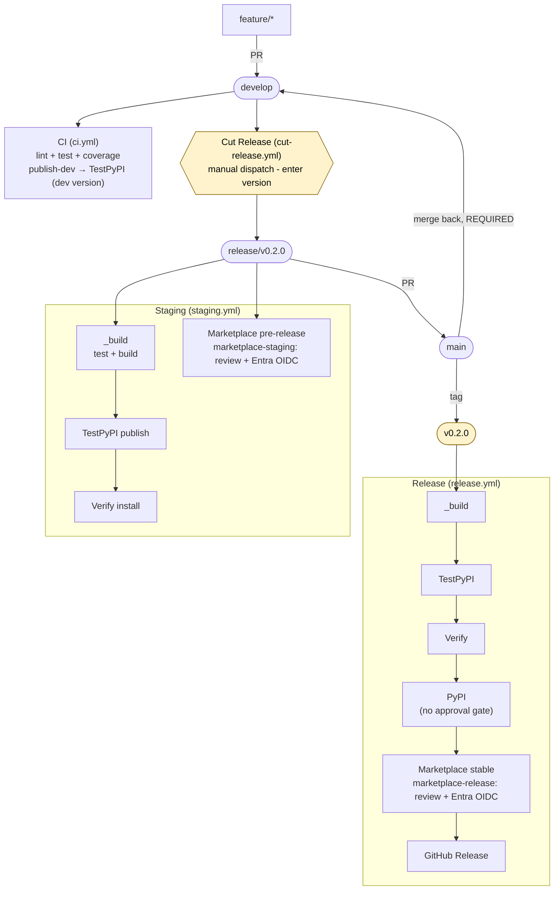

# GitOps Guide: Building and Releasing AgentOps Toolkit

This guide is a comprehensive instruction manual for engineers working on the **agentops-accelerator** project. It covers the full GitOps lifecycle - from setting up your development environment, through the branching model and CI pipeline, to staging and production releases.

## Table of Contents

- [1. GitOps Principles](#1-gitops-principles)
- [2. Branching Model](#2-branching-model)
- [3. Development Environment Setup](#3-development-environment-setup)
- [4. Development Workflow](#4-development-workflow)
- [5. CI Pipeline (Continuous Integration)](#5-ci-pipeline-continuous-integration)
- [6. Versioning with setuptools-scm](#6-versioning-with-setuptools-scm)
- [7. Staging Pipeline (TestPyPI)](#7-staging-pipeline-testpypi)
- [8. End-to-End Pipeline Testing](#8-end-to-end-pipeline-testing)
- [9. Production Release Pipeline (PyPI)](#9-production-release-pipeline-pypi)
- [10. Infrastructure Setup](#10-infrastructure-setup)
- [11. Workflow File Reference](#11-workflow-file-reference)
- [12. Release Checklist](#12-release-checklist)
- [13. Troubleshooting](#13-troubleshooting)

## 1. GitOps Principles

AgentOps follows GitOps practices where **git is the single source of truth** for both code and operational state:

- **Declarative configuration** - All pipeline behavior is defined in YAML workflow files checked into the repository.
- **Version-controlled releases** - Every release is traceable to a git tag. No manual version edits.
- **Automated pipelines** - Pushing branches or tags triggers the corresponding workflow automatically.
- **Keyless publishing** - PyPI uploads use Trusted Publishing (OIDC). There is no PyPI API token to store or rotate.
- **Immutable artifacts** - Built packages are uploaded once and reused across pipeline stages (no rebuilds between TestPyPI and PyPI).

## 2. Branching Model

AgentOps uses a modified [Git Flow](https://nvie.com/posts/a-successful-git-branching-model/) strategy:

```
main              ← always production-ready, receives merges from release/* branches
  │
develop           ← integration branch, all feature PRs target here
  │
  ├── feature/*   ← individual features branched from develop
  │
  └── release/*   ← release preparation, branched from develop when ready to ship
```

### Branch Purposes

| Branch           | Purpose                                                              | Who creates      | Merges into                   |
| ---------------- | -------------------------------------------------------------------- | ---------------- | ----------------------------- |
| `main`           | Production-ready code. Every commit here should be a tagged release. | Maintainers only | -                             |
| `develop`        | Integration branch. All feature work flows through here.             | -                | `main` (via release branches) |
| `feature/*`      | Individual features, bug fixes, or improvements.                     | Any contributor  | `develop`                     |
| `release/v0.X.Y` | Release stabilization and staging. Triggers TestPyPI pipeline.       | Maintainers      | `main`                        |

### Branch Lifecycle

```
1. feature/my-change ──PR──→ develop       (contributor)
2. develop ──branch──→ release/v0.2.0      (maintainer, when ready to release)
3. release/v0.2.0 ──PR──→ main            (maintainer, after staging validates)
4. main ──tag──→ v0.2.0                    (maintainer, publishes to PyPI immediately)
5. main ──merge──→ develop                 (maintainer, REQUIRED, same sitting as step 4)
6. release/v0.2.0 ──delete──               (maintainer, cleanup)
```

Steps 4 and 5 are a single unit of work. Leaving `develop` behind `main` corrupts
the next release's CHANGELOG. See
[Step 5: Tag the release and sync develop](#step-5-tag-the-release-and-sync-develop).

### Branch Protection Rules (Recommended)

Configure these in **Settings → Branches → Branch protection rules**:

| Branch      | Rules                                                                    |
| ----------- | ------------------------------------------------------------------------ |
| `main`      | Require PR, require status checks (CI), require approvals, no force push |
| `develop`   | Require PR, require status checks (CI), no force push                    |
| `release/*` | Require status checks (Staging pipeline), no force push                  |

## 3. Development Environment Setup

### Prerequisites

- Python 3.11 or later
- [uv](https://docs.astral.sh/uv/) (recommended) or pip
- Git with access to the repository

### First-Time Setup

```bash
# 1. Clone the repository
git clone https://github.com/Azure/agentops.git
cd agentops

# 2. Install uv (if not already installed)
# macOS/Linux:
curl -LsSf https://astral.sh/uv/install.sh | sh
# Windows:
powershell -ExecutionPolicy ByPass -c "irm https://astral.sh/uv/install.ps1 | iex"

# 3. Install the project and dev dependencies
uv sync --group dev

# 4. Verify the installation
uv run agentops --version
uv run pytest tests/ -x -q
```

### Alternative Setup (pip)

```bash
python -m venv .venv
# Windows:
.venv\Scripts\Activate.ps1
# macOS/Linux:
source .venv/bin/activate

pip install -e .
pip install pytest
agentops --version
python -m pytest tests/ -x -q
```

### Verify Your Setup

After installation, these commands should all succeed:

```bash
# CLI works
agentops --version          # Shows version like 0.1.3.dev6
agentops --help             # Shows available commands

# Tests pass
uv run pytest tests/ -x -q  # All tests should pass

# Version from git
python -m setuptools_scm    # Shows version derived from git tags
```

## 4. Development Workflow

### Creating a Feature

```bash
# 1. Start from the latest develop
git checkout develop
git pull origin develop

# 2. Create your feature branch
git checkout -b feature/my-new-feature

# 3. Make changes, commit, push
# ... edit files ...
uv run pytest tests/ -x -q          # Run tests before committing
git add .
git commit -m "feat: add my new feature"
git push origin feature/my-new-feature

# 4. Open a PR targeting develop
#    GitHub will run the CI pipeline automatically
```

### PR Requirements

Before your PR can be merged to `develop`:

1. **CI pipeline passes** - lint + tests across OS/Python matrix
2. **Code review approved** - at least one reviewer
3. **Architecture rules followed** - see [CONTRIBUTING.md](https://github.com/Azure/agentops/blob/main/CONTRIBUTING.md)
4. **Tests included** - unit tests in `tests/unit/`, integration tests if needed
5. **CHANGELOG updated** - add an entry under `## [Unreleased]` for user-visible changes. The `changelog` CI job enforces this; see [The CHANGELOG guard](#the-changelog-guard) below.

### After Your PR is Merged

```bash
# Sync your local develop
git checkout develop
git pull origin develop

# Delete your feature branch
git branch -d feature/my-new-feature
```

## 5. CI Pipeline (Continuous Integration)

The CI pipeline runs on **every push and PR** to `main` or `develop`.

**Workflow file**: `.github/workflows/ci.yml`

### Jobs

| Job | What it does | Runs on |
| --- | --- | --- |
| **lint** | `ruff check` (linting) + `mypy` (type checking, soft-fail) | Ubuntu, Python 3.11 |
| **changelog** | Fails a PR that changes shipped code without an `## [Unreleased]` entry | Ubuntu, PRs only |
| **test** | `pytest tests/` with JUnit XML output | Matrix: 2 OS × 3 Python versions |
| **coverage** | `pytest --cov` with XML coverage report | Ubuntu, Python 3.13 (after tests pass) |
| **publish-dev** | Build package + publish to TestPyPI (develop pushes only) | Ubuntu, Python 3.12 (after lint + test pass) |
| **verify-dev** | Install from TestPyPI + smoke test (develop pushes only) | Ubuntu, Python 3.12 (after publish-dev) |

The `publish-dev` and `verify-dev` jobs only run on pushes to `develop` (not on PRs). Every merged PR automatically produces an installable dev build on TestPyPI with a version like `0.1.3.dev12`.

### Test Matrix

| OS      | Python 3.11 | Python 3.12 | Python 3.13 |
| ------- | ----------- | ----------- | ----------- |
| Ubuntu  | ✅           | ✅           | ✅           |
| Windows | ✅           | ✅           | ✅           |

### What CI Catches

- Syntax and style issues (ruff)
- Type errors (mypy, non-blocking)
- Test failures across platforms
- Import errors or missing dependencies
- Regression in exit code behavior
- User-visible changes shipped without a CHANGELOG entry

### Viewing CI Results

1. Go to the **Actions** tab → find the CI run for your PR
2. Click into a failing job to see the error
3. Download test result artifacts if needed

### The CHANGELOG guard

`cut-release.yml` does not write changelog content. It inserts a `## [X.Y.Z] - <date>` heading directly beneath `## [Unreleased]` and nothing more, leaving `[Unreleased]` in place and empty. If no PR wrote anything under `[Unreleased]` during the cycle, the published release section is empty and the release pipeline still goes green. Releases 0.8.4 and 0.8.5 both shipped that way and were backfilled by hand afterwards, between them hiding six bug fixes and six dependency bumps.

Two jobs now close that gap, both driven by `scripts/check_changelog.py`:

- The **`changelog`** job in `ci.yml` runs on every PR to `develop`.
- A **`check-unreleased`** step in `cut-release.yml` aborts the release before the branch is created if `[Unreleased]` is empty. `scripts/cut-release.sh` and `scripts/cut-release.ps1` run the same check at the same point, so the local path cannot skip it.

#### When the PR check requires an entry

The PR must add a bullet under `## [Unreleased]` when **both** hold:

1. The diff touches a file that ships. Changes confined to `docs/`, `tests/`, `.github/workflows/`, `.github/ISSUE_TEMPLATE/`, `.vscode/`, `media/`, `tombstones/`, or the top-level markdown files never require an entry, whatever the PR is titled.
2. The PR title carries a user-visible conventional-commit type (`feat`, `fix`, `perf`, `revert`), is marked breaking (`feat!:` or a `BREAKING CHANGE` footer), or has no recognisable type at all. A typed `docs:`, `test:`, `ci:`, `build:`, `style:`, `refactor:`, or `chore:` PR is not asked for an entry.

An untyped title is treated as needing an entry on purpose. A PR that edits shipped code and says nothing about its intent is exactly the case worth a second look.

#### Where the entry has to go

The check parses the CHANGELOG diff and resolves each added line to the section it lands in. A bullet added under an already-released heading fails the same as no bullet at all, because `cut-release.yml` only ever promotes `[Unreleased]`. A bare `### Fixed` subheading with no bullet under it does not count either.

#### Bypassing the check

Apply the **`no-changelog`** label to the PR. The job then reports why it skipped and passes. Use it for changes that genuinely cannot matter to a user of the published package, and say so in the PR description so the reviewer can disagree.

#### Dependabot

Dependabot PRs are exempt. The bot cannot act on a failing check, so requiring an entry would leave every dependency PR red until a human labelled it, which trains everyone to reach for `no-changelog` reflexively. That is not the same as saying dependency bumps do not belong in the changelog: the `cryptography` 48 to 50 and `mcp` 1.27.1 to 1.28.1 bumps in 0.8.5 mattered to readers. Cover them when you cut the release, where one person writes one summary line instead of twelve bots writing twelve.

Nothing enforces that today. `check-unreleased` only asserts that `[Unreleased]` is non-empty, and a single bullet from any PR satisfies it, so a cycle can still reach a tag with its dependency bumps undocumented. Closing that gap properly means reading the merged Dependabot PRs for the cycle, which is a separate change.

#### Running it locally

```bash
# Is the Unreleased section empty?
python scripts/check_changelog.py check-unreleased

# Would my branch pass the PR check?
PR_TITLE="fix: something" PR_AUTHOR="$USER" PR_LABELS='[]' \
  python scripts/check_changelog.py check-pr --base origin/develop
```

## 6. Versioning with setuptools-scm

AgentOps uses [setuptools-scm](https://github.com/pypa/setuptools-scm) for **fully automatic versioning**. There is **no `version` field in `pyproject.toml`** - the version is derived from git tags at build time.

### How It Works

setuptools-scm reads your git history and computes the version:

| Git state                                     | Example version | Explanation                   |
| --------------------------------------------- | --------------- | ----------------------------- |
| Exactly on tag `v0.2.0`                       | `0.2.0`         | Clean release version         |
| 3 commits after `v0.2.0`                      | `0.2.1.dev3`    | Dev version, 3 commits ahead  |
| 10 commits after `v0.1.2` on `release/v0.2.0` | `0.1.3.dev10`   | Dev version on release branch |

### Configuration

In `pyproject.toml`:

```toml
[build-system]
requires = ["setuptools>=68", "wheel", "setuptools-scm>=8"]

[project]
dynamic = ["version"]    # Version comes from setuptools-scm, not a static field

[tool.setuptools_scm]
local_scheme = "no-local-version"   # Strips +hash suffix (PyPI rejects local versions)
```

### Checking the Version

```bash
# From the installed CLI
agentops --version

# From setuptools-scm directly
python -m setuptools_scm

# From Python code
python -c "from agentops import __version__; print(__version__)"
```

### Rules

- **Never add `version = "..."` to `pyproject.toml`** - this will conflict with setuptools-scm.
- **Tags must follow PEP 440** - use `v0.2.0`, not `release-0.2.0` or `0.2.0`.
- **`fetch-depth: 0`** is required in CI checkout steps - setuptools-scm needs the full git history.
- **`pip install -e .` requires `.git`** - editable installs need the git directory present (standard for development).

## 7. Staging Pipeline (TestPyPI)

The staging pipeline validates a release candidate by publishing to TestPyPI and
verifying the installed package works. It also attempts a **real Marketplace
pre-release** through the separate `marketplace-staging` environment. It is not
a dry run; use only legitimate, authorized release candidates.

**Workflow file**: `.github/workflows/staging.yml`

**Trigger**: Push to any `release/*` branch

### Pipeline Flow



### What Gets Validated

1. **Tests pass** - the full test suite runs before building
2. **Package builds** - setuptools-scm generates the correct version, wheel and sdist are created
3. **Package uploads** - the built artifacts successfully upload to TestPyPI
4. **Package installs** - `pip install` from TestPyPI resolves all dependencies
5. **CLI works** - `agentops --version` and `--help` run without errors
6. **Init works** - `agentops init` creates the expected workspace files

### Iterating on a Release Branch

If staging fails, fix the issue and push again:

```bash
# On your release/v0.2.0 branch
# ... fix the issue ...
git add .
git commit -m "fix: correct packaging issue"
git push origin release/v0.2.0
# Staging pipeline re-runs automatically
```

Each push generates a new dev version (e.g. `0.2.1.dev4`, `0.2.1.dev5`), so there are no version conflicts on TestPyPI. The `skip-existing: true` flag also prevents failures if the same version is re-uploaded.

### Manual Verification (Optional)

After the staging pipeline passes, you can manually test the package:

```bash
# Install the specific dev version from TestPyPI
pip install "agentops-accelerator==0.2.1.dev3" \
  --index-url https://test.pypi.org/simple/ \
  --extra-index-url https://pypi.org/simple/

agentops --version
agentops --help

# Test init in a temp directory
cd $(mktemp -d)
agentops init
ls .agentops/
```

> **Note**: `--extra-index-url https://pypi.org/simple/` is required so that dependencies (typer, pydantic, ruamel.yaml) resolve from the real PyPI.

## 8. End-to-End Pipeline Testing

**Release workflows are not dry runs.** Pushing `release/*` triggers TestPyPI
and a real Marketplace pre-release attempt; pushing `v*` triggers production
publishing. Never create dummy release branches, tags, or Marketplace versions
to test workflow changes. Deleting a ref does not undo an upload.

### 8.1 Test the Staging Pipeline

Before authorizing a real candidate, run the existing tests and package locally
without publishing:

```powershell
python -m pytest tests/ -x -q
uv build
# With Node 22 installed:
npm install -g @vscode/vsce@3.9.2
Copy-Item CHANGELOG.md,icon.png -Destination plugins\agentops
Push-Location plugins\agentops
npm run package
Pop-Location
```

For identity and publisher permissions, use the standalone read-only
`python scripts/marketplace.py check` after the
[local identity setup](#local-publishing). Do not invoke a staging or release
script merely to test credentials: those scripts publish after preflight.

When a legitimate release candidate is explicitly authorized, push its
`release/vX.Y.Z` branch and monitor **Staging** in Actions. Review the TestPyPI
upload and install verification, and approve the separately protected
`marketplace-staging` deployment only for the intended Marketplace pre-release.
Re-pushing the branch is another publication attempt, not a test-only run.

### 8.2 Test the Full Release Pipeline

> **There is no safe dry run.** The `publish-pypi` job does not pause, so pushing
> any `v*` tag publishes that version to real PyPI. There is no reject button to
> catch it. PyPI versions cannot be deleted, only yanked; a throwaway tag can
> leave permanent published artifacts.

Use packaging and the read-only Marketplace preflight in [8.1](#81-test-the-staging-pipeline)
for no-upload validation. A full end-to-end publish requires an explicitly
authorized, legitimate release. The `marketplace-release` approval gate is
separate from PyPI and does not pause `publish-pypi`.

If a PyPI approval gate is required, configure reviewers on `release` first
(see [Enabling a real approval gate](#enabling-a-real-approval-gate)).
Rejecting a deployment proves neither successful authentication nor upload.

#### Verifying the publish path without publishing

```bash
# Confirm the release environment's protection rules (empty = no gate).
gh api repos/Azure/agentops/environments/release --jq '.protection_rules'

# Confirm the workflow requests an OIDC token instead of using an API key.
grep -n "id-token\|gh-action-pypi-publish" .github/workflows/release.yml
```

Trusted Publishing must also be configured on the PyPI side under
**Manage project → Publishing**, matching the repository, workflow filename, and
environment name. A mismatch there surfaces as a `403` at upload time, after the
tag has already been pushed.

### 8.3 Quick E2E Test Summary

| What to validate | Method | What it proves |
| --- | --- | --- |
| Tests and packaging | Existing tests, `uv build`, extension `npm run package` | Build correctness; no upload |
| Marketplace identity and access | `python scripts/marketplace.py check` | Profile and explicit publisher role; no upload |
| Real pre-release | Authorized `release/vX.Y.Z` candidate and Marketplace approval | TestPyPI and real Marketplace pre-release publication |
| Real stable release | Authorized `vX.Y.Z` tag and Marketplace approval | Production publication; not reversible by deleting the tag |

### 8.4 Testing Workflow Changes on a Feature Branch

Run the existing targeted workflow/helper tests and packaging on the feature
branch. Inspect workflow diffs and environment protections without dispatching
release workflows. Do not bypass deployment policies or create a dummy
`release/*` branch to obtain a publishing identity. A standalone, explicitly
approved read-only preflight can validate federation and publisher access, but
must not call `publish` or the staging/release scripts.

## 9. Production Release Pipeline (PyPI)

The production pipeline publishes a final release to PyPI and creates a GitHub
Release. Its Marketplace stable publish uses the separate protected
`marketplace-release` environment; this does not change Python publishing.

**Workflow file**: `.github/workflows/release.yml`

**Trigger**: Push a `v*` tag (e.g. `v0.2.0`)

### Pipeline Flow



> **Pushing the tag is the point of no return.** The `publish-pypi` job declares
> `environment: release`, but that environment currently has **no protection
> rules**, so Python publishing does not pause for review. The Marketplace
> environment is separate. Verify for yourself:
>
> ```bash
> gh api repos/Azure/agentops/environments --jq '.environments[] | {name, protection_rules}'
> ```
>
> PyPI does not allow re-uploading a version, so a bad release can only be
> yanked, never replaced. Do all your verification on TestPyPI (staging) before
> you tag. See [Enabling a real approval gate](#enabling-a-real-approval-gate)
> if you want the pipeline to stop for a human.

### Step-by-Step: Cutting a Release

#### Step 1: Cut the Release (One-Click)

1. Go to the **Actions** tab → select **Cut Release** workflow
2. Click **Run workflow**
3. Enter the version (e.g. `0.2.0`) - no `v` prefix
4. Click **Run workflow**

The workflow automatically:
- Creates `release/v0.2.0` from `develop`
- Updates `CHANGELOG.md` (adds versioned section `[0.2.0] - YYYY-MM-DD`)
- Pushes the branch (triggers [staging pipeline](#7-staging-pipeline-testpypi))
- Opens a PR: `release/v0.2.0` → `main`

> **Alternative (manual)**: If you prefer to create the release branch locally:
> ```bash
> git checkout develop && git pull origin develop
> git checkout -b release/v0.2.0
> # Edit CHANGELOG.md manually
> git commit -m "chore: prepare release 0.2.0"
> git push origin release/v0.2.0
> ```

#### Step 2: Wait for Staging

The branch push triggers the staging pipeline automatically. Wait for it to pass.

#### Step 3: Monitor Staging

1. Go to **Actions** tab → find the **Staging** workflow run
2. Verify the Python jobs pass:
   - ✅ `build / build` - tests pass, package builds
   - ✅ `publish-testpypi` - uploaded to TestPyPI
   - ✅ `verify-testpypi` - installed and smoke-tested
3. Review and approve the legitimate Marketplace pre-release deployment in
   `marketplace-staging`, then verify that publication succeeded.

If any job fails, fix the issue on the release branch and push. The pipeline re-runs automatically.

#### Step 4: Merge to Main

Create a PR from `release/v0.2.0` → `main` (or use the one already opened by Cut Release):

1. Go to GitHub → **Pull Requests** → **New Pull Request**
2. Base: `main` ← Compare: `release/v0.2.0`
3. Title: `Release v0.2.0`
4. Get the required reviews and merge

#### Step 5: Tag the release **and** sync `develop`

These are one step, not two. Tagging publishes to PyPI; syncing `develop` keeps
the next release's CHANGELOG correct. Run all of it in one sitting.

```bash
# 1. Tag main. This publishes to PyPI with no approval prompt.
git checkout main
git pull origin main
git tag v0.2.0
git push origin v0.2.0

# 2. Immediately sync main back into develop.
git checkout develop
git pull origin develop
git merge main
git push origin develop

# 3. Verify the sync. This MUST print nothing.
git fetch origin
git log --oneline origin/develop..origin/main
```

If step 3 prints any commits, `develop` is behind `main` and the next release
will be built from a stale CHANGELOG. Fix it before you walk away.

**Why skipping the sync corrupts the next release.** `cut-release.yml` branches
from `develop` and rewrites the changelog by replacing the `## [Unreleased]`
marker exactly once, so everything under `Unreleased` becomes the new version's
content. When `develop` is behind `main`:

- `develop` still carries entries that already shipped, so they get republished
  under the new version.
- `develop` has no `## [0.2.0]` heading at all, so merging the next release PR
  into `main` **deletes the `[0.2.0]` section** from the published changelog.

**If you already skipped it**, do not trust a plain `git merge main`. Git places
the incoming `## [0.2.0] - <date>` heading above the unreleased entries that
`develop` accumulated in the same spot, which nests new unreleased work inside an
already-published version. The result is valid Markdown and easy to miss in
review. Open `CHANGELOG.md` after the merge and confirm that everything under
`## [Unreleased]` is genuinely unreleased before pushing.

#### Step 6: Watch the release pipeline

1. Go to **Actions** tab → find the **Release** workflow run for `v0.2.0`
2. The pipeline runs build → TestPyPI → verify → **publish-pypi** → github-release
3. `publish-pypi` does not pause. It publishes to PyPI via
   [Trusted Publishing](https://docs.pypi.org/trusted-publishers/) using the
   workflow's OIDC identity, so there is no API token to rotate
4. `github-release` then creates a GitHub Release with the built artifacts and
   auto-generated release notes

If the run fails after `publish-pypi` succeeded, the package is already on PyPI.
Fix forward with a new patch version rather than retrying the tag.

##### Enabling a real approval gate

The `release` environment exists and is referenced by the workflow, but it has no
reviewers attached, so it is a label rather than a gate. To make the pause real,
a repo admin adds required reviewers:

**Settings → Environments → `release` → Required reviewers**, then confirm:

```bash
gh api repos/Azure/agentops/environments/release --jq '.protection_rules'
```

Once reviewers exist, `publish-pypi` stops on **"Waiting for review"** and a
reviewer approves via **Review deployments → release → Approve and deploy**. No
workflow change is needed; `environment: release` is already declared.

#### Step 7: Delete the release branch

```bash
git push origin --delete release/v0.2.0
git branch -d release/v0.2.0
```

#### Step 8: Verify the Published Package

```bash
# Install from PyPI
pip install agentops-accelerator==0.2.0

# Verify
agentops --version    # Should show 0.2.0
agentops --help
```

Check the published package:
- PyPI: https://pypi.org/project/agentops-accelerator/0.2.0/
- GitHub Release: https://github.com/Azure/agentops/releases/tag/v0.2.0

## 10. Infrastructure Setup

This section covers one-time setup required before the pipelines can run.

### 10.1 GitHub Environments

Keep the existing Python environments unchanged. Create **separate Marketplace
environments** in **Settings → Environments → New environment** as described
below; do not reuse `staging` or `release` for Marketplace authentication.

#### `staging` Environment

- **Purpose**: Controls access to TestPyPI publishing
- **Protection rules**: None
- **Secrets**: None. `staging.yml` requests `id-token: write` and uploads via Trusted Publishing.

#### `release` Environment

- **Purpose**: Scopes the PyPI publish to a named environment for Trusted Publishing
- **Protection rules**: **None today.** The environment is declared by `release.yml`
  but has no reviewers, so `publish-pypi` runs without pausing. To turn it into a
  real gate, add required reviewers (see
  [Enabling a real approval gate](#enabling-a-real-approval-gate)).
- **Deployment branches**: Optionally restrict to `main` branch and `v*` tags
- **Secrets**: None. Python uploads continue to use Trusted Publishing.

#### `marketplace-staging` and `marketplace-release` Environments

Before setting any variables, configure **required reviewers** and **selected
branch/tag deployment policies**:

| Environment | Allowed deployment refs | Purpose |
| --- | --- | --- |
| `marketplace-staging` | Branches `release/*` (legitimate `release/vX.Y.Z` candidates) | Real Marketplace pre-release publishing |
| `marketplace-release` | Tags `v*`; optionally the protected `main` branch for manual dispatch with a tag input | Stable Marketplace publishing |

For manual stable releases, the job guards allow only `main` or the same release
tag as the input. Do not allow feature branches. An environment-based federated
subject **does not restrict branches by itself**: these environment protections
are essential and must exist before enabling the identity.

For an authorized retry of a pre-migration tag, explicitly dispatch the **new
migrated workflow on protected `main`**, supplying the valid release tag.
The Marketplace job checks out trusted tooling from `github.workflow_sha` at
the workspace root and extension source from `refs/tags/<tag>` into
`release-source/`. This packages the old extension source using the new OIDC
action/helper. A tag-based dispatch must match the tag input. Re-running a
historical old workflow run still executes its old PAT code; it does **not**
adopt the migrated workflow automatically. This is a real release retry, not
a read-only check.

Set these **environment variables**, not secrets, in each new environment:

| Variable | Value |
| --- | --- |
| `MARKETPLACE_AZURE_CLIENT_ID` | Dedicated user-assigned managed identity (UAMI) client GUID |
| `MARKETPLACE_AZURE_TENANT_ID` | Approved identity tenant GUID |
| `MARKETPLACE_PROFILE_ID` | Marketplace `profiles/me` profile `id`, **not** the Entra principal/object ID |

The jobs request `id-token: write` and use `azure/login@v3` with
`allow-no-subscriptions: true`. No Azure RBAC grant is needed solely to publish
an extension: Marketplace publisher membership supplies that permission.
Do not change shared `AZURE_*` E2E variables or repository-wide OIDC settings.

#### Repository secrets

| Secret       | Value                                                | How to get it                                                                   |
| ------------ | ---------------------------------------------------- | ------------------------------------------------------------------------------- |
| `RELEASE_PAT`| PAT used by `cut-release.yml` to open the release PR | GitHub → Settings → Developer settings → Personal access tokens                 |

`RELEASE_PAT` is a **GitHub** PAT and is unchanged by this migration. Marketplace
publishing has no PAT fallback. The legacy repository `VSCE_PAT` must be retained
until the staged rollout is validated; do not interpret this documentation as
confirmation it has been removed. No PyPI API token is stored. Check the current
rules and secret names (never secret values) at any time:

```bash
gh api repos/Azure/agentops/environments/release --jq '.protection_rules'
gh api repos/Azure/agentops/environments/release/secrets --jq '.secrets[].name'
gh api repos/Azure/agentops/actions/secrets --jq '.secrets[].name'
```

### 10.2 PyPI and TestPyPI Trusted Publishing

Both `staging.yml` and `release.yml` use
[PyPI Trusted Publishing](https://docs.pypi.org/trusted-publishers/), so uploads
are authenticated with a short-lived OIDC token minted by GitHub Actions. There
are no API tokens to create, store, or rotate.

Configure it once per index, on the index side:

#### TestPyPI (Staging)

1. Log in at [test.pypi.org](https://test.pypi.org/) (a separate account from PyPI)
2. Go to the project → **Manage → Publishing → Add a new publisher → GitHub**
3. Owner `Azure`, repository `agentops`, workflow `staging.yml`, environment `staging`

#### PyPI (Production)

1. Log in at [pypi.org](https://pypi.org/)
2. Go to the project → **Manage → Publishing → Add a new publisher → GitHub**
3. Owner `Azure`, repository `agentops`, workflow `release.yml`, environment `release`

The workflow filename and environment name must match exactly. A mismatch fails
at upload time with `403 Invalid or non-existent authentication information`,
which on the release pipeline happens *after* the tag is already pushed.

> **Note**: TestPyPI and PyPI are completely separate systems with separate accounts and namespaces. A publisher configured on one does not apply to the other.

### 10.3 First-Time Package Registration

Trusted Publishing cannot create a project that does not exist yet. For a brand
new project name, either upload once manually with a temporary API token, or use
[PyPI's pending publisher](https://docs.pypi.org/trusted-publishers/creating-a-project-through-oidc/)
flow to reserve the name for the workflow. `agentops-accelerator` is already
registered on both indexes, so this only matters if the package is renamed.

### 10.4 Marketplace Entra OIDC Identity Setup

**Permanent ownership and the approved production tenant/subscription must be
decided outside the code rollout.** Use a dedicated UAMI, not an E2E identity.
The earlier non-production personal-subscription probe established feasibility,
not policy approval or a permanent hosting location.

Verify the existing subject customization read-only before creating federation:

```powershell
gh api repos/Azure/agentops/actions/oidc/customization/sub
gh api repos/Azure/agentops --jq '{repository_id: .id, repository_owner_id: .owner.id}'
```

Verified for this migration: `use_default: false`, with ordered claim keys
`repository_owner_id`, `repository_id`, `context`; owner ID `6844498` and
repository ID `1161883340`. The UAMI needs two federated credentials:

| Field | Value |
| --- | --- |
| Issuer | `https://token.actions.githubusercontent.com` |
| Audience | `api://AzureADTokenExchange` |
| Staging subject | `repository_owner_id:6844498:repository_id:1161883340:environment:marketplace-staging` |
| Release subject | `repository_owner_id:6844498:repository_id:1161883340:environment:marketplace-release` |

Do not replace the repository customization with GitHub's default `repo:...`
subject: that can break other federated consumers. If verification differs,
stop and reconcile the identity configuration with repository owners.

After authenticating as the UAMI in the approved tenant, obtain a CLI token for
resource `499b84ac-1321-427f-aa17-267ca6975798` and use it only in the Authorization
header of a read-only request to
`https://app.vssps.visualstudio.com/_apis/profile/profiles/me?api-version=7.1`.
Record only the returned profile `id`. Never print, persist, or paste the token.
Have an **Owner** of publisher `AgentOpsAccelerator` grant that profile
**Contributor**, not Owner. Set `MARKETPLACE_PROFILE_ID` to this Marketplace
profile ID, not the UAMI's Entra principal ID.

### 10.5 Shared Publishing Helper and Local Use

`scripts/marketplace.py` requires Python 3.11+ (standard library only) and the
Azure CLI. Publishing also requires Node 22 and `vsce` 3.9.2 or newer; workflows
pin `npm install -g @vscode/vsce@3.9.2`.

```text
python scripts/marketplace.py check
python scripts/marketplace.py discover --out marketplace-profile.json
python scripts/marketplace.py publish --package-path PATH [--pre-release] [--allow-already-exists]
```

- `check` is **read-only** and never publishes. It selects
  `MARKETPLACE_AZURE_TENANT_ID`, checks the CLI identity's self profile against
  `MARKETPLACE_PROFILE_ID`, and requires an explicit publisher
  Contributor/Owner/Creator role with **zero deny permissions**. A generic HTTP
  200 response is not sufficient proof of publishing permission.
- `publish` runs that preflight before uploading the specified package.
  The child environment clears inherited PAT and EnvironmentCredential variables
  and selects the tenant so `vsce` uses the intended CLI credential. There is
  **no PAT fallback**, and token values are never printed.
- CI passes `--allow-already-exists` to preserve re-run handling. Local defaults
  fail on an existing version; opt in only when that behavior is intended.
  This maps to `vsce`'s native `--skip-duplicate` for existing-version/409
  handling, not output substring matching. Other errors always propagate.
- Profile pinning prevents a wrong account or tenant from publishing.
  A successful CLI profile/role preflight is **not proof of an actual upload**.

#### Permission-only GitHub workflow

`marketplace-preflight.yml` is separate from the release workflows and never
publishes. Its `workflow_dispatch` inputs select `discover` or `check` and one
of `marketplace-validation`, `marketplace-staging`, or `marketplace-release`.
It also supports `workflow_call` for a reviewed bootstrap workflow.

Use `discover` first: only client/tenant configuration is required. It reads the
new identity's Marketplace profile without requiring publisher membership and
uploads only tenant/profile IDs in the seven-day `marketplace-profile` artifact.
After granting Contributor, set `MARKETPLACE_PROFILE_ID` and run `check`.
Discovery alone is not proof of publisher access.

Configure a separate `marketplace-validation` environment for pre-merge tests,
with an exact approved validation branch, required reviewers, and its own
environment-subject federated credential. Before the workflow is available on
the default branch, an isolated no-upload push wrapper can call it from a
reviewed validation branch. Do not change the existing staging/release branch
policies to admit test branches, create dummy release refs, or bypass reviewers.
An approval pause is a real human handoff, not a reason to use another identity.
Only the selected context is validated; staging/release need their own checks
on allowed refs. Remove the isolated wrapper/branch and its federation when
validation is retired; never remove shared resources.

#### Local Publishing

The local `scripts/staging.ps1`, `scripts/staging.sh`, `scripts/release.ps1`,
and `scripts/release.sh` run permission preflight before side effects when
`vsce` is available. Their existing behavior of skipping extension packaging
when `vsce` is missing is unchanged; that skip is not a successful Marketplace
validation. These are publication scripts, not credential tests.

The extension's `npm run publish` and `npm run publish:prerelease` scripts also
package a VSIX and then invoke the shared helper. They require Python 3.11+ and
the helper from a repository checkout, not just a standalone extension folder.
The helper preflights before upload; these npm scripts package before preflight.

Log in with `az login --tenant <publisher-identity-tenant> --allow-no-subscriptions`.
Set `MARKETPLACE_AZURE_TENANT_ID` and `MARKETPLACE_PROFILE_ID` for **your interactive
publishing identity**, not the CI UAMI. Resolve your profile using the same
`profiles/me` endpoint above; your identity needs publisher Contributor or Owner
membership. Then run `python scripts/marketplace.py check` alone first.
Only invoke a publishing script or `publish` for an explicitly authorized release.

### 10.6 Staged Rollout Checklist

This is a deployment checklist, **not a claim that permanent resources are
configured or publication has been tested**.

- [ ] Approve permanent identity ownership, production tenant/subscription
  placement, and operational responsibility outside the code rollout.
- [ ] Create the dedicated UAMI and the two exact federated credentials; resolve
  its Marketplace profile and have a publisher Owner grant Contributor.
- [ ] Configure required reviewers and selected branch/tag deployment policies
  on both new environments **before setting their three variables**. Preserve
  Python `staging`/`release`, repository-wide OIDC, shared E2E variables, and
  `RELEASE_PAT`.
- [ ] Run a permission-only preflight under the intended federated identity:
  `python scripts/marketplace.py check`. Verify the pinned profile and explicit
  role with no deny permissions. Do not call publishing scripts.
  Use the dedicated `marketplace-preflight.yml` workflow, not staging/release.
  Its discovery mode resolves the profile before checking publisher membership.
  A local interactive `check` validates that local identity, not CI federation.
- [ ] Obtain explicit authorization for a legitimate pre-release, approve its
  `marketplace-staging` deployment, publish it, and verify the Marketplace result.
- [ ] Obtain explicit authorization for a legitimate stable release, approve its
  `marketplace-release` deployment, publish it, and verify the Marketplace result.
  Do not create dummy production versions for validation.
- [ ] **Only after both real publication paths succeed**, remove the GitHub
  `VSCE_PAT` secret. Have its owner revoke the underlying Azure DevOps PAT after
  confirming there are no other consumers. **Never remove or revoke `RELEASE_PAT`.**
  Include historical workflow re-runs in that consumer review: retire old PAT
  execution paths and use the migrated workflow on `main` for authorized old-tag
  retries rather than re-running historical workflows.

Prior evidence:
[successful no-upload preflight, attempt 3](https://github.com/Azure/agentops/actions/runs/34046045685/attempts/3).
All temporary probe resources were deleted. This proves feasibility only, not
permanent configuration, policy approval, actual publication, or legacy-secret
retirement.

## 11. Workflow File Reference

All workflow files are in `.github/workflows/`:

### `ci.yml` - Continuous Integration

```
Trigger: push to develop, PR to develop
Flow:    lint → test (matrix) → coverage
         + on develop push: publish-dev → verify-dev (TestPyPI)
Purpose: Quality gate for all code changes; auto-publish dev builds
```

Key detail: `publish-dev` and `verify-dev` only run on pushes to `develop` (not PRs). Every merge to develop produces a dev version on TestPyPI (e.g. `0.1.3.dev12`) via setuptools-scm. PRs to `main` are not covered by CI because they come from `release/*` branches which are already validated by the staging pipeline.

### `_build.yml` - Reusable Build

```
Trigger: workflow_call (called by staging.yml and release.yml)
Flow:    checkout (full history) → uv sync → pytest → uv build → upload artifact
Purpose: Single source of truth for the build process
```

Key detail: Uses `fetch-depth: 0` to ensure setuptools-scm has full git history for version derivation.

### `staging.yml` - Staging Pipeline

```
Trigger: push to release/* branches, or workflow_dispatch
Flow:    _build → publish-testpypi → verify-testpypi
         + parallel Marketplace pre-release (marketplace-staging)
Purpose: Validate release candidates before production
```

Key details:
- `skip-existing: true` allows re-pushes without upload failures
- Verify step uses a retry loop (5 attempts, 30s apart) for TestPyPI index propagation
- Smoke tests cover `--version`, `--help`, and `agentops init`
- The extension job separately uses `marketplace-staging`, Entra OIDC, and the
  shared helper with `--pre-release --allow-already-exists`. Staging is a real
  Marketplace pre-release attempt, not a safe disposable-branch test.

### `release.yml` - Production Release

```
Trigger: push v* tags, or workflow_dispatch
Flow:    _build → publish-testpypi → verify-testpypi → publish-pypi → publish-vsix → github-release
Purpose: Publish to PyPI and Marketplace, then create GitHub Release
```

Key details:
- `publish-pypi` declares `environment: release`, but that environment has no protection rules, so it publishes without pausing
- PyPI upload uses Trusted Publishing (`id-token: write`), not an API token
- `github-release` uses `gh release create` with `--generate-notes` for automatic release notes
- Built artifacts (.whl, .tar.gz) are attached to the GitHub Release
- The extension job separately uses `marketplace-release`, Entra OIDC, and the
  shared helper with `--allow-already-exists`. Its reviewers do not gate PyPI.
- Marketplace tooling is checked out from `github.workflow_sha` at the root;
  extension source comes from the requested release tag under `release-source/`.
  Retry pre-migration tags by dispatching the migrated workflow on protected
  `main`, not by re-running historical PAT-based workflows.

### `cut-release.yml` - Cut Release (Manual Dispatch)

```
Trigger: workflow_dispatch (manual button in Actions tab)
Input:   version - semver string (e.g. 0.2.0)
Flow:    validate → check [Unreleased] not empty → create release branch → update CHANGELOG → push → open PR
Purpose: One-click release branch creation from develop
```

Key details:
- Creates `release/v<version>` branch from `develop`
- Automatically updates `CHANGELOG.md` - inserts a versioned section `[<version>] - <date>` at the top
- Opens a PR from `release/v<version>` → `main` with a checklist
- The branch push triggers `staging.yml` automatically
- Fails safely if the branch already exists
- Refuses to run when `## [Unreleased]` is empty, because this workflow only inserts a versioned heading beneath that one and would otherwise publish an empty release section
- Does NOT auto-tag; stable tagging remains a manual, intentional step. The
  release-branch push does trigger staging publication, including a real
  Marketplace pre-release attempt.

## 12. Release Checklist

Use this checklist when cutting a release:

**Preparation**
- [ ] All intended features/fixes are merged to `develop`
- [ ] `CHANGELOG.md` has entries under `## [Unreleased]` for all user-visible changes, including anything Dependabot merged (Cut Release aborts if the section is empty)
- [ ] Tests pass locally: `uv run pytest tests/ -x -q`
- [ ] Version from setuptools-scm looks correct: `python -m setuptools_scm`
- [ ] Marketplace identity, reviewer and deployment protections are ready;
  read-only preflight passed and a legitimate publication is authorized

**Staging**
- [ ] Release branch created via **Cut Release** workflow (or manually)
- [ ] CHANGELOG automatically updated with version and date
- [ ] Staging Python jobs pass: build + TestPyPI + verify
- [ ] Marketplace pre-release deployment approved and legitimate publication verified
- [ ] PR opened: `release/v0.X.Y` → `main`

**Production (tag + sync, do these together)**
- [ ] PR from `release/v0.X.Y` → `main` created and approved
- [ ] PR merged to `main`
- [ ] Version tag created and pushed: `v0.X.Y` (this publishes to PyPI immediately)
- [ ] Release pipeline runs: build + TestPyPI + verify + publish-pypi all green
- [ ] Marketplace stable deployment approved and legitimate publication verified
- [ ] **`main` merged back into `develop` and pushed**
- [ ] **`git log --oneline origin/develop..origin/main` prints nothing**
- [ ] `CHANGELOG.md` on `develop` shows only genuinely unreleased work under `## [Unreleased]`
- [ ] GitHub Release created with artifacts
- [ ] Published package verified: `pip install agentops-accelerator==0.X.Y`

**Cleanup**
- [ ] Release branch deleted (remote and local)

## 13. Troubleshooting

### Build Failures

| Problem                                  | Cause                               | Solution                                      |
| ---------------------------------------- | ----------------------------------- | --------------------------------------------- |
| `setuptools_scm` can't determine version | Shallow clone (missing git history) | Ensure `fetch-depth: 0` in checkout step      |
| Version shows `0.0.0` locally            | Not in a git repo or no tags exist  | Run `git tag v0.0.1` to create an initial tag |
| `ModuleNotFoundError` in tests           | Dependencies not installed          | Run `uv sync --group dev`                     |
| Tests fail on Windows but pass on Linux  | Path separator issues               | Use `pathlib.Path`, not string concatenation  |

### TestPyPI Issues

| Problem                                       | Cause                            | Solution                                                                                                                |
| --------------------------------------------- | -------------------------------- | ----------------------------------------------------------------------------------------------------------------------- |
| Upload fails with 403                         | Trusted Publishing not configured for `staging.yml` / environment `staging` | Fix the publisher on test.pypi.org under **Manage → Publishing**                                                        |
| Upload fails with "already exists"            | Same version previously uploaded | Normal - `skip-existing: true` handles this. If you need a new upload, push another commit to increment the dev version |
| Install fails with "no matching distribution" | Package not yet indexed          | The verify job retries automatically (5 attempts, 30s apart). If persistent, check TestPyPI status                      |
| Install fails with dependency errors          | Dependency not on TestPyPI       | Verify `--extra-index-url https://pypi.org/simple/` is present                                                          |

### PyPI Issues

| Problem                                    | Cause                                     | Solution                                                       |
| ------------------------------------------ | ----------------------------------------- | -------------------------------------------------------------- |
| Published to PyPI without being asked      | Expected. `release` has no protection rules, so `publish-pypi` never pauses | Yank the release on pypi.org and ship a new patch version. See [Enabling a real approval gate](#enabling-a-real-approval-gate) |
| Publish step stuck on "Waiting for review" | Someone added required reviewers to `release` | A listed reviewer approves via **Review deployments → release** |
| Upload fails with 403                      | Trusted Publishing not configured for `release.yml` / environment `release` | Fix the publisher on pypi.org under **Manage → Publishing**. The tag is already pushed, so bump the version and retag |
| Version already exists on PyPI             | Tag points to an already-released version | PyPI versions are immutable. You must use a new version number |

### Git and Version Issues

| Problem                                     | Cause                          | Solution                                                                                         |
| ------------------------------------------- | ------------------------------ | ------------------------------------------------------------------------------------------------ |
| Wrong version in built package              | Tag not on the expected commit | Verify with `git log --oneline --decorate` that the tag is where you expect                      |
| `pip install -e .` fails                    | `.git` directory missing       | Editable installs need git history for setuptools-scm. Clone the repo, don't just download a zip |
| Merge conflicts between release and develop | Normal for concurrent work     | Resolve conflicts on the release branch before merging to main                                   |
| Next release's CHANGELOG republishes old entries, or drops the previous version's section | `develop` was left behind `main` after the last release | `git merge main` into `develop`, then hand-check `CHANGELOG.md`. See [Step 5](#step-5-tag-the-release-and-sync-develop) |

### Environment and Permissions

| Problem                           | Cause                               | Solution                                                               |
| --------------------------------- | ----------------------------------- | ---------------------------------------------------------------------- |
| "Environment not found" error     | GitHub Environment not created      | Preserve Python `staging`/`release`; create separate protected `marketplace-staging`/`marketplace-release` environments |
| Marketplace variable missing | Dedicated environment setup incomplete | Configure reviewers and deployment policies first, then all three `MARKETPLACE_*` variables |
| Marketplace federation fails | Issuer, audience, or customized subject mismatch | Verify repository customization and exact environment subjects; do not change repo-wide OIDC |
| Marketplace profile/role preflight fails | Wrong tenant/account/profile or missing publisher role/deny permissions | Select the correct tenant, resolve `profiles/me`, and ask the publisher Owner to review Contributor membership; never fall back to a PAT |
| No one was asked to approve the publish | `release` has no required reviewers | Confirm with `gh api repos/Azure/agentops/environments/release --jq '.protection_rules'` |
| Reviewer can't approve deployment | Not listed as required reviewer     | Update the environment's required reviewers list                       |

## Architecture Diagram


