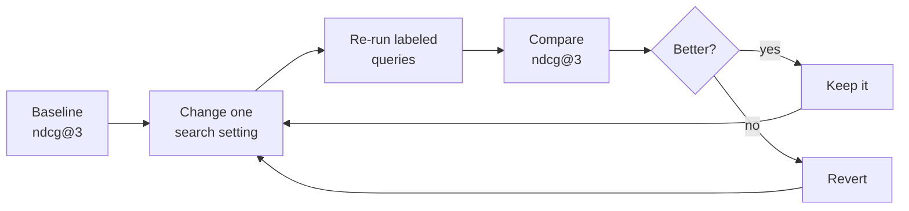

# Retrieval optimization

This is an Operate-phase activity. Once your agent is shipped and the gate is green,
operating means making it better over time, not just keeping it from regressing.
When the [operating loop](operate.md#the-operating-loop) shows weak grounding or
off-topic answers, the root cause is often retrieval: the agent answered from the
wrong chunks. This page shows how to measure and tune retrieval quality directly,
using the Foundry [Document Retrieval evaluator](https://learn.microsoft.com/azure/foundry/concepts/evaluation-evaluators/rag-evaluators#document-retrieval).

## Where this fits

The smoke gate in the [HTTP agent tutorial](tutorial-http-agent.md) already scores
two RAG signals on every PR:

- **Groundedness**: is the answer supported by what was retrieved.
- **Retrieval**: are the retrieved chunks relevant to the question.

Both are LLM-judge metrics on a 1 to 5 scale and need no ground truth, so they
guard the gate cheaply. They tell you *that* retrieval is weak. They do not tell
you *how to fix it*, and they cannot compare two search configurations
objectively.

Document Retrieval is the tuning tool. It scores the *ranking* of your retrieved
documents against relevance labels you author by hand (qrels) and returns
position-aware metrics like NDCG. You run it offline, on a small labeled query
set, whenever you change a search parameter and want to know if retrieval
actually improved.

!!! note "Why this is not a PR gate"
    Document Retrieval needs hand-labeled ground truth, returns composite metrics
    instead of a single pass/fail score, and its labels reference specific chunk
    ids. Rebuilding the index can change those ids and invalidate the labels. That
    is fine for a deliberate tuning study, but too brittle to run green on every
    commit. Keep Groundedness and Retrieval on the gate, and use Document
    Retrieval here, on demand.

## Prerequisites

You need grey-box mode enabled so the agent returns the documents it retrieved.
This is the same `X-Eval-Context` contract set up in
[step 11 of the HTTP agent tutorial](tutorial-http-agent.md#11-score-live-retrieval).
With it on, a request returns the ranked retrieval alongside the answer:

```json
{
  "answer": "...",
  "context": "...",
  "retrieved_documents": [
    { "id": "documents-vw-fuel-system-pdf-c00002", "score": 0.71, "title": "...", "content": "..." },
    { "id": "documents-vw-fuel-system-pdf-c00001", "score": 0.55, "title": "...", "content": "..." }
  ]
}
```

You also need the evaluator SDK:

```powershell
pip install azure-ai-evaluation
```

## The two shapes you map

The orchestrator and the evaluator describe documents differently, so you map one
to the other.

| Concept | Orchestrator returns | Document Retrieval expects |
|---|---|---|
| A retrieved chunk | `{ "id": ..., "score": ... }` | `{ "document_id": ..., "relevance_score": ... }` |
| A relevance label (qrels) | you author it | `{ "document_id": ..., "query_relevance_label": 0..4 }` |

`relevance_score` is the retriever's own confidence (used to rank). The
`query_relevance_label` is *your* judgment of how relevant the chunk truly is,
from `0` (irrelevant) to `4` (perfect). Document Retrieval compares the ranking
the retriever produced against the ranking your labels imply.

## Step 1: capture the live retrieval

Call the agent once per query you want to study and keep the `retrieved_documents`
list. Map it to the evaluator shape.

```python
import os, requests

ENDPOINT = os.environ["ORCHESTRATOR_URL"]  # .../orchestrator
QUERY = "What is the fuel pump rating?"

resp = requests.post(
    ENDPOINT,
    headers={"Content-Type": "application/json", "X-Eval-Context": "true"},
    json={"ask": QUERY},
    timeout=120,
).json()

retrieved_documents = [
    {"document_id": d["id"], "relevance_score": d["score"]}
    for d in resp["retrieved_documents"]
]
```

## Step 2: author the qrels

For each query, label the chunks you care about. You do not have to label every
chunk in the index, only the ones that matter for this question. Look at the
`content` of each retrieved chunk and decide how relevant it is.

```python
retrieval_ground_truth = [
    {"document_id": "documents-vw-fuel-system-pdf-c00002", "query_relevance_label": 4},
    {"document_id": "documents-vw-fuel-system-pdf-c00001", "query_relevance_label": 2},
    {"document_id": "documents-vw-brakes-pdf-c00007", "query_relevance_label": 0},
]
```

!!! tip "Keep qrels small and stable"
    A handful of well-labeled queries beats a large noisy set. Store the labels
    next to your dataset and treat them as ground truth you maintain. Because the
    ids are tied to your index, re-check the labels after any reindex or chunking
    change.

## Step 3: run the evaluator

```python
from azure.ai.evaluation import DocumentRetrievalEvaluator

evaluator = DocumentRetrievalEvaluator(
    ground_truth_label_min=0,
    ground_truth_label_max=4,
)

result = evaluator(
    retrieval_ground_truth=retrieval_ground_truth,
    retrieved_documents=retrieved_documents,
)
print(result)
```

## Step 4: read the metrics

Document Retrieval returns a set of ranking metrics, not a single score. These are
the ones you will use most.

| Metric | What it tells you | Direction |
|---|---|---|
| `ndcg@3` | ranking quality in the top 3, rewarding relevant chunks near the top | higher is better |
| `xdcg@3` | like NDCG but weights the very top results more heavily | higher is better |
| `fidelity` | how much of the truly relevant set the retriever managed to surface | higher is better |
| `top1_relevance` | the label of the single best-ranked chunk | higher is better |
| `top3_max_relevance` | the best label found anywhere in the top 3 | higher is better |
| `holes` | retrieved chunks you never labeled, a sign your qrels are incomplete | lower is better |
| `holes_ratio` | holes as a fraction of retrieved chunks | lower is better |

Pick one headline metric to optimize, usually `ndcg@3`, and watch `holes_ratio`
to make sure your labels still cover what the retriever returns. A rising
`holes_ratio` usually means the index changed and your qrels need a refresh.

## Step 5: the optimization loop

Now use it to tune search. Change one thing, re-run the same labeled queries, and
compare the headline metric.



Things worth sweeping one at a time:

- **top-k**: how many chunks the retriever returns.
- **search mode**: keyword, vector, or hybrid, and whether semantic reranking is on.
- **chunk size and overlap**: how the documents were split at ingestion.
- **reranker or filters**: any post-retrieval scoring you apply.

Keep the change that raises `ndcg@3` without inflating `holes_ratio`. When you are
done, the improvement should show up on the gate too: better ranking feeds better
context, so the LLM-judge **Groundedness** and **Retrieval** scores in your PR
smoke run should rise as well. That is the loop closing, retrieval tuning here,
confirmed by the gate there.

## Caveats

- **Labels are index-specific.** The `document_id` values are chunk ids from your
  current index. Re-author or re-verify qrels after reindexing or changing chunking.
- **Keep the labeled set focused.** This is a diagnostic and tuning surface, not a
  regression suite. A small, trusted set of queries is easier to maintain and
  reason about.
- **It complements, it does not replace, the gate.** Groundedness and Retrieval
  stay on every PR. Document Retrieval is the deeper look you reach for when those
  scores say retrieval is the problem.

## Related

- [Operate](operate.md): the operating loop this activity belongs to.
- [HTTP agent tutorial, step 11](tutorial-http-agent.md#11-score-live-retrieval): how grey-box capture is wired.
- [Foundry RAG evaluators](https://learn.microsoft.com/azure/foundry/concepts/evaluation-evaluators/rag-evaluators): the full evaluator reference, including every Document Retrieval score key.
