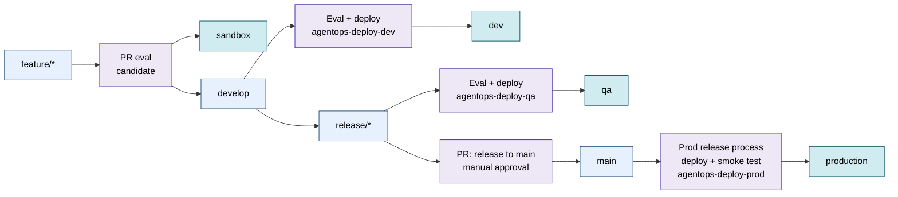

# Ship

This page explains how AgentOps gates a release in CI/CD. AgentOps owns the
repo-side quality gate; your platform owns infrastructure and deployment. The
goal is simple: the agent version that gets deployed is the exact version that
was evaluated.

For the full GitHub Actions reference, including every workflow file, the YAML,
and the OIDC and RBAC setup steps, see
[AgentOps on GitHub Actions](ci-github-actions.md). This page is the overview
that explains why the pieces fit together.

## How branches map to environments

AgentOps assumes a GitFlow-style branch model. Feature PRs run an eval against
the candidate agent before merge. The PR from `release/**` to `main` is a manual
approval gate for the already-tested release branch; it does not call agents.
Deploy workflows run after merge and promote the reviewed branch to its
environment:

Legend: blue boxes are Git branches, purple boxes are PR or workflow gates, and
teal boxes are deployed environments.

The PR gate (`agentops-pr.yml`) protects feature and release-candidate changes
before they enter `develop` or `release/**`. It does not validate the
already-deployed dev app. In the HTTP tutorial, it evaluates the sandbox
endpoint. In prompt-agent flows, it stages and evaluates the candidate prompt in
sandbox. The PR from `release/**` to `main` is a manual approval gate with
static checks only. After it merges, `agentops-deploy-prod` runs the production
release process: deploy and smoke test. A per-environment deploy workflow
promotes `develop` to dev, `release/**` to QA, and `main` to prod. The two you
start with are covered next; the full set, with the workflow YAML and the GitHub
Environment and OIDC setup, is in
[AgentOps on GitHub Actions](ci-github-actions.md).

## The two core workflows

A generated AgentOps scaffold ships a PR gate and per-environment deploy
workflows. The two that matter most early are the PR gate and the dev deploy.

| Workflow | Trigger | What it does |
|---|---|---|
| `agentops-pr.yml` | PRs to `develop`, `release/**` | Evaluates the PR candidate, runs the Doctor gate, and comments on the PR. |
| `agentops-deploy-dev.yml` | push to `develop` | Evaluates, then builds and deploys to the dev environment. |

You do not write these by hand. `agentops workflow analyze` reads the repo and
recommends the deploy wiring and eval runner, and `agentops workflow generate`
writes the workflow files from that recommendation. Because both use the same
analysis, the plan and the generated files do not drift.

!!! note "Generate the PR gate first"
    Start with `agentops workflow generate --kinds pr`. Add the dev, qa, and
    prod deploys only after GitHub Environments and Azure OIDC are ready. This
    keeps your first green run small and avoids wiring deploy steps before the
    gate works.

## Candidate versioning in Foundry

For Foundry prompt agents, each deploy stages a **candidate version** from your
source-controlled `prompt_file` before evaluating it. PR-run candidates are
tagged in Foundry with `agentops:candidate=true` plus the PR number and a
timestamp, so portal viewers can tell abandoned PR candidates apart from
deployed versions of record.

The deployed-of-record version is tracked in `foundry-agent.json`, written per
environment as a workflow artifact after the gate passes. That file, not the
Foundry version number, is the supported way to know what each environment runs.

!!! info "Prompt SHA and git SHA are the durable identity"
    Foundry version numbers are local to each project, so sandbox
    `travel-agent:2` may not match the dev or prod number. AgentOps instead
    records `agentops.prompt_sha256` (the prompt text) and `agentops.git_sha`
    (the commit) on every version and in `foundry-agent.json`. To check whether
    two environments run the same prompt, compare those SHAs, not the version
    numbers.

This is the invariant the whole flow protects: the evaluated agent version is
the deployed agent version. Foundry manages the candidate versions; AgentOps
supplies the gate, the deployment record, and Cockpit visibility.

## Why the PR gate uses a candidate

The PR gate validates the proposed agent before it enters `develop` or a
`release/**` branch. For HTTP agents, that usually means the sandbox endpoint
you configured in the workflow. For Foundry prompt agents, the workflow stages a
throwaway prompt version in sandbox and evaluates that candidate. The dev
project is updated only by the deploy workflow after the PR merges.

A passing PR gate is evidence that the proposed change is safe to merge. The dev
deploy then promotes the reviewed branch and records the deployed prompt SHA.

## The Doctor gate in CI

Every PR run also runs `agentops doctor --evidence-pack` after the eval step.
The eval step is the hard merge gate; the Doctor gate adds readiness checks like
regression detection against the rolling baseline.

| `--doctor-gate` value | PR behavior |
|---|---|
| `critical` (default) | Blocks the PR on critical findings, including a regression that drops a metric well below baseline even when eval thresholds still pass. |
| `warning` | Also blocks on smaller regression drops. |
| `none` | Doctor still writes and uploads evidence, but does not block; the eval step stays the only hard gate. |

Production deploy templates always run Doctor with a critical finding gate. To
understand the findings and severities behind these gates, see
[Own](own.md) and the [Doctor checks reference](doctor-checks.md).

## Identity and access

CI authenticates to Azure with GitHub OIDC and federated credentials, so no
long-lived secrets live in the repo. The same principal needs the right Azure
RBAC roles before the first run, or the eval step fails with null metrics.

!!! warning "Two roles are required for prompt-agent gates"
    The OIDC principal needs **Foundry User** on the Foundry project and
    **Cognitive Services OpenAI User** on the AI Services account that hosts the
    judge model. If only one is in place, every metric returns `null` and the
    gate fails without an obvious cause. The full setup, including the role ids
    and the federation steps, is in [AgentOps on GitHub Actions](ci-github-actions.md).

For the underlying procedures, follow Microsoft's own docs rather than copying
long steps here:

- [GitHub OIDC with Azure (workload identity federation)](https://learn.microsoft.com/azure/active-directory/workload-identities/workload-identity-federation-create-trust?pivots=identity-wif-apps-methods-azp)
- [Assign Azure roles (RBAC)](https://learn.microsoft.com/azure/role-based-access-control/role-assignments-portal)
