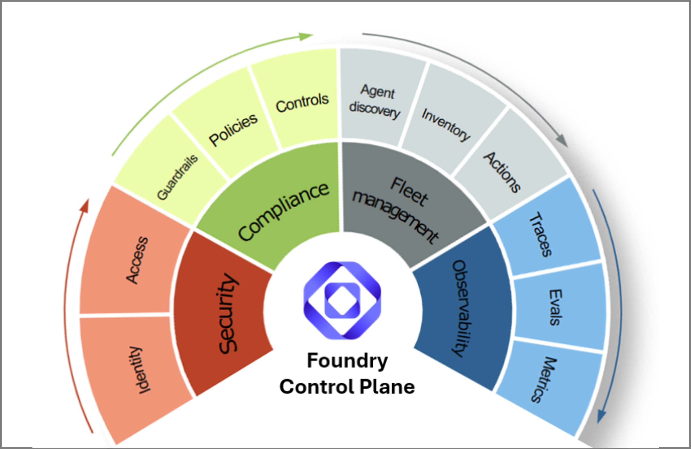

# End-to-end tutorial: release readiness for Foundry agents

This tutorial is the full path. Use it after one of the quickstarts when you
want to validate the complete develop -> evaluate -> release -> observe loop
across **sandbox**, **dev**, **qa**, and **prod** environments. The two
quickstarts cover the same loop for a single agent type in a sandbox + dev
arrangement; this tutorial expands the journey through every release stage.

It is inspired by the Azure Samples repo
[Mind the Gap In Your AI Agent Observability](https://github.com/Azure-Samples/microsoft-foundry-e2e-agent-observability-workshop/tree/2026-04-aie-europe).
That sample goes deep on Foundry SDK notebooks, tracing, evaluation, and
red-team scans. This AgentOps tutorial does not copy those labs. It shows where
AgentOps fits around the same lifecycle as the repo-side readiness and evidence
layer.



Foundry gives you the control plane: fleet management, observability, security,
and compliance. AgentOps adds the repo contract around that control plane:
repeatable CI gates, Doctor checks, release evidence, and trace-to-regression
review.

## What you will validate

| Stage | Activity | Main tools | AgentOps role | Output |
|---|---|---|---|---|
| 1 | Define the agent goal and risks | Foundry docs, VS Code, Copilot | Helps define what must be proven before release. | Success criteria and risk list |
| 2 | Choose Prompt Agent or Hosted Agent | Foundry portal, Foundry Toolkit, team architecture | Later references the target as `name:version` or URL. | Target type decision |
| 3 | Provision the **sandbox** and **dev** environments (separate Foundry projects for prompt agents; separate endpoints for hosted agents) | Foundry portal, `microsoft-foundry` skill, your platform | No ownership of create/deploy. | Two environments scoped to author and shared dev work |
| 4 | Author and iterate in **sandbox** | Foundry playground (prompt agents) or local app (hosted agents), `agentops eval run` | Local eval gate before opening a PR. | Working sandbox-validated agent |
| 5 | Configure release checks | AgentOps CLI and skills | Creates `agentops.yaml` and repo-side release contract. | Release checklist in repo |
| 6 | Open PR | Generated PR workflow with `--doctor-gate critical` | Routes to the right runner, normalizes proof, and blocks the PR on critical Doctor findings. | PR gate signal |
| 7 | Merge and deploy to **dev** | Generated dev deploy workflow + your platform | Records candidate version (prompt agents) or commit/image (hosted agents) and re-evaluates after deploy. | Dev environment ready for promotion |
| 8 | Observe production after promotion | Foundry Operate, Azure Monitor, Application Insights | Checks wiring and links to official dashboards. | Traces, metrics, health |
| 9 | Review readiness | AgentOps Doctor, Cockpit, evidence pack | Answers "can we ship it, and where is the proof?" | `evidence.md` |
| 10 | Learn from traces | Foundry/App Insights exports, AgentOps trace promotion | Turns reviewed traces into regression candidates. | Future eval rows |

## Multi-environment topology

```
.azure/
├── config.json            # defaultEnvironment: sandbox
├── .gitignore             # excludes */.env
├── sandbox/.env           # team authoring / experimentation space (Foundry project for prompts, or local/shared app for hosted agents)
├── dev/.env               # team-shared dev project / endpoint (PR + deploy gate)
├── qa/.env                # qa project / endpoint
└── prod/.env              # production project / endpoint
```

For **prompt agents**, each `.env` points at a different Foundry project so
playground saves in sandbox don't appear in dev. For **hosted agents**, each
`.env` typically points at the same Foundry project (for observability) but
the agent URL (`AGENTOPS_AGENT_ENDPOINT`) differs per environment because the
hosted endpoint itself is the per-environment artifact.

> **Why a separate sandbox?** When authors save in the Foundry playground,
> the platform auto-increments the version every save. If experimentation
> happens in the same project that CI promotes from, dev fills up with
> half-baked versions and traceability and rollback become messy. Sandbox
> is the team's authoring and experimentation space (one project works
> for most teams; split per-stream or per-developer only if save
> collisions become a real problem); dev is the gated promotion target
> CI writes to.

## The cross-environment identity story (versioning callout)

Each environment's Foundry version numbers or endpoint URLs diverge, but the
following identifiers stay **identical** across sandbox, dev, qa, and prod
for the same logical release:

```
For prompt agents:
   prompt_file in git (byte-identical content)
      └─ prompt_sha256 + git_sha (cross-environment identity)
           ├── sandbox Foundry project → travel-agent:5
           ├── dev Foundry project     → travel-agent:2
           ├── qa Foundry project      → travel-agent:7
           └── prod Foundry project    → travel-agent:3

For hosted agents:
   git commit SHA (+ container image tag derived from it)
      └─ cross-environment identity
           ├── sandbox endpoint (local FastAPI or per-dev deploy)
           ├── dev endpoint     (https://travel-agent-dev.example.com)
           ├── qa endpoint      (https://travel-agent-qa.example.com)
           └── prod endpoint    (https://travel-agent.example.com)
```

AgentOps records these identifiers in
`.agentops/deployments/foundry-agent.json` (per environment, uploaded as a CI
artifact) for prompt agents and in `results.json` / release evidence for
hosted agents. That means: given any deployed environment, you can trace
back to the exact git commit and (for prompt agents) the exact prompt
contents that produced it.

## Prerequisites

Do this once before a live walkthrough or guided session. The goal is to keep the
tutorial focused on the release-readiness loop, not on unexpected permission
prompts.

| Check | Why it matters |
|---|---|
| Azure CLI is installed and `az login` succeeds with the tenant that owns the Foundry project. | AgentOps, Foundry SDK calls, Doctor, Cockpit, and CI setup all need the same Azure identity context. |
| You have the Foundry project endpoint and can create or publish one Travel Agent target. | The target is either `travel-agent:<version>` for prompt agents or an HTTP endpoint for hosted agents. |
| You have a chat-capable Azure OpenAI deployment, for example `gpt-4o-mini`. | Local evals and CI variables need a judge model for evaluator calls. |
| Application Insights is connected to the Foundry project or agent runtime, or you can create/attach it. | Foundry Traces, Operate metrics/Ask AI when available, Azure Monitor, Doctor, Cockpit, and evidence links need telemetry. |
| You can deploy or expose any hosted endpoint that CI will call. | `localhost` works for local eval; remote CI needs a reachable HTTPS URL. |
| You can push to the tutorial GitHub repository and run GitHub Actions or Azure Pipelines. | PR and environment workflows only run after the repo is published. |
| GitHub CLI is authenticated with `gh auth login` if you use GitHub PR commands while testing CI. | The regression and release-gate steps are smoother when repo, PR, and Actions access are already confirmed. |
| You can create GitHub environments such as `dev`, `qa`, and `production`, or the equivalent Azure DevOps variables/service connections. | The full lifecycle workflow separates PR checks from environment release gates. |
| You can create an Entra app registration with federated credentials, or an admin is ready to provide the client ID, tenant ID, and subscription ID. | The workflow skill can wire OIDC cleanly; without this, CI/CD cannot authenticate to Azure. |
| Copilot or your coding-agent CLI is signed in before you ask it to run AgentOps skills. | The skill handoff assumes an authenticated coding-agent session that can read the repo and propose GitHub/Azure setup steps. |

Install AgentOps in a clean tutorial workspace:

```powershell
mkdir agentops-end-to-end
cd agentops-end-to-end
python -m venv .venv
.\.venv\Scripts\Activate.ps1
python -m pip install -U pip
python -m pip install "agentops-toolkit[foundry,agent]" fastapi "uvicorn[standard]"
az login
```

For normal usage, prefer the published package above. For this tutorial path,
install the aligned reference branch so the CLI, generated workflows, and
tutorial steps stay in sync:

```powershell
python -m pip install "agentops-toolkit[foundry,agent] @ git+https://github.com/placerda/agentops.git@develop"
```

You will provide the target values through the interactive `agentops init`
wizard. The evaluator endpoint/deployment is separate: set it only when running
local evals or configuring CI variables.

## Repository set for this tutorial

This tutorial is meant to show the power of Foundry plus repo-side operations,
not a self-contained AgentOps-only workflow. Use this repository set for a
coherent path that connects the official Foundry product surfaces, the CI/CD
evaluation runner, skill guidance, and AgentOps readiness evidence.

| Repository | Role in the combined story |
|---|---|
| `Azure/agentops` | Repo-side release readiness, Doctor, Cockpit, and evidence layer. |
| `microsoft/ai-agent-evals` | Reference for Foundry-native eval Action/task behavior. AgentOps cloud eval is the default prompt-agent gate so threshold failures become normalized PR evidence. |
| `microsoft/foundry-toolkit` | VS Code create/debug/deploy surface for the Operate/readiness handoff. |
| `microsoft/azure-skills` | Microsoft Foundry skill guidance for observe, CI/CD monitoring, regression, and trace follow-through. |
| `Azure-Samples/microsoft-foundry-e2e-agent-observability-workshop` | Reference path for Foundry Observe/Optimize/Protect: traces, App Insights, Operate Ask AI, evaluations, and red-team follow-through. |

## 1. Create the Travel Agent target

Choose one path. The rest of the tutorial works with either target.

### Option A: create a Prompt Agent in Foundry

1. Open the [Azure AI Foundry portal](https://ai.azure.com) and select your
   project.
2. Create a prompt-based agent named `travel-agent`.
3. Use `gpt-4o-mini` or another chat-capable deployment in the project.
4. Paste these instructions:

   ```text
   You are Travel Agent, a concise travel planning assistant.

   Help users plan short leisure trips. Always include:
   - a short summary;
   - a day-by-day plan when the user asks for an itinerary;
   - practical notes about budget, transit, weather, or booking constraints;
   - a reminder that you cannot make live reservations or purchases.

   Ask one clarifying question only when the destination, duration, or traveler
   preference is missing. Do not invent booking confirmations, prices, or
   availability.
   ```

5. Save and publish the agent.
6. Set the target reference. Foundry commonly shows `travel-agent:2` after this
   first publish. If Foundry shows a different version, use that exact value and
   shift the later prompt-regression numbers accordingly:

   ```powershell
   $env:TRAVEL_AGENT_TARGET = "travel-agent:2"
   ```

### Option B: create a Hosted/HTTP Travel Agent endpoint

Create a minimal HTTP agent you can run locally first and later deploy with
Foundry Toolkit, Azure Container Apps, AKS, or your normal platform.

```powershell
@'
import os

from fastapi import FastAPI
from pydantic import BaseModel

app = FastAPI(title="Travel Agent")


class ChatRequest(BaseModel):
    message: str


def plan_trip(message: str) -> str:
    if os.getenv("TRAVEL_AGENT_MODE") == "regressed":
        return "Travel depends on your preference. Search online and pick what looks best."

    text = message.lower()
    if "lisbon" in text:
        return (
            "Summary: Lisbon is a strong 3-day food and history trip. "
            "Day 1: Baixa, Chiado, and a sunset viewpoint. "
            "Day 2: Alfama, Sao Jorge Castle, and fado. "
            "Day 3: Belem, pastries, and a riverside walk. "
            "Notes: use transit, reserve popular restaurants early, and I cannot make live bookings."
        )
    if "seattle" in text:
        return (
            "Summary: Seattle can work well for a low-budget coffee and museum weekend. "
            "Day 1: Pike Place, waterfront, and independent coffee shops. "
            "Day 2: Museum of Pop Culture or Seattle Art Museum plus Capitol Hill. "
            "Notes: use transit, plan for rain, choose free viewpoints, and I cannot make live bookings."
        )
    if "tokyo" in text:
        return (
            "Summary: Tokyo with kids works best with short travel hops and flexible pacing. "
            "Plan: mix Ueno, Asakusa, Shibuya, teamLab or a science museum, parks, and one easy day trip. "
            "Notes: use IC transit cards, avoid overpacking each day, and I cannot make live bookings."
        )
    return (
        "Summary: I can help plan a short leisure trip. "
        "Please share the destination, trip length, budget, and traveler preferences. "
        "I cannot make live bookings."
    )


@app.post("/chat")
def chat(request: ChatRequest) -> dict[str, str]:
    return {"text": plan_trip(request.message)}
'@ | Set-Content -Encoding utf8 app.py
```

Start it in a second terminal:

```powershell
cd agentops-end-to-end
.\.venv\Scripts\Activate.ps1
python -m uvicorn app:app --host 127.0.0.1 --port 8000
```

Set the local target:

```powershell
$env:TRAVEL_AGENT_TARGET = "http://127.0.0.1:8000/chat"
```

To make this a real Foundry Hosted Agent for CI:

1. Install the
   [Foundry Toolkit for Visual Studio Code](https://marketplace.visualstudio.com/items?itemName=TeamsDevApp.vscode-ai-foundry).
2. Confirm the Foundry project has a deployed model and the required Hosted
   Agent permissions for your user or project identity.
3. In VS Code, run `Microsoft Foundry: Create a New Hosted Agent`.
4. Choose a single-agent template, Python or C#, and the model deployment.
5. Replace the generated instructions or source logic with the Travel Agent
   behavior from this tutorial.
6. Press F5 to debug locally with Agent Inspector.
7. Run `Microsoft Foundry: Deploy Hosted Agent`.
8. Copy the deployed endpoint URL and set:

   ```powershell
   $env:TRAVEL_AGENT_TARGET = "https://<your-foundry-hosted-travel-agent-endpoint>"
   ```

If the deployed Foundry Hosted Agent follows the Responses API shape, use
`protocol: responses` in `agentops.yaml`.

If you want the notebook-style Foundry create/debug path, follow the Azure Samples repo
for creating agents, tools, tracing, evaluation, and red-team scans:

```text
https://github.com/Azure-Samples/microsoft-foundry-e2e-agent-observability-workshop/tree/2026-04-aie-europe
```

## 2. Create the travel eval dataset

```powershell
New-Item -ItemType Directory -Force .agentops\data | Out-Null
@'
{"input":"Plan a 3-day first-time trip to Lisbon for a couple who likes food and history.","expected":"A concise 3-day Lisbon itinerary with food, history, neighborhoods such as Baixa, Alfama, and Belem, practical notes, and no claim to make live bookings."}
{"input":"Suggest a low-budget weekend in Seattle for a solo traveler who likes coffee and museums.","expected":"A practical weekend Seattle plan with low-budget choices, coffee and museum suggestions, transit or weather notes, and no claim to make live bookings."}
{"input":"I want to visit Tokyo for 5 days with two kids. What should we do?","expected":"A family-friendly 5-day Tokyo itinerary with kid-appropriate activities, transit and pacing notes, and no claim to make live bookings."}
'@ | Set-Content -Encoding utf8 .agentops\data\travel-smoke.jsonl
```

## 3. Initialize the repo-side release contract interactively

```powershell
agentops init
```

Answer the prompts as the wizard asks them:

| Prompt | Answer |
|---|---|
| Foundry project endpoint | `https://<resource>.services.ai.azure.com/api/projects/<project>` |
| Agent | The value in `$env:TRAVEL_AGENT_TARGET`, such as `travel-agent:2` or `http://127.0.0.1:8000/chat` |
| Dataset path | `.agentops/data/travel-smoke.jsonl` |

The wizard does not ask for App Insights. Later runtime commands try to discover
the connected App Insights resource through the Azure AI Projects SDK. If the
project has no resource attached, or your identity cannot read it, run
`agentops init --appinsights-connection-string "<connection-string>"` or set
`APPLICATIONINSIGHTS_CONNECTION_STRING` manually in `.agentops/.env`.

If the first run shows starter defaults such as `Agent [my-agent:1]` or
`Dataset path [.agentops/data/smoke.jsonl]`, replace them with your Travel Agent
target and dataset. Those defaults only come from the scaffolded starter file.

The wizard saves `agent` and `dataset` to `agentops.yaml`. The `.agentops/.env`
file is intentional: AgentOps keeps local Azure values out of source control
while eval, Doctor, and Cockpit commands resolve the same workspace environment.
The Foundry project endpoint lives there instead of in `agentops.yaml`; if you
force an App Insights connection string later, it is saved there too. Existing
azd workspaces keep using `.azure/<env>/.env`.

For a hosted HTTP endpoint, add the endpoint protocol fields:

```yaml
protocol: http-json
request_field: message
response_field: text
```

Add `auth_header_env: HOSTED_AGENT_TOKEN` only when the deployed endpoint needs
a bearer token.

## 4. Decide the eval runner

```powershell
agentops workflow analyze --format text
```

Expected result:

| Agent target | Runner |
|---|---|
| `agent: name:version` | AgentOps cloud eval in Foundry |
| `agent: https://...` | `agentops-local` |
| `agent: model:<deployment>` | `agentops-local` |

This is the key alignment rule. Foundry-native prompt agents run cloud eval in
Foundry through `agentops eval run`, so AgentOps can enforce thresholds and write
repo-side evidence. AgentOps keeps the local path for hosted endpoints, models,
unsupported evaluator mappings, and fallback cases.

## 5. Run the first eval

For hosted agents or local fallback:

```powershell
$env:AZURE_OPENAI_ENDPOINT = "https://<resource>.openai.azure.com"
$env:AZURE_OPENAI_DEPLOYMENT = "gpt-4o-mini"
```

```powershell
agentops eval analyze
agentops eval run --output .agentops\results\manual-smoke
code .agentops\results\manual-smoke\report.md
```

For prompt agents, generate the PR workflow with `--deploy-mode prompt-agent`
(uses the stage-prompt-as-candidate template) and `--doctor-gate critical`
so critical Doctor findings block the PR:

```powershell
agentops workflow generate `
  --kinds pr `
  --deploy-mode prompt-agent `
  --doctor-gate critical `
  --force
```

For hosted endpoints, omit `--deploy-mode prompt-agent` (the staging flow is
prompt-agent specific):

```powershell
agentops workflow generate `
  --kinds pr `
  --doctor-gate critical `
  --force
```

> **`--doctor-gate critical` is the new default.** The PR workflow runs
> `agentops doctor --severity-fail critical`, which exits non-zero (and fails
> the PR check) when Doctor reports any critical finding such as a
> `regression.<metric>` drop. Use `--doctor-gate warning` to also block on
> warnings during hardening sprints. Use `--doctor-gate none` to make Doctor
> advisory-only (the pre-`--doctor-gate` behavior).

> **Promoting prompt agents across multiple Foundry projects?** Add a
> `prompt_agent_bootstrap` block (model deployment plus optional
> description, model_parameters, and tools) to `agentops.yaml`. When the
> deploy workflow runs against a dev / qa / prod Foundry project that does
> not yet contain the agent, it reads that block plus `prompt_file` and
> creates the first version automatically. No per-environment manual
> seeding. See the
> [prompt-agent quickstart](tutorial-prompt-agent-quickstart.md) for the
> full multi-environment journey.

Before running that workflow, make the PR gate runnable in GitHub. Install the
AgentOps workflow skill if needed:

```powershell
agentops skills install --platform copilot --force
```

Then ask Copilot:

```text
Use the AgentOps workflow skill to make the generated PR workflow runnable for
this Foundry prompt-agent repo.

Create or connect the GitHub repo if needed, create the `dev` environment, wire
Azure OIDC, set AZURE_OPENAI_DEPLOYMENT=gpt-4o-mini as a GitHub `dev`
environment variable or equivalent Azure DevOps pipeline variable, verify the
OIDC principal has Foundry User access, and show me the plan before changing
GitHub or Azure.
```

That value is not an `agentops init` answer. It tells the Foundry cloud eval
which model deployment should judge responses:

```text
AZURE_OPENAI_DEPLOYMENT=gpt-4o-mini
```

The generated workflow prepares a temporary cloud config, runs
`agentops eval run`, and writes normalized results under:

```text
.agentops/results/latest/
```

It also records release evidence after the gate.

In PR workflows, that Doctor evidence is advisory: the eval step is the merge
gate, and `Release readiness: blocked` means the evidence found release work to
review. Production deploy workflows still run Doctor as a critical release gate.

No tutorial-only Action replacement is needed. The generated workflow keeps the
evaluation in Foundry while AgentOps owns the CI threshold decision and the
`results.json` / `report.md` artifacts. The detailed managed-eval view stays in
Foundry Evaluations through the link in the AgentOps report.

## 6. Force a regression and recover

Run one deliberate failure before you assemble the release path. It makes the
tutorial concrete: you compare a worse agent against a known-good run, fix it,
and rerun the same gate.

### Prompt Agent regression

Make sure the original prompt version has one green workflow run before you
change it. For example, commit the generated workflow and `agentops.yaml`, run
`gh workflow run agentops-pr.yml --ref main`, and keep that Foundry evaluation
page open as the baseline.

1. In Foundry, edit the `travel-agent` instructions to this intentionally bad
   version:

   ```text
   Answer travel questions in one vague sentence. Do not include day-by-day
   plans, practical notes, constraints, or booking caveats.
   ```

2. Publish it as the next version, for example `travel-agent:3`.
3. Re-run the wizard and update only the agent value:

   ```powershell
   agentops init --reconfigure
   ```

   Keep the same project endpoint and dataset, but answer `Agent` with the
   regressed version.
4. Run the generated PR workflow. In Foundry Evaluations and the workflow
   summary, compare the regressed run with the previous prompt version. The
   vague prompt should lose quality because it no longer satisfies the travel
   dataset.
5. Restore the original Travel Agent instructions, publish again as a fixed
   version such as `travel-agent:4`, re-run `agentops init --reconfigure`, and
   run the pipeline again.

This exercises Foundry prompt versioning, AgentOps cloud eval in Foundry, and
AgentOps evidence for the exact version under release review.

### Hosted/HTTP regression

The sample endpoint has a regression switch. Stop the server, restart it in
regressed mode, and compare it with the first run:

```powershell
$env:TRAVEL_AGENT_MODE = "regressed"
python -m uvicorn app:app --host 127.0.0.1 --port 8000
```

```powershell
agentops eval run `
  --baseline .agentops\results\manual-smoke `
  --output .agentops\results\regressed
code .agentops\results\regressed\report.md
```

The report should show lower quality or threshold movement. Now stop the server,
remove the regression switch, restart it, and compare the fixed run:

```powershell
Remove-Item Env:\TRAVEL_AGENT_MODE -ErrorAction SilentlyContinue
python -m uvicorn app:app --host 127.0.0.1 --port 8000
```

```powershell
agentops eval run `
  --baseline .agentops\results\regressed `
  --output .agentops\results\fixed
code .agentops\results\fixed\report.md
```

This exercises the AgentOps local runner, baseline comparison, normalized
`results.json`, and the same fix-rerun loop you put behind a PR gate.

## 7. Add CI/CD gates

Generate the common release path. For prompt agents, add
`--deploy-mode prompt-agent` so the PR template stages your prompt as a
candidate version against the dev project; for hosted agents, omit it.
`--doctor-gate critical` makes the PR template block on critical Doctor
findings (deploy workflows already use strict critical gating):

```powershell
# Prompt agents
agentops workflow generate `
  --kinds pr,dev,qa,prod `
  --deploy-mode prompt-agent `
  --doctor-gate critical `
  --force

# Hosted endpoints
agentops workflow generate `
  --kinds pr,dev,qa,prod `
  --doctor-gate critical `
  --force
```

The generated workflows are intentionally boring:

- PR gate: evaluate and publish report/evidence.
- Dev/QA/Prod: deploy with azd or placeholders, then run readiness checks.
- Optional Doctor cadence: generate `--kinds doctor` separately if you want a
  scheduled readiness run outside PRs.

Before you run the generated workflows, hand the broader environment wiring to
the AgentOps workflow skill:

```powershell
agentops skills install --platform copilot --force
```

Then ask Copilot:

```text
Use the AgentOps workflow skill to get the generated PR, Dev, QA, and Prod
workflows running for this Foundry agent repo.

Extend the PR/dev setup if it already exists, wire Azure OIDC for the `qa` and
`production` environments, confirm required Actions variables such as
AZURE_OPENAI_DEPLOYMENT, verify the OIDC principals have Foundry User access,
and keep deploy placeholders unless this repo already has an azd deployment
path. Show me the plan before changing GitHub or Azure, and call out anything
that needs owner/admin permission.
```

Use this moment in the video to connect the four repos: Foundry Toolkit creates
and deploys the agent, `ai-agent-evals` runs the official prompt-agent CI gate,
AgentOps captures the release-readiness evidence, and the Microsoft Foundry
skill is the cross-repo guidance layer that teaches the same Operate loop to
coding agents.

## 8. Wire observability

Foundry and Azure Monitor own live observability. AgentOps only checks whether
the repo and runtime are wired to those signals, whether release evidence can
point back to them, and whether reviewed traces can become future regression
rows.

Use this loop in the video:

| Signal | Foundry or Azure Monitor action | AgentOps handoff |
|---|---|---|
| App Insights connection | In Foundry, open the project or agent **Traces** view and connect an App Insights resource. Verify it under project connected resources. | Doctor checks whether telemetry wiring is discoverable. |
| Live trace | Run one playground prompt for a Prompt Agent, or call the hosted endpoint a few times. Open the agent **Traces** tab, wait 2-5 minutes if needed, and click the Trace ID. In the modal, inspect spans plus the **Input + Output** and **Metadata** tabs. | Evidence and Cockpit link reviewers back to the runtime view. |
| Operate summary | Switch to **Operate** -> **Overview**, select the same subscription/project, wait for metrics to sync, and use **Ask AI** for dashboard-level questions such as `Help me identify any issues or anomalies in my agent metrics.` | The summary informs the release discussion; AgentOps does not rewrite it. |
| Eval context | From a Foundry eval run, inspect row-level explanations and, when available, the trace attached to the interaction. | The repo keeps the exact target, dataset, gate, and evidence together. |
| Trace learning | Export or curate traces that represent real issues. | `agentops eval promote-traces` turns reviewed traces into regression candidates. |

For the screen recording, make the Foundry side visible before opening AgentOps
Cockpit:

| Panel | Show | Say |
|---|---|---|
| Project overview / connected resources | Foundry project plus attached App Insights. | "This is where runtime telemetry is connected." |
| Agent or endpoint Traces | One Trace ID, span tree, input/output, metadata, latency, model/tool call, and conversation context if present. | "This is the single interaction drilldown." |
| Foundry Evaluations | The managed eval run and row-level scoring. | "This is the quality evidence for the candidate." |
| Operate overview | Aggregate health, errors, latency, usage, and Ask AI when available. | "This is the production operations view." |
| Application Insights Logs | KQL for the same operation or trace. | "This is the raw Azure Monitor investigation path." |
| Red Teaming / safety | Scan entry point or linked scan result. | "This is the managed safety review path." |

Then open AgentOps Doctor/Cockpit to show the complement: repo-side gates,
workflow state, evidence, findings, and links back to those official Foundry and
Azure Monitor surfaces.

If runtime discovery does not find a connected App Insights resource, or your
identity cannot read it, set the connection string in the AgentOps local env:

```powershell
agentops init --appinsights-connection-string "<connection-string>"
agentops init show --reveal-secrets
notepad .agentops\.env
```

The env file should include:

```text
APPLICATIONINSIGHTS_CONNECTION_STRING=InstrumentationKey=...
```

For the local Hosted/HTTP sample, add OpenTelemetry before you restart the
endpoint:

```powershell
python -m pip install azure-monitor-opentelemetry
```

Add these imports to `app.py`:

```python
from azure.monitor.opentelemetry import configure_azure_monitor
from opentelemetry import trace
```

Configure the tracer after `app = FastAPI(title="Travel Agent")`:

```python
if os.getenv("APPLICATIONINSIGHTS_CONNECTION_STRING"):
    configure_azure_monitor()

tracer = trace.get_tracer("agentops.travel-agent")
```

Wrap the `/chat` response in a span:

```python
@app.post("/chat")
def chat(request: ChatRequest) -> dict[str, str]:
    with tracer.start_as_current_span("travel-agent.chat") as span:
        mode = os.getenv("TRAVEL_AGENT_MODE", "normal")
        span.set_attribute("travel.agent.mode", mode)
        span.set_attribute("travel.query.length", len(request.message))
        response_text = plan_trip(request.message)
        span.set_attribute("travel.response.length", len(response_text))
        return {"text": response_text}
```

Then load the connection string into the server terminal:

```powershell
$env:APPLICATIONINSIGHTS_CONNECTION_STRING = (
  Get-Content .agentops\.env |
  Where-Object { $_ -like "APPLICATIONINSIGHTS_CONNECTION_STRING=*" } |
  Select-Object -First 1
) -replace "^APPLICATIONINSIGHTS_CONNECTION_STRING=", ""
```

Restart `uvicorn` after setting that variable, then call the endpoint again so
the new requests produce spans.

For a real Foundry Hosted Agent, the runtime emits richer Foundry spans for
agent runs, tool calls, model calls, and conversation context. For the local
FastAPI sample, use App Insights **Logs** to see the custom `travel-agent.chat`
operation and attributes; it does not produce Foundry-managed Conversation IDs
or the same agent trace modal as a Foundry-managed runtime.

Use this KQL in the App Insights **Logs** view when you have a Trace ID or
operation ID from the portal:

```kusto
union traces, requests, dependencies
| where timestamp > ago(1h)
| where operation_Id == "<trace-or-operation-id>"
| order by timestamp asc
```

## 9. Run Doctor and create release evidence

```powershell
agentops doctor --workspace . --evidence-pack
code .agentops\agent\report.md
code .agentops\release\latest\evidence.md
```

`agentops doctor` can take a few minutes here because it checks Azure auth,
Foundry discovery, Azure Monitor/App Insights, local eval history, workflow
evidence, and readiness rules. The terminal progress line should keep moving
while those sources are collected.

Read the output in this order: `AgentOps pre-flight` lists the local auth and
telemetry-discovery checks, `Release readiness` is the verdict to discuss,
`Findings` / `Finding summary` names the blocking or warning items, and
`Evidence pack` / `Evidence report` are the review files. Warnings are advisory
unless strict pre-flight is enabled; `blocked` means review the findings, not
that Doctor crashed. If App Insights is connected in Foundry but AgentOps cannot
discover it, run `az login`, confirm Reader on the Foundry project resource
group, or set `APPLICATIONINSIGHTS_CONNECTION_STRING` explicitly.

Use this quick readout while presenting the terminal output:

| Output | How to explain it |
|---|---|
| `AgentOps pre-flight   4 ok` | The workspace, Azure auth, Foundry project, and App Insights discovery checks are all usable. |
| `Wrote` | The local Doctor diagnostic report was generated. |
| `Release readiness: blocked` | The command succeeded, but the current evidence has findings that block release readiness. |
| `Evidence pack` / `Evidence report` | These are the release-review artifacts to open or attach to the PR/release discussion. |
| `Findings: ...` | This is the severity rollup; critical items are what you discuss first. |
| `Finding summary` | This is the terminal triage list. Explain production latency/errors and eval regressions as release blockers, then use workflow, threshold, RAI, and trace-regression warnings to show the remaining operational hardening work. |

The useful story is the insight list, not the fact that a file was written.
Doctor connects the whole operating model: production telemetry findings show
whether the live agent is healthy, regression findings show whether quality moved
backward, RAI/safety findings show governance gaps, and operational findings
show whether the repo has the release machinery reviewers expect. Use critical
findings as release blockers and warning/info findings as the backlog that turns
the POC into an operated service.

If those same Doctor findings appear inside a PR workflow, treat them as
evidence attached to the PR rather than as the merge gate. The eval step gates
the PR; production deploy workflows are where critical Doctor findings block the
release path.

Open both files. The Doctor report is the diagnostic view: it tells you which
signals are present, which are missing, and whether the finding is blocking or
informational. The evidence pack is the reviewer view: it turns those signals
into a concise release artifact.

The evidence pack is not a second gate. It summarizes existing signals:

- eval gate status;
- Doctor findings;
- CI/CD readiness;
- telemetry readiness;
- trace-regression status;
- links back to Foundry and Azure Monitor.

In a fresh tutorial, some findings should still be missing: production telemetry
may not have live traffic, scheduled workflows may not have history, and trace
regression candidates may not exist yet. That is useful tutorial feedback, not
a failure of Doctor.

## 10. Run Foundry red-team scans

Red-team scans are a Foundry capability. Run them from Foundry Observability /
Red Teaming or the official Foundry SDK path. AgentOps does not create or run
managed red-team scans.

Use AgentOps for the repo-side follow-through:

1. Add safety/adversarial rows to your eval dataset when there are repeatable
   cases worth gating in CI.
2. Keep the Foundry red-team scan URL or summary with the release review.
3. Re-run Doctor and evidence:

```powershell
agentops doctor --workspace . --evidence-pack
```

Use the same Doctor output rules from step 9: a multi-minute run is normal,
pre-flight warnings explain access or telemetry-discovery gaps, and `blocked`
means the evidence needs review.

Cockpit links back to Foundry Red Teaming so reviewers can drill into the
managed scan results.

## 11. Promote production traces into regression candidates

Export reviewed Foundry or Application Insights traces to JSON/JSONL. Preview
the conversion first:

```powershell
New-Item -ItemType Directory -Force .agentops\traces | Out-Null
```

Export or copy the reviewed trace rows into
`.agentops\traces\candidate-traces.jsonl`, then preview the conversion:

```powershell
agentops eval promote-traces --source .agentops\traces\candidate-traces.jsonl
```

If the rows look useful, apply them:

```powershell
agentops eval promote-traces `
  --source .agentops\traces\candidate-traces.jsonl `
  --apply
```

This writes reviewable regression candidates under `.agentops/data/`. AgentOps
does not claim they are human-approved truth. They are candidates until the team
reviews and accepts them.

## 12. Open Cockpit

```powershell
agentops cockpit --workspace .
```

Use Cockpit as the local command center:

- Foundry connection and deep links;
- Microsoft Foundry eval or AgentOps local eval gate status;
- Doctor findings;
- release evidence;
- local eval history;
- production telemetry snapshot;
- CI/CD workflow status;
- next actions.

## Completion checklist

You are ready for a release review when:

- The agent target is explicit in `agentops.yaml`. For prompt agents,
  `agent:` plus `prompt_file:` lock the cross-environment identity
  (prompt SHA + git SHA). For hosted agents, the git commit SHA is the
  identity recorded in `results.json` and evidence.
- `.azure/` separates sandbox from dev (and qa / prod if you provisioned
  them); the sandbox is the team's authoring and experimentation space
  and dev is the shared promotion target.
- CI uses the expected runner for the target (cloud Foundry eval for
  prompt agents in CI, local runner for hosted endpoints).
- Eval results or Microsoft Foundry eval metadata are attached to the
  workflow artifact.
- The PR workflow was generated with `--doctor-gate critical`, so a
  critical Doctor finding blocks the PR. Deploy workflows always run
  Doctor with `--severity-fail critical`.
- The tutorial includes one deliberate regression and one fixed rerun,
  either through Foundry prompt versions or AgentOps local baseline
  comparison.
- `agentops doctor --evidence-pack` writes `evidence.md`.
- The workflow summary surfaces the Doctor finding summary from
  `evidence.md`, so blocked readiness names the critical items to fix.
- Application Insights is connected or the evidence clearly says it is
  missing.
- At least one trace or operation was inspected in Foundry Traces or App
  Insights, and Operate Ask AI was used for an aggregate summary when
  available.
- Foundry red-team scans are linked or tracked as a release action.
- Trace learnings have a path back into regression candidates.

## Where to go next

- **Detailed prompt-agent walkthrough** (sandbox + dev journey, regression
  PR, Doctor-blocking gate, fix + redeploy):
  [tutorial-prompt-agent-quickstart.md](tutorial-prompt-agent-quickstart.md).
- **Detailed hosted-agent walkthrough** (same sandbox + dev story but
  for endpoints, with the git SHA / image tag identity story):
  [tutorial-hosted-agent-quickstart.md](tutorial-hosted-agent-quickstart.md).
- **CI/CD reference** ([docs/ci-github-actions.md](ci-github-actions.md))
  for full `agentops workflow generate` flag reference including the
  `--doctor-gate` semantics.
- **Doctor explainer** ([docs/doctor-explained.md](doctor-explained.md))
  for the full readiness check catalog and severity rules that drive
  the `--doctor-gate` block decision.
