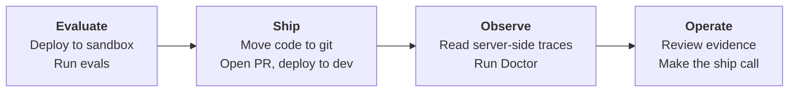

# Hosted agent tutorial

Use this tutorial when your agent is a **Foundry Hosted Agent**. Foundry runs
the agent for you as a managed runtime, so you deploy code and Foundry serves
it behind a stable endpoint. The worked example is a small Travel Agent, and you
use AgentOps to add a PR gate that catches regressions before merge, a dev
deploy, Doctor evidence, and Cockpit.

A hosted agent is not an HTTP agent. With an HTTP agent you run the web server
yourself and wire the telemetry by hand. With a hosted agent the Foundry runtime
serves the request and emits the trace for you, so `invoke_agent` spans show up
in Application Insights without any `configure_azure_monitor` call in your code.
If your agent runs as a URL service you operate yourself, use the
[HTTP agent tutorial](tutorial-http-agent.md) instead.

You will do four things:

1. **Evaluate** the hosted agent while you experiment in sandbox.
2. **Ship** the code through GitHub so the same reviewed commit deploys to dev.
3. **Observe** the dev run with server-side traces, telemetry, and Doctor findings.
4. **Operate** with release evidence, thresholds, and a Cockpit summary.



The idea is simple: sandbox is for trying things, Git is the source of truth,
and CI evaluates the PR candidate against the dev endpoint before anything is
promoted. If Doctor finds a critical regression, the PR should not ship.

## Before you run the tutorial

Run through this once before a live walkthrough, grouped by area, so the demo
stays on the Foundry plus AgentOps flow instead of permission prompts.

**Foundry projects**

- A Foundry project with a deployed model (for example `gpt-4o-mini`) and the Hosted Agent permissions your user or project identity needs to create and deploy a hosted agent.
- Application Insights connected to the project, with Reader granted to the project's managed identity. This powers the server-side traces and telemetry that make the Observe step real.

**Azure**

- Azure CLI installed and `az login` working on the tenant that owns the project.
- An Entra app registration with federated credentials, or an admin ready to provide the client, tenant, and subscription id, for the CI deploy.

**GitHub**

- Push access to the tutorial repo and permission to run GitHub Actions.
- GitHub environments named `sandbox` and `dev` for Azure auth and Foundry endpoints.
- `gh auth login` authenticated for the PR commands.

**Tooling**

- The [Foundry Toolkit for Visual Studio Code](https://marketplace.visualstudio.com/items?itemName=TeamsDevApp.vscode-ai-foundry) installed, so you can create and deploy the hosted agent from the command palette.
- Your coding-agent CLI (Copilot or similar) signed in before you run AgentOps skills, so it can read the repo and propose the GitHub and Azure setup.

## What happens in this tutorial

One commit moves through four stages. Use this as a checklist:

| Stage | What it means |
|---|---|
| **Deploy to sandbox** | Create the hosted agent, deploy it to a sandbox endpoint, and try it. |
| **Move code** | Keep the agent source in Git, which becomes the source of truth. |
| **Create dev environment** | Leave dev empty. CI reads the AgentOps config and deploys the dev hosted agent from the merged commit. |
| **Block regressions** | CI evaluates the PR candidate against the dev endpoint, applies thresholds, and runs Doctor. Serious regressions stop the PR. |

### Why the git SHA matters

Foundry gives each deployed hosted agent a version number that is local to its
project, so sandbox `travel-agent:2` may not match the number in dev, qa, or
prod. The stable identity across environments is the **git commit SHA** that
produced the deployed code, plus the container image tag when you containerize.

```
git commit SHA (and container image tag, if you containerize)
   │
   └─ cross-environment identity
        │
        ├── sandbox endpoint (your team sandbox deploy)
        ├── dev endpoint     (https://travel-agent-dev.example.com)
        ├── qa endpoint      (https://travel-agent-qa.example.com)
        └── prod endpoint    (https://travel-agent.example.com)
```

Each environment's endpoint URL changes, but the SHA that produced the running
code stays the same. AgentOps records the git SHA in
`.agentops/results/<timestamp>/results.json` and in release evidence, so the
eval result and the source code stay linked across environments. To check
whether dev and prod run the same code, compare git SHAs, not the Foundry
version numbers.

## 1. Create the workspace

First, create and activate a workspace folder with its own virtual environment:

```powershell
mkdir agentops-hosted-quickstart
cd agentops-hosted-quickstart
python -m venv .venv
.\.venv\Scripts\Activate.ps1
```

Then install AgentOps and confirm the CLI:

```powershell
python -m pip install agentops-accelerator
agentops --help
```

## 2. Install the skills

Install the AgentOps Copilot skills so your coding agent can read the repo and
propose the GitHub and Azure wiring for you:

```powershell
agentops skills install
```

The skills are optional for the core loop, but they make the CI and OIDC steps
much faster because the agent adapts the generated workflows to your project.

## 3. Create the hosted agent

Deploy the Travel Agent through the official Foundry Toolkit path so it runs as
a real Foundry Hosted Agent, not a service on your laptop:

1. Confirm the Foundry project has a deployed model and the required Hosted Agent permissions for your user or project identity.
2. In VS Code, open the command palette and run `Microsoft Foundry: Create a New Hosted Agent`.
3. Choose a single-agent template, Python or C#, and the model deployment.
4. Give the agent Travel Agent behavior: plan short trips from a free-text request, with a day-by-day itinerary and a few concrete suggestions.
5. Press F5 to debug locally with Agent Inspector and confirm it answers.
6. Run `Microsoft Foundry: Deploy Hosted Agent` from the command palette.
7. Copy the deployed endpoint URL from the Foundry Toolkit or the Foundry portal.

Store the sandbox endpoint so the AgentOps commands can reach it:

```powershell
$env:TRAVEL_AGENT_ENDPOINT = "https://<your-foundry-hosted-travel-agent-endpoint>"
```

This deployed endpoint is your **sandbox** for the tutorial. Later you add a
separate **dev** endpoint that CI evaluates on every PR.

## 4. Try the agent

Send a request to the deployed endpoint to confirm it responds before you wire
evaluation around it. Use the shape your hosted agent expects; a Responses API
hosted agent takes an input string and returns an output message.

Once you get a sensible itinerary back, you are ready to evaluate it.

## 5. Create the dataset

Create a small smoke dataset that AgentOps replays against the endpoint:

```powershell
mkdir .agentops\data
```

Create `.agentops\data\travel-smoke.jsonl` with three cases, one JSON object per
line:

```json
{"message": "Plan a 3-day first-time trip to Lisbon for a couple who likes food and history."}
{"message": "Suggest a low-budget weekend in Seattle for a solo traveler who likes coffee and museums."}
{"message": "I want to visit Tokyo for 5 days with two kids. What should we do?"}
```

Keep the dataset small and safe. It is the input AgentOps sends to the endpoint
on every eval run, so three representative prompts are enough to catch a
regression.

## 6. Initialize AgentOps

Run the wizard and point it at the hosted endpoint:

```powershell
agentops init
```

Answer the prompts as the wizard asks them:

| Prompt | Answer |
|---|---|
| Foundry project endpoint | `https://<resource>.services.ai.azure.com/api/projects/<project>` |
| Agent | The value in `$env:TRAVEL_AGENT_ENDPOINT` |
| Dataset path | `.agentops/data/travel-smoke.jsonl` |

Then edit `agentops.yaml` so AgentOps knows how to call the hosted endpoint. A
Foundry Hosted Agent that follows the Responses API shape uses
`protocol: responses`:

```yaml
version: 1
agent: https://<your-foundry-hosted-travel-agent-endpoint>
dataset: .agentops/data/travel-smoke.jsonl
protocol: responses
```

If the deployed endpoint is protected by a bearer token, add the environment
variable that holds it:

```yaml
auth_header_env: HOSTED_AGENT_TOKEN
```

The wizard writes local Azure values to `.agentops/.env` so they stay out of
source control while eval, Doctor, and Cockpit commands resolve the same
workspace. The Foundry project endpoint lives there, not in `agentops.yaml`.
Later runtime commands discover the connected App Insights resource through the
Azure AI Projects SDK. If the project has no resource attached, or your identity
cannot read it, run
`agentops init --appinsights-connection-string "<connection-string>"`.

## 7. Check the selected eval runner

```powershell
agentops workflow analyze --format text
```

For hosted endpoints, AgentOps recommends local eval:

```text
Recommendation
  deploy          placeholder
  evaluate        AgentOps local eval
  workflow edits  needed - review project-specific build/deploy steps
  Copilot skills  installed - available for workflow adaptation handoff
```

That is expected. A hosted endpoint is evaluated with AgentOps local eval so the
repo can invoke the endpoint, normalize results, apply thresholds, and keep a
stable `results.json` contract, in sandbox and in CI alike.

## 8. Run a local eval

Replay the dataset against the sandbox endpoint and score it:

```powershell
agentops eval run
```

AgentOps calls the endpoint for each dataset row, records the responses, applies
the configured evaluators and thresholds, and writes the result under
`.agentops/results/<timestamp>/results.json` with the git SHA attached. This is
the same command CI runs on the PR candidate later, so a green run here means
the gate has a working baseline.

## 9. Observe the endpoint in App Insights

This is where a hosted agent pays off. Because the Foundry runtime serves the
request, it emits the trace for you. You do not add `configure_azure_monitor` or
manual spans to the agent code. Spend a minute in the observability surfaces:

| Foundry / Azure surface | What to show | Why it matters |
|---|---|---|
| Hosted agent page | The deployed endpoint that `agentops.yaml` calls. | Connects the repo target to the runtime being observed. |
| Agent Traces | A recent request: Trace ID, the `invoke_agent` span, input and output, latency, the model call, and tool calls when present. | The server-side trace an HTTP sample cannot emit for free. |
| Operate overview | Aggregate latency, failures, and usage, plus Ask AI when available. | Shows service health beyond one request. |
| Application Insights Logs | KQL for the same operation or trace ID. | The raw Azure Monitor drilldown path. |

To pull the same request from Application Insights **Logs**, filter on the
operation and wait a couple of minutes if telemetry is not visible yet:

```kusto
dependencies
| where timestamp > ago(1h)
| where name has "invoke_agent"
| project timestamp, operation_Id, name, duration, customDimensions
| order by timestamp desc
```

The division of labor is the same as the prompt-agent tutorial: Foundry and
Azure Monitor run live observability; AgentOps checks whether those signals are
wired into eval gates, Doctor findings, Cockpit, and release evidence.

## 10. Force a regression, compare, then fix it

Prove the gate works. Change the agent behavior so an answer gets worse (for
example, drop the day-by-day itinerary from the instructions), redeploy it to
sandbox, and rerun the eval:

```powershell
agentops eval run
```

Then compare the two runs:

```powershell
agentops eval compare
```

The compare report shows the delta between the good baseline and the regressed
run, with the git SHA on each side. Restore the itinerary behavior, redeploy,
and run `agentops eval run` again to confirm the score recovers. This is the
exact signal CI uses to stop a bad PR.

## 11. Add a dev environment

Sandbox is your author-side deploy. Add a separate dev endpoint that CI
evaluates on every PR. Deploy a second hosted agent (or a second revision) and
record its endpoint in a dev env file so the sandbox and dev URLs stay
independent. Each environment maps to its own env file with its own
`TRAVEL_AGENT_ENDPOINT`.

Leave dev empty at first if you prefer. CI reads the AgentOps config and deploys
the dev hosted agent from the merged commit, so the deployed code always matches
a known git SHA.

## 12. Generate the workflows

Let AgentOps generate the PR gate and deploy workflows:

```powershell
agentops workflow generate
```

This writes GitHub Actions workflow files under `.github/workflows/`. The PR
gate runs `agentops eval run` against the dev endpoint and fails the check on a
regression. The deploy workflow updates the dev hosted agent on merge. Review
the generated files and fill in the project-specific build and deploy steps the
analyzer flagged.

## 13. Wire CI and OIDC

Point the workflows at your default branch and give CI a way to authenticate to
Azure without secrets. Use the Entra app registration with federated
credentials so the workflow gets a short-lived token through OIDC, and set the
`sandbox` and `dev` GitHub environments with the Foundry endpoints and the
Azure client, tenant, and subscription id. The AgentOps skills can adapt the
generated workflows to your exact project if they are installed.

## 14. First green PR

Open a pull request with a small change. CI evaluates the PR candidate against
the dev endpoint, applies the thresholds, and runs Doctor. When the gate is
green, merge it. The deploy workflow updates the dev hosted agent from the
merged commit, so the running code and the git SHA stay in lockstep.

## 15. Build the evidence pack

Collect the release evidence that ties a deploy to a known-good evaluation and a
git SHA:

```powershell
agentops doctor --workspace . --evidence-pack
```

Doctor writes the pack to `.agentops/release/latest/evidence.md` (and a JSON
sibling) with the git SHA, the eval result, and the readiness findings. This is
what you cite when someone asks which release is in production and whether it
passed its gate.

## 16. Open Cockpit

Read the whole loop in one place:

```powershell
agentops cockpit
```

Cockpit shows the latest eval, the Doctor findings, and the release evidence for
the workspace, so you can make the ship call from a single summary instead of
five browser tabs.

## What you walk away knowing

- A hosted agent is served by the Foundry runtime, so `invoke_agent` traces reach App Insights without any instrumentation code in the agent.
- The git commit SHA is the stable identity across sandbox, dev, qa, and prod, because Foundry version numbers are local to each project.
- AgentOps evaluates the hosted endpoint with local eval, keeps a stable `results.json` contract, and blocks regressions in CI.
- Doctor evidence and Cockpit tie a deploy to a passing evaluation and a git SHA, so release decisions are grounded in signals, not vibes.

### Where to go next

- [HTTP agent tutorial](tutorial-http-agent.md): when you operate the web server yourself and wire client-side instrumentation.
- [Prompt agent tutorial](tutorial-prompt-agent.md): when your agent is a Foundry-managed prompt referenced as `name:version`.
- [Operate](operate.md): release evidence, thresholds, and the deploy record.

## Repos and skills used

- [Azure/agentops](https://github.com/Azure/agentops): the AgentOps Accelerator toolkit and CLI.
- [Foundry Toolkit for Visual Studio Code](https://marketplace.visualstudio.com/items?itemName=TeamsDevApp.vscode-ai-foundry): create, debug, and deploy the hosted agent.
