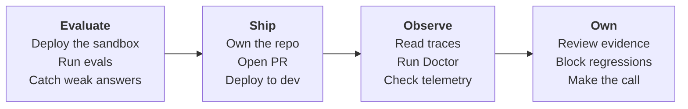

# HTTP agent to dev

Use this tutorial when your agent runs as an HTTP service behind a URL, not as a
Foundry-managed prompt agent. The worked example is the GPT-RAG orchestrator
deployed by the `Azure/gpt-rag` template, which runs its `maf_lite` strategy as a
FastAPI app inside an Azure Container App. You deploy it, take ownership of the
cloned orchestrator, and add an AgentOps PR gate that evaluates the HTTP endpoint
before merge.

The path is the same sandbox to dev story as the other tutorials, adapted for an
endpoint-based agent:



Sandbox is the environment you deploy first and experiment against. Dev is the
shared environment CI deploys and evaluates on every PR. The PR gate proves the
deployed HTTP endpoint still passes your thresholds before a merge ships it.

!!! info "HTTP agent vs Foundry prompt agent"
    A Foundry prompt agent is referenced as `name:version` and hosted by
    Foundry. An HTTP agent is any service you call at a URL. The GPT-RAG
    orchestrator answers over HTTP because `maf_lite` is its default strategy,
    so you evaluate it by posting requests to its endpoint, not by staging a
    prompt version.

## Before you run the tutorial

Have these ready once, so the walkthrough stays on the deploy and evaluate flow
instead of permission prompts.

- Azure Developer CLI (`azd`) and Azure CLI (`az`), both signed in to the
  subscription and tenant that will host the deployment.
- The Copilot CLI with the `agentops` and `microsoft-foundry` skills installed,
  so the agent can read the repo and propose the GitHub and Azure setup steps.
- Permission to create resources in the target subscription, and push access to
  a GitHub repository you control for the orchestrator.
- A Foundry project with a chat-capable deployment for the judge model that
  AgentOps uses to score answers. See [Evaluation](evaluation.md) for how
  scoring works.

## 1. Deploy the sandbox

Create the GPT-RAG workspace from the template. The first azd environment is your
sandbox.

```powershell
azd init -t Azure/gpt-rag
```

Name the environment `sandbox` when prompted, then set the required values:

```powershell
azd env set AZURE_LOCATION <region>
azd env set AZURE_SUBSCRIPTION_ID <subscription-id>
```

Provision and deploy everything:

```powershell
azd up
```

!!! info "What the deploy does"
    A predeploy hook reads `manifest.json` and clones each component from
    upstream. The orchestrator is cloned into a sibling `gpt-rag-orchestrator`
    directory, pinned to tag `v2.8.6`, and built into a container image. Because
    `maf_lite` is the orchestrator's default strategy, the deployed orchestrator
    answers over HTTP at `POST /orchestrator`.

## 2. Stand up a dev environment

Create a second environment in the same checkout, set its values, and deploy it.

```powershell
azd env new dev
azd env set AZURE_LOCATION <region>
azd env set AZURE_SUBSCRIPTION_ID <subscription-id>
azd up
```

!!! info "Why a separate dev environment"
    The PR gate must evaluate a deployed target that is not your sandbox
    playground. Dev is the environment CI deploys and evaluates on every PR, so
    a passing gate means the reviewed change is healthy in a real deployment.
    See [Ship](ship.md) and [Evaluation](evaluation.md) for the release
    contract and scoring depth.

## 3. Take ownership of the cloned orchestrator

The agent you evaluate lives in the cloned orchestrator, so work from that
directory.

```powershell
cd ../gpt-rag-orchestrator
git remote -v
```

You will see `origin` pointing at the upstream project, checked out at the pinned
tag in a detached state:

```text
origin  https://github.com/azure/gpt-rag-orchestrator.git (fetch)
origin  https://github.com/azure/gpt-rag-orchestrator.git (push)
```

!!! warning "This intentionally disconnects from upstream"
    This tutorial makes the orchestrator your own service to evaluate and
    deploy. Removing `origin` detaches it from the GPT-RAG open source project
    so your commits and CI never target upstream. Do this only in your own copy.

Remove the upstream remote and start your own history:

```powershell
git remote remove origin
git checkout -b main
git add -A
git commit -m "Vendor gpt-rag-orchestrator (maf_lite) for AgentOps"
```

Then create your repository and push it with the GitHub CLI:

```powershell
gh repo create <owner>/gpt-rag-orchestrator --private --source . --push
```

!!! note "The clone is shallow"
    The predeploy hook clones with `--depth 1`, so you only have the pinned
    commit. `git checkout -b main` simply names a branch at that commit, which
    is all you need to make it your own repo.

## 4. Initialize AgentOps against the maf_lite endpoint

The orchestrator streams its answers, so first add a small evaluation route, then
point AgentOps at it.

!!! info "The orchestrator streams, AgentOps expects JSON"
    `POST /orchestrator` returns Server-Sent Events (`text/event-stream`): a
    conversation id followed by streamed answer chunks. AgentOps `http-json`
    sends one JSON request and parses one JSON response, so it cannot read the
    SSE stream directly. You add a tiny non-streaming route that returns the
    final answer as JSON.

Add the evaluation route. It reuses the real `Orchestrator`, collects the streamed
chunks, drops the leading conversation id, and returns the answer as JSON:

```
edit src/eval_adapter.py
```

```python
import os
from typing import Optional

from fastapi import APIRouter, Header, HTTPException
from pydantic import BaseModel

from orchestration.orchestrator import Orchestrator

router = APIRouter()


class EvalRequest(BaseModel):
    ask: str


@router.post("/orchestrator/eval")
async def orchestrator_eval(
    body: EvalRequest,
    authorization: Optional[str] = Header(None, alias="Authorization"),
):
    expected = os.getenv("AGENTOPS_EVAL_TOKEN", "")
    token = (authorization or "").removeprefix("Bearer ").strip()
    if not expected or token != expected:
        raise HTTPException(status_code=401, detail="Invalid eval token")

    orchestrator = await Orchestrator.create()
    chunks = [chunk async for chunk in orchestrator.stream_response(body.ask)]
    # stream_response yields "<conversation_id> " first, then the answer chunks.
    answer = "".join(chunks[1:]).strip()
    return {"text": answer}
```

Register the route on the FastAPI app. Add these lines next to the other app
wiring in `main.py`:

```
edit src/main.py
```

```python
from eval_adapter import router as eval_router

app.include_router(eval_router)
```

!!! note "Why a separate token"
    The production `POST /orchestrator` route authenticates with
    `dapr-api-token` or `X-API-KEY`, or skips auth when `DISABLE_AUTH=true`. The
    eval route uses its own `AGENTOPS_EVAL_TOKEN` so evaluation traffic is
    scoped and you never commit the production key. Set `AGENTOPS_EVAL_TOKEN` as
    an environment variable on the dev orchestrator Container App, then redeploy
    the orchestrator so the route can validate it.

Get the dev orchestrator URL. The Container App name and endpoint are stored in
the deployment's App Configuration as `ORCHESTRATOR_APP_NAME` and
`ORCHESTRATOR_APP_ENDPOINT`; you can also read the ingress host directly:

```powershell
az containerapp show -n <ORCHESTRATOR_APP_NAME> -g <resource-group> --query properties.configuration.ingress.fqdn -o tsv
```

Export the same eval token locally so AgentOps can send it:

```powershell
$env:AGENTOPS_EVAL_TOKEN = "<a-strong-random-value>"
```

Sign in and run the wizard inside the orchestrator repo:

```powershell
az login
agentops init
```

Answer the prompts with the dev orchestrator values:

| Prompt | Answer |
|---|---|
| Foundry project endpoint | The dev Foundry project endpoint for the judge model, or press Enter to set it later. |
| Agent | The dev eval URL, for example `https://<orchestrator-fqdn>/orchestrator/eval`. |
| Dataset path | `.agentops/data/travel-smoke.jsonl` |

Then edit `agentops.yaml` so AgentOps calls the eval route correctly:

```
edit agentops.yaml
```

```yaml
version: 1
agent: https://<orchestrator-fqdn>/orchestrator/eval
dataset: .agentops/data/travel-smoke.jsonl
protocol: http-json
request_field: ask
response_field: text
auth_header_env: AGENTOPS_EVAL_TOKEN
```

| Field | What it does |
|---|---|
| `agent` | The dev eval URL AgentOps calls with `POST`. |
| `protocol: http-json` | Send one JSON request and parse one JSON response. |
| `request_field: ask` | Put each dataset input under the `ask` key, matching the orchestrator's own field name. |
| `response_field: text` | Read the answer from the `text` key the eval route returns. |
| `auth_header_env: AGENTOPS_EVAL_TOKEN` | Read this env var and send `Authorization: Bearer <token>`. |

!!! note "How AgentOps calls the endpoint"
    AgentOps posts `{"ask": "<input>"}` with `Content-Type: application/json`
    and the bearer header from `AGENTOPS_EVAL_TOKEN`, then reads `text` from the
    JSON body. If `text` is absent it falls back to `response`, `output`,
    `content`, then `message`. The defaults are `request_field: message` and
    `response_field: text`; you set `request_field` to `ask` because that is the
    orchestrator's vocabulary.

## 5. Create the eval dataset

Create a small JSONL dataset that exercises grounded retrieval behavior. Each row
is one line of JSON.

```
edit .agentops/data/travel-smoke.jsonl
```

```json
{"input":"What is our standard refund window for online orders?","expected":"A grounded answer that states the refund window from the indexed policy documents and does not invent a number when the source is unclear."}
{"input":"Summarize the onboarding steps for a new field technician.","expected":"A concise, ordered summary drawn from the indexed onboarding material, covering the main steps and citing or referring to the source content."}
{"input":"Who won the 2031 world championship?","expected":"A clear statement that the indexed knowledge base does not contain this information, with no fabricated answer."}
```

!!! note "input maps to ask"
    AgentOps reads the `input` field from each row and sends it as `ask`. The
    `expected` values are acceptance criteria for judge-based scoring, not exact
    answer strings, so write them as reviewable behavior.

## 6. Run evals locally against the sandbox

With the dataset and target set, run the gate from the orchestrator repo:

```powershell
agentops eval run
```

You should see a `Threshold status` line and normalized output written under
`.agentops/results/latest/`.

!!! info "What eval run checks"
    It sends each dataset row to the eval URL, scores the responses with the
    judge model, applies your thresholds, and writes `results.json` and
    `report.md`. It exits zero when thresholds pass and non-zero when a
    threshold fails or the endpoint errors, which is exactly what lets the PR
    gate block a merge. See [Evaluation](evaluation.md) for thresholds and
    metric concepts.

## 7. Generate the PR + dev deploy workflows

Generate the PR gate and the dev deploy workflow. The orchestrator has its own
`azure.yaml`, so the deploy mode is `azd`.

```powershell
agentops workflow generate --kinds pr,dev --deploy-mode azd --doctor-gate critical --force
```

| Flag | What it does |
|---|---|
| `--kinds pr,dev` | Generate both the PR gate and the dev deploy workflow. |
| `--deploy-mode azd` | Deploy through the orchestrator's azd project, running `azd provision` and `azd deploy`. |
| `--doctor-gate critical` | Fail the PR only on critical Doctor findings. |
| `--force` | Overwrite existing workflow files. |

!!! info "What the PR gate does"
    The generated PR workflow runs `agentops eval run` against the dev eval URL
    from `agentops.yaml`, applies your thresholds, then runs Doctor with
    `--severity-fail critical`. A failing threshold or a critical finding blocks
    the merge. See [Ship](ship.md) for the OIDC, RBAC, and GitHub environment
    wiring instead of reproducing it here.

## 8. Ship, observe, and own

The repo now carries everything CI needs. Close the loop with the same three
section pages the other tutorials use.

```powershell
agentops doctor --evidence-pack
```

- **Ship.** Push the repo, configure the `dev` GitHub environment and Azure
  OIDC, and open a PR so the gate runs against the dev endpoint. See
  [Ship](ship.md).
- **Observe.** Read traces, telemetry, and Doctor findings for the dev run. See
  [Observe](observe.md).
- **Own.** Review the evidence pack, decide ship or no-ship, and open Cockpit for
  a single readiness view with `agentops cockpit --workspace .`. See
  [Own](own.md).

## What you walk away knowing

- You can tell an HTTP agent apart from a Foundry prompt agent, and why the
  GPT-RAG orchestrator is the former.
- You deployed the GPT-RAG template into a sandbox and a dev environment, and you
  know why the PR gate evaluates dev rather than sandbox.
- You took ownership of the cloned orchestrator by removing the upstream remote
  and starting your own repository.
- You bridged the orchestrator's SSE stream to AgentOps `http-json` with a small
  JSON eval route, and you can map `ask` and `text` to the real request and
  response shape.
- You ran local evals against the deployed endpoint and generated a PR gate that
  blocks regressions before they merge.
