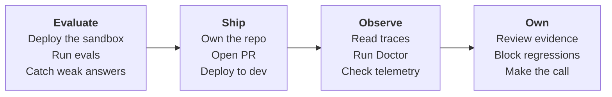

# HTTP agent to dev

Use this tutorial when your agent runs as an HTTP service behind a URL, not as a
Foundry-managed prompt agent. The worked example is the GPT-RAG orchestrator
deployed by the `Azure/gpt-rag` template, which runs its `maf_lite` strategy as a
FastAPI app inside an Azure Container App. You deploy it, take ownership of the
cloned orchestrator, and add an AgentOps PR gate that evaluates the HTTP endpoint
before merge.

The path is the same sandbox to dev story as the other tutorials, adapted for an
endpoint-based agent:



Sandbox is the environment you deploy first and experiment against. Dev is the
shared environment CI deploys and evaluates on every PR. The PR gate proves the
deployed HTTP endpoint still passes your thresholds before a merge ships it.

!!! info "HTTP agent vs Foundry prompt agent"
    A Foundry prompt agent is referenced as `name:version` and hosted by
    Foundry. An HTTP agent is any service you call at a URL. The GPT-RAG
    orchestrator answers over HTTP because `maf_lite` is its default strategy,
    so you evaluate it by posting requests to its endpoint, not by staging a
    prompt version.

## Before you run the tutorial

Have these ready once, so the walkthrough stays on the deploy and evaluate flow
instead of permission prompts.

- Azure Developer CLI (`azd`) and Azure CLI (`az`), both signed in to the
  subscription and tenant that will host the deployment.
- The Copilot CLI with the `agentops` and `microsoft-foundry` skills installed,
  so the agent can read the repo and propose the GitHub and Azure setup steps.
- Permission to create resources in the target subscription, and push access to
  a GitHub repository you control for the orchestrator.
- A Foundry project with a chat-capable deployment for the judge model that
  AgentOps uses to score answers. See [Evaluation](evaluation.md) for how
  scoring works.

## 1. Deploy the sandbox

Create the GPT-RAG workspace from the template. The first azd environment is your
sandbox.

```powershell
azd init -t Azure/gpt-rag
```

Name the environment `sandbox` when prompted, then set the required values:

```powershell
azd env set AZURE_LOCATION <region>
azd env set AZURE_SUBSCRIPTION_ID <subscription-id>
```

Provision and deploy everything:

```powershell
azd up
```

!!! info "What the deploy does"
    A predeploy hook reads `manifest.json` and clones each component from
    upstream. The orchestrator is cloned into a sibling `gpt-rag-orchestrator`
    directory, pinned to tag `v2.8.6`, and built into a container image. Because
    `maf_lite` is the orchestrator's default strategy, the deployed orchestrator
    answers over HTTP at `POST /orchestrator`.

## 2. Stand up a dev environment

Create a second environment in the same checkout, set its values, and deploy it.

```powershell
azd env new dev
azd env set AZURE_LOCATION <region>
azd env set AZURE_SUBSCRIPTION_ID <subscription-id>
azd up
```

!!! info "Why a separate dev environment"
    The PR gate must evaluate a deployed target that is not your sandbox
    playground. Dev is the environment CI deploys and evaluates on every PR, so
    a passing gate means the reviewed change is healthy in a real deployment.
    See [Ship](ship.md) and [Evaluation](evaluation.md) for the release
    contract and scoring depth.

## 3. Index a document so the agent has something to answer

Your agent grounds its answers on indexed content, so give it one document to
work with. This tutorial uses a short sample manual.

[Download the sample document](media/how-works-a-volkswagen.pdf) is a 10-page
"How Works a Volkswagen" manual. Save it locally.

Index it into the knowledge base behind the environment you will evaluate. With
the GPT-RAG template that is the `documents` blob container in that environment's
storage account; dropping a file there triggers ingestion, which chunks, embeds,
and indexes it into Azure AI Search:

```powershell
az storage blob upload `
  --account-name <storage-account> `
  --container-name documents `
  --file "how-works-a-volkswagen.pdf" `
  --name "how-works-a-volkswagen.pdf" `
  --auth-mode login
```

Ingestion runs in the background, so give it a couple of minutes before you
expect grounded answers.

!!! note "Any knowledge base works the same way"
    The only thing that matters is that your agent has indexed content to ground
    on. If your agent reads a different store, index the document there instead.
    The rest of the tutorial just assumes the agent can answer questions about
    this document.

## 4. Take ownership of the cloned orchestrator

The agent you evaluate lives in the cloned orchestrator, so work from that
directory.

```powershell
cd ../gpt-rag-orchestrator
git remote -v
```

You will see `origin` pointing at the upstream project, checked out at the pinned
tag in a detached state:

```text
origin  https://github.com/azure/gpt-rag-orchestrator.git (fetch)
origin  https://github.com/azure/gpt-rag-orchestrator.git (push)
```

!!! warning "This intentionally disconnects from upstream"
    This tutorial makes the orchestrator your own service to evaluate and
    deploy. Removing `origin` detaches it from the GPT-RAG open source project
    so your commits and CI never target upstream. Do this only in your own copy.

Remove the upstream remote and start your own history:

```powershell
git remote remove origin
git checkout -b main
git add -A
git commit -m "Vendor gpt-rag-orchestrator (maf_lite) for AgentOps"
```

Then create your repository and push it with the GitHub CLI:

```powershell
gh repo create <owner>/gpt-rag-orchestrator --private --source . --push
```

!!! note "The clone is shallow"
    The predeploy hook clones with `--depth 1`, so you only have the pinned
    commit. `git checkout -b main` simply names a branch at that commit, which
    is all you need to make it your own repo.

!!! tip "Ignore the upstream evaluations and pipelines"
    The vendored orchestrator ships its own `evaluations/` and `dataset/`
    folders and its own CI under `.github/workflows/` (`pr_pipeline.yaml`,
    `cicd_pipeline.yaml`, `block-pr-to-main.yml`). Those belong to the upstream
    project. Since you are building your own copy, you can ignore or delete them.
    AgentOps gives you your own eval dataset (Section 6) and generates your own
    workflows (Section 9), so nothing here depends on the orchestrator's.

    ```powershell
    # optional: remove the inherited eval pipeline and CI so only AgentOps runs
    Remove-Item -Recurse -Force evaluations
    Remove-Item -Force .github/workflows/pr_pipeline.yaml, .github/workflows/cicd_pipeline.yaml, .github/workflows/block-pr-to-main.yml
    ```

## 5. Initialize AgentOps against the maf_lite endpoint

The orchestrator streams its answers as Server-Sent Events, and AgentOps reads
streamed responses natively, so you point it straight at `POST /orchestrator`.
No adapter route is needed.

!!! info "The orchestrator streams, AgentOps reads it natively"
    `POST /orchestrator` returns Server-Sent Events (`text/event-stream`): a
    conversation id followed by streamed answer chunks. AgentOps `http-json`
    reads the stream when you set `response_mode: text`, drops the leading
    conversation id, and scores the final answer. This needs AgentOps 0.4.4 or
    newer.

Get the dev orchestrator URL. The Container App name and endpoint are stored in
the deployment's App Configuration as `ORCHESTRATOR_APP_NAME` and
`ORCHESTRATOR_APP_ENDPOINT`; you can also read the ingress host directly:

```powershell
az containerapp show -n <ORCHESTRATOR_APP_NAME> -g <resource-group> --query properties.configuration.ingress.fqdn -o tsv
```

The `POST /orchestrator` route authenticates with a shared secret sent as the
`X-API-KEY` header (or skips auth when `DISABLE_AUTH=true` on dev). Export the
dev orchestrator key locally so AgentOps can send it. The key is the
deployment's `ORCHESTRATOR_APP_APIKEY`; never commit it:

```powershell
$env:ORCHESTRATOR_APP_APIKEY = "<dev-orchestrator-api-key>"
```

Sign in and run the wizard inside the orchestrator repo:

```powershell
az login
agentops init
```

Answer the prompts with the dev orchestrator values:

| Prompt | Answer |
|---|---|
| Foundry project endpoint | The dev Foundry project endpoint for the judge model, or press Enter to set it later. |
| Agent | The dev orchestrator URL, for example `https://<orchestrator-fqdn>/orchestrator`. |
| Dataset path | `.agentops/data/vw-smoke.jsonl` |

Then edit `agentops.yaml` so AgentOps reads the streamed response correctly:

```
edit agentops.yaml
```

```yaml
version: 1
agent: https://<orchestrator-fqdn>/orchestrator
dataset: .agentops/data/vw-smoke.jsonl
protocol: http-json
request_field: ask
response_mode: text
stream:
  strip_leading_token: true
auth_header_name: X-API-KEY
auth_value_template: "{token}"
auth_header_env: ORCHESTRATOR_APP_APIKEY
evaluators:
  relevance: ">=3"
  coherence: ">=3"
```

| Field | What it does |
|---|---|
| `agent` | The dev orchestrator URL AgentOps calls with `POST`. |
| `protocol: http-json` | Send one JSON request; here AgentOps reads a streamed response. |
| `request_field: ask` | Put each dataset input under the `ask` key, matching the orchestrator's own field name. |
| `response_mode: text` | Read the `text/event-stream` body and aggregate it into one answer instead of parsing a single JSON body. |
| `stream.strip_leading_token: true` | Drop the leading conversation id the orchestrator emits as its first chunk. |
| `auth_header_name: X-API-KEY` | Send the shared secret in the `X-API-KEY` header instead of `Authorization`. |
| `auth_value_template: "{token}"` | Send the raw token as the header value, with no `Bearer ` prefix. |
| `auth_header_env: ORCHESTRATOR_APP_APIKEY` | Read the secret from this env var; nothing is written to `agentops.yaml`. |
| `evaluators.relevance` / `evaluators.coherence` | Score each answer for on-topic relevance and readable coherence, requiring at least 3 out of 5. This smoke-core checks the agent answers sensibly, not that it is grounded. |

!!! note "How AgentOps calls the endpoint"
    AgentOps posts `{"ask": "<input>"}` with `Content-Type: application/json` and
    the `X-API-KEY` header from `ORCHESTRATOR_APP_APIKEY`, reads the streamed
    `text/event-stream` response, drops the leading conversation id, and scores
    the aggregated answer. The default `request_field` is `message`; you set it
    to `ask` because that is the orchestrator's vocabulary. If your endpoint
    emits structured `data:` JSON frames instead of raw text, set
    `response_mode: sse` and add `stream.text_field` to point at the token text.

## 6. Create the eval dataset

Create a small JSONL dataset grounded in the document you indexed. Each row is
one line of JSON: an `input` to ask and an `expected` describing the behavior you
want.

```
edit .agentops/data/vw-smoke.jsonl
```

```json
{"input":"How does the Volkswagen's horn complete its electrical circuit?","expected":"Explains that the ground wire runs up through the hollow steering rod to the horn button to complete the circuit. On topic and consistent with the manual."}
{"input":"Why does the car need a differential?","expected":"Explains that the differential lets the two driven wheels turn at different speeds when cornering, because the outer wheel travels a longer path than the inner one. Clear and on topic."}
{"input":"In the four-cycle engine, how often does each cylinder fire?","expected":"States that each cylinder fires once every two revolutions of the crankshaft. Concise and on topic."}
{"input":"What is the 0 to 100 km/h time of the latest electric Volkswagen ID.4?","expected":"Makes clear the indexed document does not cover modern electric models and does not invent a figure."}
```

!!! note "input maps to ask"
    AgentOps reads the `input` field from each row and sends it as `ask`. The
    `expected` values are acceptance criteria for judge-based scoring, not exact
    answer strings, so write them as reviewable behavior.

!!! warning "Smoke-core is relevance and coherence, not groundedness"
    The endpoint returns only the final text, not the retrieved context, so the
    judge cannot measure true groundedness here. This smoke-core scores relevance
    and coherence: the answer is on topic and reads sensibly. The first three rows
    should pass once the document is indexed; the last row checks that the agent
    refuses to invent facts the source does not contain. To measure real
    groundedness, evaluate a target that also returns its retrieved context. See
    [Evaluation](evaluation.md).

## 7. Run evals locally against the sandbox

With the dataset and target set, run the gate from the orchestrator repo:

```powershell
agentops eval run
```

You should see a `Threshold status` line and normalized output written under
`.agentops/results/latest/`.

!!! info "What eval run checks"
    It sends each dataset row to the orchestrator endpoint, scores the responses with the
    judge model, applies your thresholds, and writes `results.json` and
    `report.md`. It exits zero when thresholds pass and non-zero when a
    threshold fails or the endpoint errors, which is exactly what lets the PR
    gate block a merge. See [Evaluation](evaluation.md) for thresholds and
    metric concepts.

## 8. See your evals and traces

Two views show what actually happened, and you want both.

**Per-row evidence (local).** Every run writes normalized output under
`.agentops/results/latest/`. Open `report.md` to read each input, the aggregated
answer, the judge scores, and pass or fail against your thresholds:

```powershell
code .agentops/results/latest/report.md
```

**Runtime traces (Azure Monitor / Foundry).** When an Application Insights
connection string is set, AgentOps emits `agentops.eval.*` spans for each run,
and your agent emits its own request traces. Point AgentOps at telemetry before
the run:

```powershell
$env:APPLICATIONINSIGHTS_CONNECTION_STRING = "<app-insights-connection-string>"
agentops eval run
```

Then open the traces in the Foundry project's tracing view, or query them in
Azure Monitor Logs. `agentops cockpit --workspace .` deep-links the same spans
into one readiness view.

!!! info "Eval evidence vs runtime traces"
    The local `report.md` is the fastest way to see why a row passed or failed.
    The App Insights spans are how the same runs show up in Foundry and how the
    Doctor later reads p95 latency and error rate from real traffic. See
    [Observe](observe.md).

## 9. Generate the PR + dev deploy workflows

You build your own CI here. `agentops workflow generate` writes fresh,
AgentOps-owned GitHub Actions into your repo, it does not reuse whatever CI the
upstream orchestrator shipped. The orchestrator's `azure.yaml` is used only as
the deploy project, so the deploy mode is `azd`.

```powershell
agentops workflow generate --kinds pr,dev --deploy-mode azd --doctor-gate critical --force
```

This writes two files, both prefixed `agentops-` so they never collide with the
orchestrator's existing workflows:

- `.github/workflows/agentops-pr.yml` - the PR gate (eval + Doctor).
- `.github/workflows/agentops-deploy-dev.yml` - the dev deploy workflow.

| Flag | What it does |
|---|---|
| `--kinds pr,dev` | Generate both the PR gate and the dev deploy workflow. |
| `--deploy-mode azd` | Deploy through the orchestrator's azd project, running `azd provision` and `azd deploy`. |
| `--doctor-gate critical` | Fail the PR only on critical Doctor findings. |
| `--force` | Overwrite existing AgentOps workflow files. |

!!! note "These are your workflows, not the orchestrator's"
    The generated files are yours to edit and own. If the vendored orchestrator
    still carries upstream workflows under `.github/workflows/` that you do not
    want running, delete them so only your `agentops-*` workflows fire. You can
    re-run `agentops workflow generate` any time to regenerate yours.

!!! info "What the PR gate does"
    The generated PR workflow runs `agentops eval run` against the dev orchestrator endpoint
    from `agentops.yaml`, applies your thresholds, then runs Doctor with
    `--severity-fail critical`. A failing threshold or a critical finding blocks
    the merge. See [Ship](ship.md) for the OIDC, RBAC, and GitHub environment
    wiring instead of reproducing it here.
    The generated PR workflow runs `agentops eval run` against the dev orchestrator endpoint
    from `agentops.yaml`, applies your thresholds, then runs Doctor with
    `--severity-fail critical`. A failing threshold or a critical finding blocks
    the merge. See [Ship](ship.md) for the OIDC, RBAC, and GitHub environment
    wiring instead of reproducing it here.

## 10. Ship, observe, and own

The repo now carries everything CI needs. Close the loop with the same three
section pages the other tutorials use.

```powershell
agentops doctor --evidence-pack
```

- **Ship.** Push the repo, configure the `dev` GitHub environment and Azure
  OIDC, and open a PR so the gate runs against the dev endpoint. See
  [Ship](ship.md).
- **Observe.** Read traces, telemetry, and Doctor findings for the dev run. See
  [Observe](observe.md).
- **Own.** Review the evidence pack, decide ship or no-ship, and open Cockpit for
  a single readiness view with `agentops cockpit --workspace .`. See
  [Own](own.md).

## Optional: add ASSERT and Red Team safety gates

The eval gate above checks answer quality. To also gate on safety behavior, add
the same two governance runners the Prompt Agent tutorial uses. Both feed the
same evidence pack and can fail the PR.

- **ASSERT** (`agentops assert run`) turns natural-language safety policies into
  executable behavior tests. It drives a model deployment and system prompt
  through LiteLLM, so for an HTTP agent you point it at the same model your agent
  uses and describe the agent's intended behavior.
- **Red Team** (`agentops redteam run`) runs Foundry's adversarial scan. Its
  target resolves from the YAML as a model deployment, agent, or endpoint, so it
  can scan the orchestrator endpoint directly for safety regressions.

Scaffold either one with the governance skill, which writes the correct config
and `agentops.yaml` block for your target:

```text
/skills agentops-governance
```

The full walkthrough, including config schema, thresholds, and the LiteLLM and
red-team SDK setup, is in
[Add ASSERT and Red Team to the release gate](tutorial-prompt-agent.md#12-add-assert-and-red-team-to-the-release-gate).

!!! warning "These hit live Azure services"
    Both runners call live models. Run them against a non-production deployment
    and keep the objective count small while you wire them up.

## What you walk away knowing

- You can tell an HTTP agent apart from a Foundry prompt agent, and why the
  GPT-RAG orchestrator is the former.
- You deployed the GPT-RAG template into a sandbox and a dev environment, and you
  know why the PR gate evaluates dev rather than sandbox.
- You took ownership of the cloned orchestrator by removing the upstream remote
  and starting your own repository.
- You pointed AgentOps directly at the orchestrator's streaming endpoint with
  `response_mode: text`, and you can map `ask` and `text` to the real request and
  response shape.
- You indexed a sample document, built a smoke dataset from its content, and
  scored answers on relevance and coherence, knowing why that is smoke and not
  groundedness.
- You inspected both the per-row eval evidence and the runtime traces, locally
  and in Azure Monitor or Foundry.
- You ran local evals against the deployed endpoint and generated a PR gate that
  blocks regressions before they merge, and you know where ASSERT and Red Team
  plug in when you want safety gates too.
