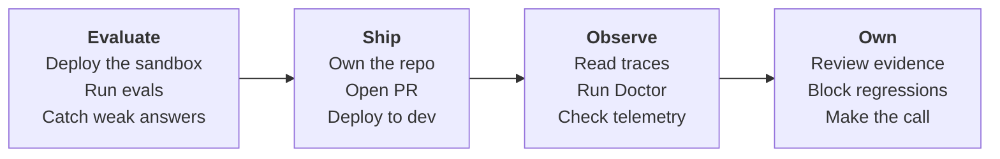

# HTTP agent to dev

Use this tutorial when your agent runs as an HTTP service behind a URL, not as a
Foundry-managed prompt agent. The worked example is the GPT-RAG orchestrator
deployed by the `Azure/gpt-rag` template. It is a FastAPI service inside an
Azure Container App, exposed at `POST /orchestrator`. You deploy it, take
ownership of the cloned orchestrator, and add an AgentOps PR gate that evaluates
the HTTP endpoint before merge.

The path is the same sandbox to dev story as the other tutorials, adapted for an
endpoint-based agent:



Use the environments this way:

| Environment | Used for | When AgentOps points at it |
|---|---|---|
| `sandbox` | Your candidate validation target: upload the sample PDF, initialize AgentOps, run local evals, and let the PR gate deploy and evaluate candidate code there. | Sections 3 through 11. |
| `dev` | The shared deployment target for the generated deploy workflow. | After merge, or by manually dispatching the dev deploy workflow. |

The important rule is: **AgentOps evals use sandbox; dev is for deployment**.

!!! info "HTTP agent vs Foundry prompt agent"
    A Foundry prompt agent is referenced as `name:version` and hosted by
    Foundry. An HTTP agent is any service you call at a URL. The GPT-RAG
    orchestrator answers over HTTP at `POST /orchestrator`, so you evaluate it
    by posting requests to that endpoint, not by staging a prompt version.

## Before you run the tutorial

Have these ready once, so the walkthrough stays on the deploy and evaluate flow
instead of permission prompts.

- Azure Developer CLI (`azd`) and Azure CLI (`az`), both signed in to the
  subscription and tenant that will host the deployment.
- The Copilot CLI signed in, so AgentOps can install its skills later and the
  agent can propose the GitHub and Azure setup steps.
- Permission to create resources in the target subscription, and push access to
  a GitHub repository you control for the orchestrator.
- A Foundry project with a chat-capable deployment for the judge model that
  AgentOps uses to score answers. See [Evaluation](evaluation.md) for how
  scoring works.

## 1. Deploy the sandbox

Create the GPT-RAG workspace from the template. The first azd environment is your
sandbox.

```powershell
azd init -t Azure/gpt-rag
```

Name the environment with a unique suffix so it does not collide with anyone
else's resource names, for example `gptrag-sandbox-2606182303` (the pattern is
`gptrag-sandbox-yymmddhhmm`).

azd downloads the template into a `gpt-rag` directory. Change into it, then set
the required values:

```powershell
cd gpt-rag
azd env set AZURE_LOCATION <region>
azd env set AZURE_SUBSCRIPTION_ID <subscription-id>
```

!!! tip "Why a unique name"
    The azd environment name seeds globally unique Azure resource names like the
    storage account. A plain `sandbox` often clashes with another deployment, so
    a timestamp suffix keeps yours distinct.

Provision and deploy everything:

```powershell
azd up
```

!!! info "What the deploy does"
    A predeploy hook reads `manifest.json` and clones each component from
    upstream. The orchestrator is cloned into a sibling `gpt-rag-orchestrator`
    directory, pinned to tag `v2.8.6`, and built into a container image. The
    deployed orchestrator answers over HTTP at `POST /orchestrator`.

## 2. Stand up a dev environment

Create a second environment in the same checkout, set its values, and deploy it.
Give it its own unique suffix, using the pattern `gptrag-dev-yymmddhhmm`.

```powershell
azd env new gptrag-dev-<yymmddhhmm>
azd env set AZURE_LOCATION <region>
azd env set AZURE_SUBSCRIPTION_ID <subscription-id>
azd up
```

!!! info "Why a separate dev environment"
    Sandbox is where the PR workflow deploys and evaluates candidate code. Dev is
    the shared deployment target updated by the generated deploy workflow after
    merge or manual dispatch.

## 3. Index a document so the agent has something to answer

Your agent grounds its answers on indexed content, so give it one document to
work with. This tutorial uses a short sample manual.

[Download the sample document](media/vw-fuel-system.pdf) is the "Fuel System"
section of a Volkswagen service manual, 28 pages covering the carbureted 1968
through 1974 models. Save it locally.

Upload it to the sandbox `documents` blob container. GPT-RAG ingests it in the
background and indexes it into Azure AI Search:

```powershell
az storage blob upload `
  --account-name <storage-account> `
  --container-name documents `
  --file "vw-fuel-system.pdf" `
  --name "vw-fuel-system.pdf" `
  --auth-mode login
```

Give ingestion a couple of minutes before testing grounded answers.

## 4. Take ownership of the cloned orchestrator

The agent you evaluate lives in the cloned orchestrator, so work from that
directory.

```powershell
cd ../gpt-rag-orchestrator
git remote -v
```

You will see `origin` pointing at the upstream project, checked out at the pinned
tag in a detached state:

```text
origin  https://github.com/azure/gpt-rag-orchestrator.git (fetch)
origin  https://github.com/azure/gpt-rag-orchestrator.git (push)
```

!!! warning "This intentionally disconnects from upstream"
    This tutorial makes the orchestrator your own service to evaluate and
    deploy. Re-initializing the git history detaches it from the GPT-RAG open
    source project so your commits and CI never target upstream. Do this only in
    your own copy.

Optionally drop the inherited eval pipeline and CI, then start your own history.
The clone is shallow on a pinned tag, so re-rooting with `git init` (instead of
committing on top of the shallow commit) is what lets the push succeed later:

```powershell
# optional: remove the inherited eval pipeline and CI so only AgentOps runs
Remove-Item -Recurse -Force evaluations
Remove-Item -Force .github/workflows/*

# start a fresh, independent history at a real root commit
Remove-Item -Recurse -Force .git
git init
git add -A
git commit -m "Initial commit: my GPT-RAG orchestrator copy"
git branch -M main
```

!!! note "What you just removed"
    Those upstream evals and workflows are not used here. AgentOps creates its
    own eval dataset and workflows later, so removing them keeps your first
    commit focused on your copy.

Then create your repository and push the `main` branch with the GitHub CLI. Pick
a name that does not collide with a fork you may already have, for example
`gpt-rag-orchestrator-agentops`:

```powershell
gh repo create <owner>/gpt-rag-orchestrator-agentops --private --source . --remote origin
git push -u origin main
```

!!! tip "Use a distinct repo name"
    `gh repo create` names a brand-new repo from the current folder, regardless
    of the local directory name. If you already keep a fork at
    `<owner>/gpt-rag-orchestrator`, give this one a different name like
    `gpt-rag-orchestrator-agentops` so your own copy stays easy to tell apart.

## 5. Install AgentOps in the orchestrator repo

From the `gpt-rag-orchestrator` directory, create a local Python environment,
install AgentOps, and install the Copilot skills:

```powershell
python -m venv .venv
.\.venv\Scripts\Activate.ps1
python -m pip install -U pip
python -m pip install agentops-accelerator
agentops --version
agentops skills install
```

## 6. Initialize AgentOps against the orchestrator endpoint

Point AgentOps straight at `POST /orchestrator`. No adapter route is needed.
This orchestrator returns `text/event-stream`, so the config below uses
`response_mode: text` and drops the leading conversation id. If your endpoint
returns normal JSON, keep the default `response_mode: json`, remove the
`stream:` block, and set `response_field` to the JSON field that contains the
answer. For the full matrix, see
[Fill `agentops.yaml` for HTTP endpoints](evaluation.md#fill-agentopsyaml-for-http-endpoints).

Use the sandbox orchestrator for local AgentOps setup and local eval runs. The
PR gate uses sandbox too. Dev is updated after merge or manual dispatch.

```powershell
# Select sandbox.
azd env select <sandbox-env-name>

# Disable the API-key guard.
$fqdn = azd env get-value CONTAINER_APP_INTERNAL_FQDN
$agent = "https://$fqdn/orchestrator"
$app = $fqdn.Split('.')[0]
$rg = azd env get-value AZURE_RESOURCE_GROUP
az containerapp update -n $app -g $rg --set-env-vars DISABLE_AUTH=true --only-show-errors --output none

# Print the endpoint.
$agent
```

!!! info "Anonymous evals"
    In this tutorial, evals call the orchestrator without a user
    `Authorization` bearer token or `X-API-KEY` header. `DISABLE_AUTH=true`
    keeps that local setup simple.

Sign in if needed, then run the wizard:

```powershell
az login
agentops init
```

Answer the prompts with the sandbox orchestrator values:

| Prompt | Answer |
|---|---|
| Foundry project endpoint | The sandbox Foundry project endpoint for the judge model, or press Enter to set it later. |
| Agent | The `$agent` URL printed above. |
| Dataset path | `.agentops/data/vw-smoke.jsonl` |

Then edit `agentops.yaml` so AgentOps matches the orchestrator request and
response shape. Do not set thresholds yet; first create the dataset so
`agentops eval init` can inspect it and recommend the right evaluators.

```
edit agentops.yaml
```

```yaml
version: 1
agent: https://<orchestrator-fqdn>/orchestrator
dataset: .agentops/data/vw-smoke.jsonl
protocol: http-json
request_field: ask
response_mode: text
stream:
  strip_leading_token: true
```

| Field | What it does |
|---|---|
| `agent` | The sandbox orchestrator URL AgentOps calls with `POST` for local eval runs. |
| `protocol: http-json` | Send one JSON request to the orchestrator. |
| `request_field: ask` | Put each dataset input under the `ask` key, matching the orchestrator's own field name. |
| `response_mode: text` | Read the `text/event-stream` body and aggregate it into one answer instead of parsing a single JSON body. |
| `stream.strip_leading_token: true` | Drop the leading conversation id the orchestrator emits as its first chunk. |
| Non-streaming JSON endpoint | Use the default `response_mode: json` and set `response_field`, for example `response_field: text`. |

!!! note "How AgentOps calls the endpoint"
    AgentOps posts `{"ask": "<input>"}` with `Content-Type: application/json` and
    no `Authorization` or `X-API-KEY` header. The orchestrator treats the request
    as anonymous, streams a `text/event-stream` response, and AgentOps drops the
    leading conversation id before scoring the aggregated answer. The default
    `request_field` is `message`; you set it to `ask` because that is the
    orchestrator's vocabulary. If your endpoint emits structured `data:` JSON
    frames instead of raw text, set `response_mode: sse` and add
    `stream.text_field` to point at the token text.

!!! tip "If you enabled API keys on purpose"
    Only add `auth_header_name`, `auth_value_template`, and `auth_header_env` if
    you deployed GPT-RAG with `useCAppAPIKey=true`. The default tutorial path does
    not use that option.

## 7. Create the eval dataset

Create a small JSONL dataset grounded in the document you indexed. Each row is
one line of JSON: an `input` to ask and an `expected` describing the behavior you
want.

```
edit .agentops/data/vw-smoke.jsonl
```

```json
{"input":"What is the fuel tank capacity of the Volkswagen described in the manual?","expected":"States the fuel tank holds 15.8 U.S. gallons (about 60 liters) and sits beneath the rear luggage area ahead of the engine. On topic and consistent with the manual."}
{"input":"Which carburetor did the 1970 model use?","expected":"Identifies a single Solex 30 PICT-3 carburetor for the 1970 model. Concise and on topic."}
{"input":"What does the evaporative emission control system do?","expected":"Explains it keeps gasoline fumes from escaping to the atmosphere by venting the tank into a system that traps fuel vapors until the engine burns them, standard from the 1970 models. On topic and consistent with the manual."}
{"input":"What is the 0 to 100 km/h time of the latest electric Volkswagen ID.4?","expected":"Makes clear the indexed document does not cover modern electric models and does not invent a figure."}
```

!!! note "input maps to ask"
    AgentOps reads the `input` field from each row and sends it as `ask`. The
    `expected` values are acceptance criteria for judge-based scoring, not exact
    answer strings, so write them as reviewable behavior.

!!! warning "Smoke-core is answer quality, not groundedness"
    The endpoint returns only the final text, not the retrieved context, so the
    judge cannot measure true groundedness here. This smoke-core scores
    coherence, similarity to the expected behavior, and response completeness.
    The first three rows should pass once the document is indexed; the last row
    checks that the agent refuses to invent facts the source does not contain. To
    measure real groundedness, evaluate a target that also returns its retrieved
    context. See [Evaluation](evaluation.md).

## 8. Review evaluator recommendations and set thresholds

Ask AgentOps to inspect the HTTP target and dataset:

```powershell
agentops eval init
```

For this HTTP target, `agentops eval init` only inspects `agentops.yaml` and the
dataset, then prints the recommended evaluators. It does not call `azd` or create
a Foundry `eval.yaml`, because the target is not a Foundry prompt agent.

Because this dataset includes `expected` ground truth and does not include
retrieved `context`, the smoke recommendation should include answer-quality
evaluators such as `coherence`, `similarity`, and `response_completeness`.

Now add thresholds for the recommended smoke evaluators:

```yaml
thresholds:
  coherence: ">=3"
  similarity: ">=3"
  response_completeness: ">=3"
```

`similarity` is useful here because the dataset has `expected` ground truth. The
gate checks that the agent answers sensibly and stays close to the expected
behavior, not that it is grounded.

## 9. Run the local eval gate against the sandbox

AgentOps evals run wherever you execute the command. In this step, you run the
same gate locally from the orchestrator repo:

If you also want the local metrics and row results to show up in Foundry, open
`agentops.yaml` and add `publish: true` at the top level, next to `dataset`,
`protocol`, and `thresholds`:

```yaml
version: 1
agent: https://<orchestrator-fqdn>/orchestrator
dataset: .agentops/data/vw-smoke.jsonl
publish: true
protocol: http-json
request_field: ask
response_mode: text
stream:
  strip_leading_token: true
thresholds:
  coherence: ">=3"
  similarity: ">=3"
  response_completeness: ">=3"
```

If you do not want to publish to Foundry, leave the `publish` field out.

!!! note "Foundry visibility for HTTP targets"
    This still runs locally. AgentOps invokes the HTTP endpoint from your machine
    or CI runner, then uploads the finished metrics and row results to Classic
    Foundry Evaluations. It does not create a New Foundry server-side evaluation
    run. In AgentOps, `execution: cloud` currently applies to Foundry prompt
    agents (`name:version`) only. Foundry hosted agent endpoints can still use the
    local runner with `publish: true`, and hosted/prompt agents can use
    `execution: azd` when you have an `azd ai agent eval` recipe.

```powershell
agentops eval run
```

You should see a `Threshold status` line and normalized output written under
`.agentops/results/latest/`.

!!! info "What eval run checks"
    It sends each dataset row to the orchestrator endpoint, scores the responses with the
    judge model, applies your thresholds, and writes `results.json` and
    `report.md`. It exits zero when thresholds pass and non-zero when a
    threshold fails or the endpoint errors, which is exactly what lets the PR
    gate block a merge. See [Evaluation](evaluation.md) for thresholds and
    metric concepts.

The cloud version is the same command in GitHub Actions. Later, when you generate
the PR workflow, CI runs `agentops eval run` in the GitHub-hosted runner and
stores the evidence as workflow artifacts. There is no separate setting in
`agentops.yaml` that says "local" or "cloud"; the runner location comes from
where the command is executed.

## 10. See results and traces

Two views show what actually happened, and you want both.

**Eval results (local or CI artifact).** Every run writes normalized output under
`.agentops/results/latest/` in the machine that ran the command. Locally, open
`report.md` to read each input, the aggregated answer, the judge scores, and pass
or fail against your thresholds:

```powershell
code .agentops/results/latest/report.md
```

In GitHub Actions, the same files are kept as workflow artifacts.

**Runtime traces (Azure Monitor / Foundry).** Set an Application Insights
connection string before the run so the spans land somewhere you can read them:

```powershell
$env:APPLICATIONINSIGHTS_CONNECTION_STRING = "<app-insights-connection-string>"
agentops eval run
```

Two different kinds of trace show up, from two different producers:

- **Evaluation traces** come from AgentOps itself. Each `agentops eval run`
  emits `agentops.eval.*` spans (one run, one span tree), and scheduled Doctor
  runs emit `agentops.agent.finding.*` spans. These exist even if the agent has
  no telemetry of its own.
- **Application/agent traces** come from the orchestrator at runtime, not from
  AgentOps. They appear only if the orchestrator app is instrumented to emit its
  own OpenTelemetry to App Insights. AgentOps and the Doctor read those traces
  (p95 latency, error rate) but do not generate them.

Open the traces in the Foundry project's tracing view, or query them in Azure
Monitor Logs. `agentops cockpit --workspace .` deep-links the same spans into one
readiness view.

!!! note "Foundry Evaluations is opt-in"
    By default, this tutorial keeps eval evidence local or in CI artifacts. With
    `publish: true`, the same local run also appears in Classic Foundry
    Evaluations. `execution: cloud` is the New Foundry server-side evaluation
    path, but in AgentOps it currently applies to Foundry prompt agents
    (`name:version`) only. Hosted agent endpoints use the local runner plus
    optional Classic publish, or `execution: azd` when an azd eval recipe exists.

!!! info "Eval evidence vs runtime traces"
    The local `report.md` is the fastest way to see why a row passed or failed.
    The `agentops.eval.*` spans are how the same runs show up in Foundry. The
    agent's own request traces are separate runtime telemetry the Doctor reads
    for latency and errors. See [Observe](observe.md).

## 11. Add ASSERT and Red Team safety gates

Quality is not enough to ship. Before you generate the workflows, add the two
safety gates so CI blocks unsafe behavior the same way it blocks quality
regressions. Both write normalized JSON the evidence pack ingests, and both can
fail the PR.

- **ASSERT** turns natural-language safety policies into executable behavior
  tests (refuse prompt injection, no fabricated facts, no stereotyping). It
  drives a model deployment plus system prompt through LiteLLM, so you target the
  same chat model your orchestrator uses and describe its intended behavior.
- **Red Team** runs Foundry's PyRIT-backed adversarial scan across risk
  categories and attack strategies. Its target resolves from the YAML as a model
  deployment, agent, or endpoint, so it can scan your orchestrator endpoint or
  its chat model.

### Scaffold both (recommended)

Let the governance skill write the config and the `agentops.yaml` blocks for your
target:

```text
/skills agentops-governance
```

Ask it to scaffold ASSERT and the Red Team runner for this workspace, target your
orchestrator's chat model deployment, judge with safety-core and alignment, and
fail Red Team when the attack success rate exceeds 20 percent.

### Or add the blocks yourself

```powershell
pip install assert-ai "azure-ai-evaluation[redteam]"
```

Append to `agentops.yaml`:

```yaml
assert:
  config: ./assert/eval_config.yaml
  fail_on_violations: true

redteam:
  target:
    model_deployment: <your-chat-model-deployment>
  risk_categories: [violence, hate_unfairness]
  attack_strategies: [base64]
  num_objectives: 3
  fail_on_attack_success_rate: 0.2
```

ASSERT calls models through LiteLLM, which for Azure OpenAI expects three vars in
your shell or `.agentops/.env`:

```powershell
$env:AZURE_API_KEY = "<your Azure OpenAI account key>"
$env:AZURE_API_BASE = "https://<resource>.openai.azure.com"
$env:AZURE_API_VERSION = "2024-10-21"
```

Run both gates:

```powershell
agentops assert run
agentops redteam run
```

ASSERT writes `.agentops/assert/latest.json` and Red Team writes
`.agentops/redteam/latest.json`. Each exits non-zero on a policy violation or
when the attack success rate exceeds your threshold, which is exactly what blocks
the PR. For the full config schema, behavior presets, risk categories, and attack
strategies, see
[Add ASSERT and Red Team to the release gate](tutorial-prompt-agent.md#12-add-assert-and-red-team-to-the-release-gate).

!!! warning "These hit live Azure services"
    Both runners call live models. Run them against a non-production deployment
    and keep the objective count small while you wire them up. Red Team's matrix
    is `risk_categories x attack_strategies x num_objectives` and grows quickly.

## 12. Generate the PR + dev deploy workflows

You build your own CI here. `agentops workflow generate` writes fresh,
AgentOps-owned GitHub Actions into your repo, it does not reuse whatever CI the
upstream orchestrator shipped. The orchestrator's `azure.yaml` is used only as
the deploy project, so the deploy mode is `azd`.

Keep `agentops.yaml` pointed at the sandbox endpoint. For a PR gate to validate
the candidate code, the PR workflow must deploy that candidate to sandbox before
it runs `agentops eval run`. Evaluating dev without deploying the PR first would
only test the old dev deployment.

```powershell
agentops workflow generate --kinds pr,dev --deploy-mode azd --doctor-gate critical --force
```

This writes two files, both prefixed `agentops-` so they never collide with the
orchestrator's existing workflows:

- `.github/workflows/agentops-pr.yml` - the PR gate (eval + Doctor).
- `.github/workflows/agentops-deploy-dev.yml` - the dev deploy workflow.

| Flag | What it does |
|---|---|
| `--kinds pr,dev` | Generate both the PR gate and the dev deploy workflow. |
| `--deploy-mode azd` | Deploy through the orchestrator's azd project, running `azd provision` and `azd deploy`. |
| `--doctor-gate critical` | Fail the PR only on critical Doctor findings. |
| `--force` | Overwrite existing AgentOps workflow files. |

Update `.github/workflows/agentops-pr.yml` so the PR gate uses the `sandbox`
GitHub environment and deploys the PR candidate before the eval step:


```yaml
jobs:
  eval:
    name: AgentOps eval (PR gate)
    runs-on: ubuntu-latest
    environment: sandbox
    concurrency:
      group: agentops-sandbox
      cancel-in-progress: true
    steps:
      - name: Checkout
        uses: actions/checkout@v6

      - name: Set up azd
        uses: Azure/setup-azd@v2

      - name: Azure login (OIDC)
        uses: azure/login@v3
        with:
          client-id: ${{ vars.AZURE_CLIENT_ID }}
          tenant-id: ${{ vars.AZURE_TENANT_ID }}
          subscription-id: ${{ vars.AZURE_SUBSCRIPTION_ID }}

      - name: Deploy PR candidate to sandbox
        env:
          AZURE_ENV_NAME: ${{ vars.AZURE_ENV_NAME }}
          AZURE_LOCATION: ${{ vars.AZURE_LOCATION }}
        run: |
          azd env new "$AZURE_ENV_NAME" --no-prompt --subscription "${{ vars.AZURE_SUBSCRIPTION_ID }}" ${AZURE_LOCATION:+--location "$AZURE_LOCATION"} \
            || azd env select "$AZURE_ENV_NAME"
          azd env set AZURE_SUBSCRIPTION_ID "${{ vars.AZURE_SUBSCRIPTION_ID }}"
          if [ -n "$AZURE_LOCATION" ]; then
            azd env set AZURE_LOCATION "$AZURE_LOCATION"
          fi
          azd provision --no-prompt
          azd deploy --no-prompt

      # keep the generated Python setup, AgentOps install, eval, Doctor,
      # artifact upload, summary, and PR comment steps below this point
```


Configure a GitHub environment named `sandbox` with the same Azure OIDC vars you
use for dev, plus `AZURE_ENV_NAME=<sandbox-env-name>` and `AZURE_LOCATION=<region>`.
The `agentops-sandbox` concurrency group keeps two PRs from deploying to the
shared sandbox at the same time.

!!! note "These are your workflows, not the orchestrator's"
    The generated files are yours to edit and own. If the vendored orchestrator
    still carries upstream workflows under `.github/workflows/` that you do not
    want running, delete them so only your `agentops-*` workflows fire. You can
    re-run `agentops workflow generate` any time to regenerate yours.

!!! info "What the PR gate does"
    The PR workflow deploys the pull request's code to sandbox, then runs
    `agentops eval run` against the sandbox endpoint in `agentops.yaml`, applies
    your thresholds, and runs Doctor with `--severity-fail critical`. A failing
    threshold, failed deployment, or critical finding blocks the merge. The dev
    workflow remains separate and updates dev after merge or manual dispatch.
    See [Ship](ship.md) for the OIDC, RBAC, and GitHub environment wiring.

## 13. Ship, observe, and own

The repo now carries everything CI needs. Close the loop with the same three
section pages the other tutorials use.

```powershell
agentops doctor --evidence-pack
```

- **Ship.** Push the repo, configure the `sandbox` and `dev` GitHub environments
  with Azure OIDC, and open a PR so the gate deploys and evaluates the candidate
  in sandbox. See
  [Ship](ship.md).
- **Observe.** Read traces, telemetry, and Doctor findings for the dev run. See
  [Observe](observe.md).
- **Own.** Review the evidence pack, decide ship or no-ship, and open Cockpit for
  a single readiness view with `agentops cockpit --workspace .`. See
  [Own](own.md).

## What you walk away knowing

- You can tell an HTTP agent apart from a Foundry prompt agent, and why the
  GPT-RAG orchestrator is the former.
- You deployed the GPT-RAG template into a sandbox and a dev environment, and you
  know why the PR gate deploys and evaluates candidate code in sandbox before
  anything updates dev.
- You took ownership of the cloned orchestrator by re-initializing its git
  history and starting your own repository.
- You pointed AgentOps directly at the orchestrator endpoint and mapped `ask`
  and `text` to the real request and response shape.
- You indexed a sample document, built a smoke dataset from its content, and
  scored answers on coherence, similarity, and response completeness, knowing why
  that is smoke and not groundedness.
- You inspected both the per-row eval evidence and the runtime traces, and you
  know which spans AgentOps emits (`agentops.eval.*`) versus which come from the
  orchestrator's own runtime telemetry.
- You added ASSERT and Red Team as required safety gates alongside the eval gate,
  so CI blocks unsafe behavior, not just quality regressions.
- You ran local evals against the deployed endpoint and generated a PR gate that
  blocks regressions before they merge.
