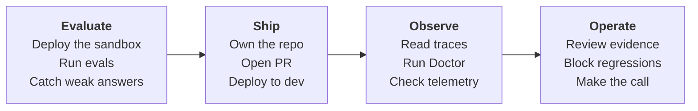

# HTTP agent tutorial

Use this tutorial when your agent runs as an HTTP service behind a URL, not as a
Foundry-managed prompt agent. The worked example is a RAG agent, implemented in the
[gpt-rag-orchestrator](https://github.com/Azure/gpt-rag-orchestrator). It is a FastAPI service inside an
Azure Container App, exposed at `POST /orchestrator`. You deploy it, take
ownership of the cloned orchestrator, and add an AgentOps PR gate that evaluates
the HTTP endpoint before merge.

The path is the same sandbox to dev story as the other tutorials, adapted for an
endpoint-based agent:



Use the environments this way:

| Environment | Used for | When AgentOps points at it |
|---|---|---|
| `sandbox` | Your candidate validation target: upload the sample PDF, initialize AgentOps, run local evals, and let the PR gate deploy and evaluate candidate code there. | Sections 3 through 11. |
| `dev` | The shared deployment target for the generated deploy workflow. | After merge, or by manually dispatching the dev deploy workflow. |

The important rule is: **AgentOps evals use sandbox; dev is for deployment**.

!!! info "HTTP agent vs Foundry prompt agent"
    A Foundry prompt agent is referenced as `name:version` and hosted by
    Foundry. An HTTP agent is any service you call at a URL. The GPT-RAG
    orchestrator answers over HTTP at `POST /orchestrator`, so you evaluate it
    by posting requests to that endpoint, not by staging a prompt version.

## Before you run the tutorial

Have these ready once, so the walkthrough stays on the deploy and evaluate flow
instead of permission prompts.

- Azure Developer CLI (`azd`) and Azure CLI (`az`), both signed in to the
  subscription and tenant that will host the deployment.
- The Copilot CLI signed in, so AgentOps can install its skills later and the
  agent can propose the GitHub and Azure setup steps.
- Permission to create resources in the target subscription, and push access to
  a GitHub repository you control for the orchestrator.
- A Foundry project with a chat-capable deployment for the judge model that
  AgentOps uses to score answers. See [Evaluation](evaluation.md) for how
  scoring works.

## 1. Deploy the sandbox

Create the GPT-RAG workspace from the template. The first azd environment is your
sandbox.

!!! concept "What the sandbox is for"
    The sandbox is your candidate-validation environment. You deploy real Azure
    resources here, point AgentOps at them, and let the PR gate deploy and score
    candidate code before it can reach dev. Treating it as disposable is the
    point: you can break it, reset it, and keep dev clean.

```powershell
azd init -t Azure/gpt-rag
```

Name the environment with a unique suffix so it does not collide with anyone
else's resource names, for example `gptrag-sandbox-2606182303` (the pattern is
`gptrag-sandbox-yymmddhhmm`).

azd downloads the template into a `gpt-rag` directory. Change into it, then set
the required values:

```powershell
cd gpt-rag
azd env set AZURE_LOCATION <region>
azd env set AZURE_SUBSCRIPTION_ID <subscription-id>
```

!!! tip "Why a unique name"
    The azd environment name seeds globally unique Azure resource names like the
    storage account. A plain `sandbox` often clashes with another deployment, so
    a timestamp suffix keeps yours distinct.

Provision and deploy everything:

```powershell
azd up
```

!!! info "What the deploy does"
    A predeploy hook reads `manifest.json` and clones each component from
    upstream. The orchestrator is cloned into a sibling `gpt-rag-orchestrator`
    directory, pinned to tag `v2.8.6`, and built into a container image. The
    deployed orchestrator answers over HTTP at `POST /orchestrator`.

## 2. Add a dev environment

Create a second environment in the same checkout, set its values, and deploy it.
Give it its own unique suffix, using the pattern `gptrag-dev-yymmddhhmm`.

```powershell
azd env new gptrag-dev-<yymmddhhmm>
azd env set AZURE_LOCATION <region>
azd env set AZURE_SUBSCRIPTION_ID <subscription-id>
azd up
```

!!! info "Why a separate dev environment"
    Sandbox is where the PR workflow deploys and evaluates candidate code. Dev is
    the shared deployment target updated by the generated deploy workflow after
    merge or manual dispatch.

## 3. Index a document

Your agent grounds its answers on indexed content, so give it one document to
work with. This tutorial uses a short sample manual.

!!! concept "Why grounding needs an index"
    A RAG agent does not read your PDF at question time. An ingestion pipeline
    splits the document into chunks, turns each chunk into an embedding vector,
    and stores them in a search index. At query time the agent retrieves the
    closest chunks and answers from them. No index, no grounded answer, which is
    why this one upload is what gives the agent something true to say.

[Download the sample document](media/vw-fuel-system.pdf) is the "Fuel System"
section of a Volkswagen service manual, 28 pages covering the carbureted 1968
through 1974 models. Save it locally.

Upload it to the sandbox `documents` blob container. GPT-RAG ingests it in the
background and indexes it into Azure AI Search:

```powershell
az storage blob upload `
  --account-name <storage-account> `
  --container-name documents `
  --file "vw-fuel-system.pdf" `
  --name "vw-fuel-system.pdf" `
  --auth-mode login
```

Give ingestion a couple of minutes before testing grounded answers.

## 4. Own the orchestrator

The agent you evaluate lives in the cloned orchestrator, so work from that
directory.

```powershell
cd ../gpt-rag-orchestrator
git remote -v
```

You will see `origin` pointing at the upstream project, checked out at the pinned
tag in a detached state:

```text
origin  https://github.com/azure/gpt-rag-orchestrator.git (fetch)
origin  https://github.com/azure/gpt-rag-orchestrator.git (push)
```

!!! warning "This intentionally disconnects from upstream"
    This tutorial makes the orchestrator your own service to evaluate and
    deploy. Re-initializing the git history detaches it from the GPT-RAG open
    source project so your commits and CI never target upstream. Do this only in
    your own copy.

Optionally drop the inherited eval pipeline and CI, then start your own history.
The clone is shallow on a pinned tag, so re-rooting with `git init` (instead of
committing on top of the shallow commit) is what lets the push succeed later:

```powershell
# optional: remove the inherited eval pipeline and CI so only AgentOps runs
Remove-Item -Recurse -Force evaluations
Remove-Item -Force .github/workflows/*

# start a fresh, independent history at a real root commit
Remove-Item -Recurse -Force .git
git init
git add -A
git commit -m "Initial commit: my GPT-RAG orchestrator copy"
git branch -M main
```

!!! note "What you just removed"
    Those upstream evals and workflows are not used here. AgentOps creates its
    own eval dataset and workflows later, so removing them keeps your first
    commit focused on your copy.

Then create your repository and push the `main` branch with the GitHub CLI. Pick
a name that does not collide with a fork you may already have, for example
`gpt-rag-orchestrator-agentops`:

```powershell
gh repo create <owner>/gpt-rag-orchestrator-agentops --private --source . --remote origin
git push -u origin main
```

!!! tip "Use a distinct repo name"
    `gh repo create` names a brand-new repo from the current folder, regardless
    of the local directory name. If you already keep a fork at
    `<owner>/gpt-rag-orchestrator`, give this one a different name like
    `gpt-rag-orchestrator-agentops` so your own copy stays easy to tell apart.

## 5. Install AgentOps

From the `gpt-rag-orchestrator` directory, create a local Python environment,
install AgentOps, and install the Copilot skills:

```powershell
python -m venv .venv
.\.venv\Scripts\Activate.ps1
python -m pip install -U pip
python -m pip install agentops-accelerator
agentops --version
agentops skills install
```

## 6. Initialize AgentOps

Point AgentOps straight at `POST /orchestrator`. No adapter route is needed.
This orchestrator returns `text/event-stream`, so the config below uses
`response_mode: text` and drops the leading conversation id. If your endpoint
returns normal JSON, keep the default `response_mode: json`, remove the
`stream:` block, and set `response_field` to the JSON field that contains the
answer. For the full matrix, see
[Configure an HTTP target](evaluation.md#configure-an-http-target).

!!! concept "Black-box HTTP targets"
    AgentOps treats your orchestrator as a black box: it sends an input over
    HTTP and reads back one answer. It does not import your code or mock your
    model, so the gate scores the same path your users hit in production,
    including retrieval, the model, and your prompt. That realism is the whole
    value, and it is also why step 11 has to do extra work to peek at the
    retrieved context behind the answer.

Use the sandbox orchestrator for local AgentOps setup and local eval runs. The
PR gate uses sandbox too. Dev is updated after merge or manual dispatch.

```powershell
# Select sandbox.
azd env select <sandbox-env-name>

# Disable the API-key guard.
$fqdn = azd env get-value CONTAINER_APP_INTERNAL_FQDN
$agent = "https://$fqdn/orchestrator"
$app = $fqdn.Split('.')[0]
$rg = azd env get-value AZURE_RESOURCE_GROUP
az containerapp update -n $app -g $rg --set-env-vars DISABLE_AUTH=true --only-show-errors --output none

# Print the endpoint.
$agent
```

!!! info "Anonymous evals"
    In this tutorial, evals call the orchestrator without a user
    `Authorization` bearer token or `X-API-KEY` header. `DISABLE_AUTH=true`
    keeps that local setup simple.

Sign in if needed, then run the wizard:

```powershell
az login
agentops init
```

Answer the prompts with the sandbox orchestrator values:

| Prompt | Answer |
|---|---|
| Foundry project endpoint | The sandbox Foundry project endpoint for the judge model, or press Enter to set it later. |
| Agent | The `$agent` URL printed above. |
| Dataset path | `.agentops/data/vw-smoke.jsonl` |

Then edit `agentops.yaml` so AgentOps matches the orchestrator request and
response shape. Do not set thresholds yet; first create the dataset so
`agentops eval init` can inspect it and recommend the right evaluators.

```
edit agentops.yaml
```

```yaml
version: 1
agent: https://<orchestrator-fqdn>/orchestrator
dataset: .agentops/data/vw-smoke.jsonl
protocol: http-json
request_field: ask
response_mode: text
stream:
  strip_leading_token: true
```

| Field | What it does |
|---|---|
| `agent` | The sandbox orchestrator URL AgentOps calls with `POST` for local eval runs. |
| `protocol: http-json` | Send one JSON request to the orchestrator. |
| `request_field: ask` | Put each dataset input under the `ask` key, matching the orchestrator's own field name. |
| `response_mode: text` | Read the `text/event-stream` body and aggregate it into one answer instead of parsing a single JSON body. |
| `stream.strip_leading_token: true` | Drop the leading conversation id the orchestrator emits as its first chunk. |
| Non-streaming JSON endpoint | Use the default `response_mode: json` and set `response_field`, for example `response_field: text`. |

!!! note "How AgentOps calls the endpoint"
    AgentOps posts `{"ask": "<input>"}` with `Content-Type: application/json` and
    no `Authorization` or `X-API-KEY` header. The orchestrator treats the request
    as anonymous, streams a `text/event-stream` response, and AgentOps drops the
    leading conversation id before scoring the aggregated answer. The default
    `request_field` is `message`; you set it to `ask` because that is the
    orchestrator's vocabulary. If your endpoint emits structured `data:` JSON
    frames instead of raw text, set `response_mode: sse` and add
    `stream.text_field` to point at the token text.

!!! tip "If you enabled API keys on purpose"
    Only add `auth_header_name`, `auth_value_template`, and `auth_header_env` if
    you deployed GPT-RAG with `useCAppAPIKey=true`. The default tutorial path does
    not use that option.

## 7. Create the dataset

Create a small JSONL dataset grounded in the document you indexed. Each row is
one line of JSON: an `input` to ask and an `expected` describing the behavior you
want.

!!! concept "An eval dataset scores behavior, not exact text"
    `expected` is not a string the answer must match. An LLM judge reads the
    agent's answer and your `expected` description and rates how well they agree.
    So you describe the behavior you want ("names the correct torque value and
    cites the manual") and the judge tolerates wording differences. That is what
    lets a non-deterministic agent be tested at all.

```
edit .agentops/data/vw-smoke.jsonl
```

```json
{"input":"What is the fuel tank capacity of the Volkswagen described in the manual?","expected":"States the fuel tank holds 15.8 U.S. gallons (about 60 liters) and sits beneath the rear luggage area ahead of the engine. On topic and consistent with the manual."}
{"input":"Which carburetor did the 1970 model use?","expected":"Identifies a single Solex 30 PICT-3 carburetor for the 1970 model. Concise and on topic."}
{"input":"What does the evaporative emission control system do?","expected":"Explains it keeps gasoline fumes from escaping to the atmosphere by venting the tank into a system that traps fuel vapors until the engine burns them, standard from the 1970 models. On topic and consistent with the manual."}
{"input":"What is the 0 to 100 km/h time of the latest electric Volkswagen ID.4?","expected":"Makes clear the indexed document does not cover modern electric models and does not invent a figure."}
```

!!! note "input maps to ask"
    AgentOps reads the `input` field from each row and sends it as `ask`. The
    `expected` values are acceptance criteria for judge-based scoring, not exact
    answer strings, so write them as reviewable behavior.

!!! warning "Smoke-core is answer quality, not groundedness"
    The endpoint returns only the final text, not the retrieved context, so the
    judge cannot measure true groundedness here. This smoke-core scores
    coherence, similarity to the expected behavior, and response completeness.
    The first three rows should pass once the document is indexed; the last row
    checks that the agent refuses to invent facts the source does not contain. To
    measure real groundedness, evaluate a target that also returns its retrieved
    context. See [Evaluation](evaluation.md).

## 8. Set thresholds

Ask AgentOps to inspect the HTTP target and dataset:

!!! concept "What a threshold gate does"
    Each evaluator returns a score from 1 to 5. A threshold turns that score into
    a pass or fail: set a floor like `>= 3` and any row below it fails the run.
    A failed run exits non-zero, and in CI a non-zero exit blocks the merge. That
    is the mechanism that converts "the answer felt worse" into an automatic,
    enforceable gate.

```powershell
agentops eval init
```

For this HTTP target, `agentops eval init` only inspects `agentops.yaml` and the
dataset, then prints the recommended evaluators. It also looks at the active azd
environment and, when it finds one non-embedding Azure AI deployment, saves the
judge model settings it needs for scoring.

You should see output like this:

```text
Evaluator model: configured chat (gpt-5-nano)
 - saved AZURE_OPENAI_DEPLOYMENT, AZURE_OPENAI_MODEL_NAME to .azure\<env>\.env
```

`agent` is the HTTP target being tested. `AZURE_OPENAI_DEPLOYMENT` is the chat
model deployment that scores the answers. AgentOps saves both the deployment name
and the model name because Azure OpenAI calls use the deployment name, while the
model name lets the evaluator SDK handle GPT-5 and o-series models correctly.

If AgentOps cannot auto-discover a single judge deployment, it prints a warning.
List the deployments and set the two values manually:

```powershell
$rg = azd env get-value AZURE_RESOURCE_GROUP
$account = az cognitiveservices account list -g $rg `
  --query "[?kind=='AIServices' || kind=='OpenAI'].name | [0]" -o tsv

az cognitiveservices account deployment list -g $rg -n $account `
  --query "[].{deployment:name, model:properties.model.name}" -o table

azd env set AZURE_OPENAI_DEPLOYMENT <chat-deployment-name>
azd env set AZURE_OPENAI_MODEL_NAME <model-name>
```

It does not call `azd ai agent eval generate` or create a Foundry `eval.yaml`,
because the target is not a Foundry prompt agent.

Because this dataset includes `expected` ground truth and does not include
retrieved `context`, the smoke recommendation should include answer-quality
evaluators such as `coherence`, `similarity`, and `response_completeness`.

Now add thresholds for the recommended smoke evaluators:

```powershell
edit agentops.yaml
```

```yaml
thresholds:
  coherence: ">=3"
  similarity: ">=3"
  response_completeness: ">=3"
```

`similarity` is useful here because the dataset has `expected` ground truth. The
gate checks that the agent answers sensibly and stays close to the expected
behavior, not that it is grounded.

## 9. Run the eval gate

AgentOps evals run wherever you execute the command. In this step, you run the
same gate locally from the orchestrator repo:

If you also want the local metrics and row results to show up in Foundry, open
`agentops.yaml` and add `publish: true` at the top level, next to `dataset`,
`protocol`, and `thresholds`:

```powershell
edit agentops.yaml
```

```yaml
version: 1
agent: https://<orchestrator-fqdn>/orchestrator
dataset: .agentops/data/vw-smoke.jsonl
publish: true
protocol: http-json
request_field: ask
response_mode: text
stream:
  strip_leading_token: true
thresholds:
  coherence: ">=3"
  similarity: ">=3"
  response_completeness: ">=3"
```

If you do not want to publish to Foundry, leave the `publish` field out.

!!! note "Foundry visibility for HTTP targets"
    This still runs locally. AgentOps invokes the HTTP endpoint from your machine
    or CI runner, then uploads the finished metrics and row results to Classic
    Foundry Evaluations. It does not create a New Foundry server-side evaluation
    run. In AgentOps, `execution: cloud` currently applies to Foundry prompt
    agents (`name:version`) only. Foundry hosted agent endpoints can still use the
    local runner with `publish: true`, and hosted/prompt agents can use
    `execution: azd` when you have an `azd ai agent eval` recipe.

```powershell
agentops eval run
```

You should see a `Threshold status` line and normalized output written under
`.agentops/results/latest/`.

!!! info "What eval run checks"
    It sends each dataset row to the orchestrator endpoint, scores the responses with the
    judge model, applies your thresholds, and writes `results.json` and
    `report.md`. It exits zero when thresholds pass and non-zero when a
    threshold fails or the endpoint errors, which is exactly what lets the PR
    gate block a merge. See [Evaluation](evaluation.md) for thresholds and
    metric concepts.

The cloud version is the same command in GitHub Actions. Later, when you generate
the PR workflow, CI runs `agentops eval run` in the GitHub-hosted runner and
stores the evidence as workflow artifacts. There is no separate setting in
`agentops.yaml` that says "local" or "cloud"; the runner location comes from
where the command is executed.

## 10. Results and traces

Use the local report for the evaluation evidence. Use Application Insights when
you want the run traces.

**Eval results (local or CI artifact).** Every run writes normalized output under
`.agentops/results/latest/` in the machine that ran the command. Locally, open
`report.md` to read each input, the aggregated answer, the judge scores, and pass
or fail against your thresholds:

```powershell
code .agentops/results/latest/report.md
```

In GitHub Actions, the same files are kept as workflow artifacts.

**Runtime traces.** `agentops eval run` auto-discovers the Application Insights
resource connected to `AZURE_AI_FOUNDRY_PROJECT_ENDPOINT`. Open that Application
Insights resource, go to **Logs**, and run:

```kusto
requests
| where timestamp > ago(24h)
| where cloud_RoleName == 'agentops'
| project timestamp, name, operation_Id, duration, success
| order by timestamp desc
```

You should see one `RUN agentops` row plus one `eval_item ...` row for each
dataset row. If you do not see them, confirm you opened the Application Insights
resource connected to the same Foundry project endpoint used by your active azd
environment, not another dev or sandbox environment.

!!! note "Foundry Evaluations is opt-in"
    By default, this tutorial keeps eval evidence local or in CI artifacts. With
    `publish: true`, the same local run also appears in Classic Foundry
    Evaluations. `execution: cloud` is the New Foundry server-side evaluation
    path, but in AgentOps it currently applies to Foundry prompt agents
    (`name:version`) only. Hosted agent endpoints use the local runner plus
    optional Classic publish, or `execution: azd` when an azd eval recipe exists.

!!! info "Eval evidence vs runtime traces"
    The local `report.md` is the fastest way to see why a row passed or failed.
    The `agentops.eval.*` spans are how the same runs show up in Foundry. The
    agent's own request traces are separate runtime telemetry the Doctor reads
    for latency and errors. See [Observe](observe.md).

## 11. Score live retrieval

Steps 7 to 10 score the answer text only. The judge never sees the passages your
agent actually retrieved, so it cannot tell you whether the agent pulled the
right context or stayed grounded in it. That is black-box evaluation: one query
in, one answer out.

To evaluate retrieval you need grey-box evaluation. The target returns the answer
**and** the context it used for that answer, so the Foundry RAG evaluators score
the real retrieval behind each response instead of a static dataset field. This
is what your audience means by "evaluate the retrieval", not just the final text.

!!! note "This step is optional and needs an agent that can expose its context"
    The smoke gate works without it. Grey-box retrieval scoring requires your
    agent to return the retrieved context at eval time. The GPT-RAG orchestrator
    in this tutorial can do that through the opt-in mode described below. If you
    bring your own agent, add an equivalent opt-in path.

### The orchestrator contract (opt-in, gated)

Retrieved context is sensitive: it exposes the corpus passages behind an answer.
So the orchestrator only returns it when the caller opts in **and** an operator
has enabled it. Two switches:

- Request header `X-Eval-Context: true` on the eval request.
- Feature flag `EVAL_CONTEXT_ENABLED` in App Configuration, off by default.

When both are set, the orchestrator replies with a single JSON document instead
of the streamed answer:

```json
{
  "answer": "The VW mechanical fuel pump draws gasoline from the tank ...",
  "context": "### Vw Fuel System\n# 4. FUEL PUMP AND LINES ...",
  "retrieved_documents": [ { "id": "vw-fuel-system.pdf#4", "score": 0.81 } ]
}
```

Without the header, behavior is unchanged and you get the normal streamed answer.

!!! danger "Never enable this on an unauthenticated public endpoint"
    Eval-context mode returns retrieved corpus content. Keep
    `EVAL_CONTEXT_ENABLED` off in production, and only turn it on for
    access-controlled sandbox and dev endpoints used for evaluation.

### Wire AgentOps to the live context

Switch the eval target from `text` to `json` and capture the two extra fields.
`response_field` stays the answer (the prediction); `response_fields` captures the
grey-box fields so the RAG evaluators can read them. You can drop the `stream`
block, it does not apply to JSON responses.

```yaml
# eval target: read the grey-box JSON response
response_mode: json
response_field: answer
response_fields:
  context: context
  retrieved_documents: retrieved_documents
headers:
  X-Eval-Context: "true"

evaluators:
  - CoherenceEvaluator
  - SimilarityEvaluator
  - ResponseCompletenessEvaluator
  - name: GroundednessEvaluator
    input_mapping:
      context: $response.context
  - name: RetrievalEvaluator
    input_mapping:
      context: $response.context

thresholds:
  coherence: ">=3"
  similarity: ">=3"
  response_completeness: ">=3"
  groundedness: ">=3"
  retrieval: ">=3"
```

How the wiring works:

- `response_fields` captures named fields from the JSON response. The
  `$response.<name>` token then makes each one available to an evaluator's
  `input_mapping`. Here only `context` is remapped to the live retrieval; `query`
  and `response` keep their preset defaults (`$prompt` and `$prediction`).
- Listing `evaluators:` explicitly replaces auto-selection, so keep the smoke
  evaluators in the list too. Every `thresholds` key needs a matching evaluator.
- The `X-Eval-Context` header is global, so ASSERT and Red Team also receive the
  JSON response. They read the same `response_field` (`answer`), so those gates
  keep working unchanged.
- This needs AgentOps `>= 0.5.2` (the `input_mapping` and `$response.*` feature).

### The Foundry RAG evaluators

| Evaluator | Scores | Inputs |
|---|---|---|
| [Groundedness](https://learn.microsoft.com/azure/foundry/concepts/evaluation-evaluators/rag-evaluators#using-rag-evaluators) | whether the answer is supported by the retrieved context, with no fabrication (precision) | `response`, `context` |
| [Retrieval](https://learn.microsoft.com/azure/foundry/concepts/evaluation-evaluators/rag-evaluators#using-rag-evaluators) | how relevant the retrieved chunks are to the query | `query`, `context` |
| [Document Retrieval](https://learn.microsoft.com/azure/foundry/concepts/evaluation-evaluators/rag-evaluators#document-retrieval) (advanced) | ranked retrieval against human relevance labels (Fidelity, NDCG, XDCG, Max Relevance, Holes) | `retrieved_documents`, qrels ground truth |

Groundedness and Retrieval are LLM-judge metrics on a 1 to 5 scale, passing at
`>=3`, the same shape as the smoke evaluators. They need no ground truth, so they
drop straight into the gate.

Document Retrieval is a different tool. It scores retrieval *ranking* against
relevance labels you author by hand and returns composite metrics for search
tuning, so it runs offline, not on the gate. It belongs to the Operate phase, when you
optimize the agent's search over time. For a full walkthrough, see
[Retrieval optimization](retrieval-optimization.md).

### Run it

```powershell
agentops eval run
```

Each row is now scored on groundedness and retrieval against the context the
agent actually used. A low retrieval score means the agent fetched off-topic
passages; a low groundedness score means the answer drifted from what it
retrieved. Both are invisible to the black-box smoke, which is exactly why the
audience asked for them.

!!! tip "Keep the smoke dataset on-corpus"
    Retrieval and groundedness only score well when the question is answerable
    from the indexed document. An out-of-corpus question correctly earns a low
    retrieval score, which is useful as a negative test but makes the gate
    flaky if it is in the smoke set. Keep smoke questions answerable from your
    index, and use ASSERT and Red Team for the refusal and safety cases.

## 12. Add governance checks

Quality is not enough to ship. Add Red Team and a tiny ASSERT smoke so CI can
exercise the live HTTP orchestrator, not just score happy-path answers.

!!! concept "Quality is not safety"
    The eval gate asks "is the answer good?" It does not ask "is the agent safe
    when someone attacks it?" Those are different questions and need different
    tools. Red Team probes for harmful or jailbroken responses, and ASSERT runs
    fast behavioral smoke checks. Stacking all three is defense in depth: a
    helpful agent can still be unsafe, and a safe agent can still be unhelpful.

!!! tip "Learn more about these gates"
    - Red Team uses the Azure AI Foundry red teaming agent. See
      [AI Red Teaming Agent (concepts)](https://learn.microsoft.com/en-us/azure/ai-foundry/concepts/ai-red-teaming-agent)
      and [Run automated scans](https://learn.microsoft.com/en-us/azure/ai-foundry/how-to/develop/run-scans-ai-red-teaming-agent)
      for the full risk-category and attack-strategy list.
    - ASSERT is the AgentOps contract smoke. The full config schema lives in the
      [release gate reference](tutorial-prompt-agent.md#12-add-assert-and-red-team).

### Scaffold it (recommended)

Let the governance skill create the small files and update `agentops.yaml`:

```text
/skills agentops-governance
```

Then paste this prompt:

```text
Scaffold AgentOps governance for this HTTP orchestrator workspace.

This is an HTTP orchestrator target, not a model-deployment target.
Use the top-level agent endpoint from agentops.yaml.
Keep the existing HTTP mapping: request_field ask, response_mode text, and the stream settings.

Add a small ASSERT smoke:
- create .agentops/assert_http_adapter.py as a callable target that posts to the HTTP agent using the AgentOps HTTP mapping
- create assert/eval_config.yaml, assert/test_set.jsonl, and assert/taxonomy.json
- use the question: "What is the fuel tank capacity of the Volkswagen described in the manual?"
- judge that the answer states 15.8 U.S. gallons or about 60 liters
- use default_model.name azure/chat
- set assert.env with AZURE_API_BASE, AZURE_API_VERSION, PYTHONPATH .agentops, and AGENTOPS_ASSERT_AZURE_MAX_COMPLETION_TOKENS "true"
- do not commit secrets

Add a small Red Team smoke:
- risk_categories: violence, hate_unfairness
- attack_strategies: base64
- num_objectives: 1
- fail_on_attack_success_rate: 1.0

Update only these files: agentops.yaml, .agentops/assert_http_adapter.py, assert/eval_config.yaml, assert/test_set.jsonl, assert/taxonomy.json.
```

`fail_on_attack_success_rate: 1.0` keeps the first smoke run from randomly
blocking CI while you are wiring the workflow. After you review
`.agentops/redteam/latest.json`, lower it, for example to `0.2`, when you are
ready to enforce the safety gate.

### What the scaffold generated

The skill adds two blocks to `agentops.yaml` and a small `assert/` suite. Nothing
here targets a model deployment. Every check runs against the same live HTTP
endpoint your eval already uses.


```yaml
# added to agentops.yaml
assert:
  config: ./assert/eval_config.yaml   # the ASSERT suite to run
  fail_on_violations: true            # non-zero exit when the judge finds a violation
  env:
    AZURE_API_BASE: https://<your-aoai>.cognitiveservices.azure.com/
    AZURE_API_VERSION: 2024-12-01-preview
    AGENTOPS_ASSERT_AZURE_MAX_COMPLETION_TOKENS: "true"  # GPT-5 judge token-arg shim
    PYTHONPATH: .agentops               # so the adapter below is importable
redteam:
  risk_categories: [violence, hate_unfairness]
  attack_strategies: [base64]
  num_objectives: 1
  fail_on_attack_success_rate: 1.0
```


Files written:

- `.agentops/assert_http_adapter.py` - a callable `target(message)` that POSTs to
  your `agent` URL using the same HTTP mapping from `agentops.yaml`
  (`request_field`, `response_mode`, `stream`, headers). This is what makes ASSERT
  hit the real orchestrator instead of a model deployment.
- `assert/eval_config.yaml` - the ASSERT suite. Points `inference.target` at
  `assert_http_adapter:target`, reads `test_set.jsonl`, and judges with
  `azure/chat`.
- `assert/test_set.jsonl` - the smoke case (the fuel-tank question).
- `assert/taxonomy.json` - the answer contract the judge scores against (the
  answer must state 15.8 U.S. gallons or about 60 liters).

### Run the checks

```powershell
pip install "azure-ai-evaluation[redteam]"
pip install assert-ai
```

```powershell
agentops assert run
agentops redteam run
```

ASSERT writes `.agentops/assert/latest.json`. Red Team writes
`.agentops/redteam/latest.json`. Both commands exit non-zero when their gate
fails.

If the SDK prints an Azure upload authorization warning but AgentOps still writes
`.agentops/redteam/latest.json` and exits `0`, the local gate worked. The warning
is only about publishing the SDK's optional scan artifact back to Foundry.
For the full config schema, risk categories, and attack strategies, see the
[release gate reference](tutorial-prompt-agent.md#12-add-assert-and-red-team).

!!! warning "These hit live Azure services"
    Red Team calls live Azure services. Run it against a non-production endpoint
    and keep the objective count small while you wire it up. The matrix is
    `risk_categories x attack_strategies x num_objectives` and grows quickly.

## 13. Generate the workflows

You build your own CI here. `agentops workflow generate` writes fresh,
AgentOps-owned GitHub Actions into your repo. The files are prefixed `agentops-`
so they never collide with the orchestrator's existing workflows. The
orchestrator's `azure.yaml` is used only as the deploy project, so the deploy
mode is `azd`.

!!! concept "Why AgentOps generates your CI"
    The workflows are derived from `agentops.yaml`, not hand-written. That means
    your gates and your CI cannot drift apart: change a threshold or add an
    evaluator and you regenerate the workflows to match. The `agentops-` prefix
    keeps them separate from the repo's own pipelines, and regenerating is safe
    because it overwrites only AgentOps-owned files.

```powershell
agentops workflow generate --kinds pr,dev --deploy-mode azd --force
```

This writes two files:

- `.github/workflows/agentops-pr.yml` - the PR gate.
- `.github/workflows/agentops-deploy-dev.yml` - the dev deploy workflow.

Because `agentops.yaml` now has `assert:` and `redteam:` blocks, both workflows
install the optional dependencies and run **eval + ASSERT + Red Team** against
the live endpoint automatically. Doctor also runs, but only to collect evidence,
it does not block the merge.

| Flag | What it does |
|---|---|
| `--kinds pr,dev` | Generate the PR gate and the dev deploy workflow. |
| `--deploy-mode azd` | Deploy through the orchestrator's azd project. |
| `--force` | Overwrite existing AgentOps workflow files. |

### Adjust for an already-provisioned environment

This tutorial deploys into sandbox and dev environments that are **already
provisioned**. So the deploy step is `azd deploy` only, never `azd provision`.
Make two edits to the generated files:

1. **PR gate**: add a first job that deploys the PR candidate to sandbox with
   `azd deploy`, then let the eval job run the gates against it with
   `needs: deploy-sandbox`. Evaluating without deploying the PR first would only
   test the old deployment.
2. **Dev deploy**: drop the provision job and keep `azd deploy` only.

The sandbox deploy job looks like this:


```yaml
jobs:
  deploy-sandbox:
    name: Deploy candidate (sandbox)
    runs-on: ubuntu-latest
    environment: sandbox
    steps:
      - uses: actions/checkout@v4
      - uses: Azure/setup-azd@v2
      - name: Azure login (OIDC)
        uses: azure/login@v2
        with:
          client-id: ${{ vars.AZURE_CLIENT_ID }}
          tenant-id: ${{ vars.AZURE_TENANT_ID }}
          subscription-id: ${{ vars.AZURE_SUBSCRIPTION_ID }}
      - name: azd deploy (sandbox)
        env:
          AZURE_ENV_NAME: ${{ vars.AZURE_ENV_NAME }}
          AZURE_LOCATION: ${{ vars.AZURE_LOCATION }}
          AZURE_SUBSCRIPTION_ID: ${{ vars.AZURE_SUBSCRIPTION_ID }}
          APP_CONFIG_ENDPOINT: ${{ vars.APP_CONFIG_ENDPOINT }}
          BUILD_MODE: acr-task
        run: |
          azd config set auth.useAzCliAuth "true"
          azd env new "$AZURE_ENV_NAME" --no-prompt \
            --subscription "$AZURE_SUBSCRIPTION_ID" \
            ${AZURE_LOCATION:+--location "$AZURE_LOCATION"} \
            || azd env select "$AZURE_ENV_NAME"
          azd env set APP_CONFIG_ENDPOINT "$APP_CONFIG_ENDPOINT"
          azd deploy --no-prompt
```


The dev workflow is the same shape: the `eval` job runs the gates, then a
`deploy` job with `needs: eval` runs the same `azd deploy` step against the dev
environment. The complete, proven files live in the reference repo
[placerda/gpt-rag-orchestrator-agentops](https://github.com/placerda/gpt-rag-orchestrator-agentops/tree/develop/.github/workflows).

### Required GitHub configuration

Create two GitHub environments, `sandbox` and `dev`, and set these variables on
each. There are no secrets: Azure login uses OIDC, and the Foundry and OpenAI
resources use Entra auth.

| Variable | Purpose |
|---|---|
| `AZURE_CLIENT_ID`, `AZURE_TENANT_ID`, `AZURE_SUBSCRIPTION_ID` | OIDC login for the workflow's service principal. |
| `AZURE_ENV_NAME`, `AZURE_LOCATION`, `APP_CONFIG_ENDPOINT` | The azd environment that `azd deploy` targets. Different per environment. |
| `AZURE_AI_FOUNDRY_PROJECT_ENDPOINT` | Foundry project the judge and Red Team scan use. |
| `AZURE_OPENAI_ENDPOINT`, `AZURE_OPENAI_DEPLOYMENT` | The judge model endpoint and deployment name. |
| `AZURE_OPENAI_MODEL_NAME` | The model behind the deployment, for example `gpt-5-nano`. Required so the judge detects a reasoning model and sends `max_completion_tokens` instead of `max_tokens`. |
| `APPLICATIONINSIGHTS_CONNECTION_STRING` | Lets the runtime publish eval spans to Foundry. |

!!! warning "AZURE_OPENAI_MODEL_NAME is easy to miss"
    If your judge deployment is named something generic like `chat`, AgentOps
    cannot tell it is a GPT-5 reasoning model from the deployment name alone.
    Without `AZURE_OPENAI_MODEL_NAME`, a GPT-5 judge returns HTTP 400 because it
    is sent the wrong token argument. Set it to the real model id.

### Wire OIDC (one time)

OIDC lets the workflow log in to Azure with a short-lived federated token, so no
client secret is ever stored. Give the workflow a service principal with one
federated credential per environment.

```powershell
# create the app + service principal
az ad app create --display-name "gpt-rag-orchestrator-agentops-ci"

# add one federated credential per environment (repeat with ...:environment:dev)
az ad app federated-credential create --id <appId> --parameters '{
  "name": "github-sandbox",
  "issuer": "https://token.actions.githubusercontent.com",
  "subject": "repo:<owner>/<repo>:environment:sandbox",
  "audiences": ["api://AzureADTokenExchange"]
}'
```

Set `AZURE_CLIENT_ID` to the app's client id in both environments, and grant the
service principal the roles it needs on the sandbox and dev resource groups
(Contributor for `azd deploy`, plus the data-plane roles your orchestrator uses).
See [Ship](ship.md) for the full RBAC list.

For the federated-credential subject format and login options, see
[GitHub: configuring OpenID Connect in Azure](https://docs.github.com/en/actions/deployment/security-hardening-your-deployments/configuring-openid-connect-in-azure)
and the [azure/login action](https://github.com/Azure/login).

!!! warning "CI runners must reach your endpoint and Foundry"
    The eval, ASSERT, and Red Team gates run on GitHub-hosted runners and call
    your orchestrator's HTTP endpoint and the Azure AI Foundry project directly.
    If those resources block public network access, the gates fail with
    connection timeouts. You have two options:

    - **Public-reachable sandbox/dev.** Keep the endpoint and Foundry reachable
      from the runner (public access, or an IP allowlist that includes the
      GitHub-hosted runner ranges). Simplest, fine for non-production.
    - **Network-isolated environment.** If the orchestrator and Foundry sit
      behind private endpoints, GitHub-hosted runners cannot reach them. Run the
      workflows on self-hosted runners deployed inside the same VNet (or a peered
      one) so they resolve the private endpoints. See
      [GitHub self-hosted runners](https://docs.github.com/en/actions/hosting-your-own-runners/managing-self-hosted-runners/about-self-hosted-runners),
      [Azure Container Apps networking](https://learn.microsoft.com/en-us/azure/container-apps/networking),
      and [Azure Private Endpoint overview](https://learn.microsoft.com/en-us/azure/private-link/private-endpoint-overview).

!!! note "These are your workflows, not the orchestrator's"
    The generated files are yours to edit and own. If the vendored orchestrator
    still carries upstream workflows under `.github/workflows/` that you do not
    want running, delete them so only your `agentops-*` workflows fire. You can
    re-run `agentops workflow generate` any time to regenerate yours.

## 14. Ship, observe, operate

The repo now carries everything CI needs. Close the loop with the same three
section pages the other tutorials use.

```powershell
agentops doctor --evidence-pack
```

- **Ship.** Push the repo, configure the `sandbox` and `dev` GitHub environments
  with Azure OIDC, and open a PR so the gate deploys and evaluates the candidate
  in sandbox. See
  [Ship](ship.md).
- **Observe.** Read traces, telemetry, and Doctor findings for the dev run. See
  [Observe](observe.md).
- **Operate.** Review the evidence pack, decide ship or no-ship, and open Cockpit for
  a single readiness view with `agentops cockpit --workspace .`. See
  [Operate](operate.md).

## What you walk away knowing

- You can tell an HTTP agent apart from a Foundry prompt agent, and why the
  GPT-RAG orchestrator is the former.
- You deployed the GPT-RAG template into a sandbox and a dev environment, and you
  know why the PR gate deploys and evaluates candidate code in sandbox before
  anything updates dev.
- You took ownership of the cloned orchestrator by re-initializing its git
  history and starting your own repository.
- You pointed AgentOps directly at the orchestrator endpoint and mapped `ask`
  and `text` to the real request and response shape.
- You indexed a sample document, built a smoke dataset from its content, and
  scored answers on coherence, similarity, and response completeness, knowing why
  that is smoke and not groundedness.
- You added grey-box retrieval scoring, returning the answer plus the retrieved
  context behind an opt-in, gated flag, so the Foundry Groundedness and Retrieval
  evaluators score the real retrieval and not a static dataset field.
- You inspected both the per-row eval evidence and the runtime traces, and you
  know which spans AgentOps emits (`agentops.eval.*`) versus which come from the
  orchestrator's own runtime telemetry.
- You added Red Team as a safety gate alongside the eval gate, so CI blocks
  unsafe behavior, not just quality regressions.
- You ran local evals against the deployed endpoint and generated a PR gate that
  blocks regressions before they merge.
