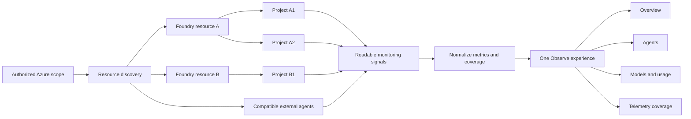
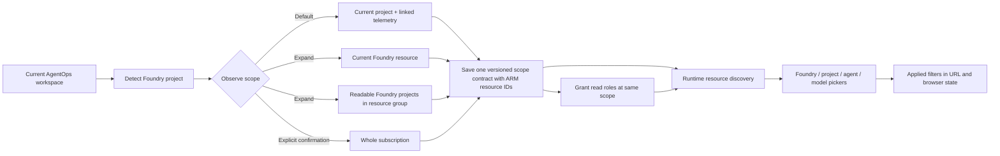

# Feature Specification: Deploy Hosted Cockpit

**Feature Branch**: `placerda-specify-issue-433`

**Created**: 2026-08-20

**Status**: Draft

**Input**: User description: "https://github.com/Azure/agentops/issues/433"

## Clarifications

### Session 2026-08-20

- Q: How should we resolve the conflict between `agentops cockpit deploy` and the current constitution, which prohibits the Cockpit from creating or deploying cloud resources? → A: Amend the constitution to permit explicit operator-invoked deployment while keeping the Cockpit runtime read-only.
- Q: Should Observe display raw prompt, response, and trace-attribute content, or only aggregate metrics, metadata, and links to authorized portals? → A: Display raw content by reading values from `AppGenAIContent` while honoring the protection controlled by `protectGenAISensitiveData`.
- Q: Should OBO use the user's identity only to read `AppGenAIContent`, while the managed identity handles discovery and aggregate metrics, or should OBO be used for every Observe query? → A: Use a hybrid model: managed identity for discovery and aggregate metrics, and per-user OBO only for `AppGenAIContent`.
- Q: How should deployment obtain the Entra application configuration required for OBO access to `AppGenAIContent` on behalf of the user? → A: Require and validate an existing app registration; AgentOps does not create tenant identities.
- Q: Which confidential credential should the existing app registration use to perform OBO without storing a secret in App Service? → A: Use a dedicated user-assigned managed identity federated with the app registration.

## User Scenarios & Testing *(mandatory)*

### User Story 1 - Deploy a Shared Cockpit (Priority: P1)

An Azure operator deploys a shared, authenticated, read-only AgentOps Cockpit
for the Foundry project in the current AgentOps workspace through a guided
command. Before anything changes, the operator can review the detected project,
its telemetry resources, access scope, and role assignments. The operator can
explicitly expand the deployment to a broader Foundry or Azure scope. After
confirmation, the operator receives a working Cockpit URL and a link to the
deployed Azure resources.

**Why this priority**: A secure, repeatable deployment is the prerequisite for
every hosted use case and removes the need for each team member to install and
configure AgentOps locally.

**Independent Test**: Starting with an authenticated Azure operator and an
existing telemetry resource group, complete the guided deployment, open the
returned authenticated experience, sign in through the validated existing
application registration, and verify that rerunning the deployment preserves
the configured service.

**Acceptance Scenarios**:

1. **Given** an operator authenticated to Azure with the required permissions,
   **When** they start the hosted Cockpit deployment, **Then** they can select or
   confirm the Foundry project detected from the current workspace, tenant,
   subscription, resource group, location, and telemetry resources before any
   resources are changed.
2. **Given** the current workspace resolves to one Foundry project, **When** the
   operator accepts the default deployment scope, **Then** only that project and
   the telemetry resources required to observe it are included.
3. **Given** the operator wants a shared view beyond the current project,
   **When** they choose Expand scope, **Then** they can explicitly select all
   projects in the current Foundry resource, all readable Foundry projects in
   the resource group, or the subscription.
4. **Given** a valid deployment configuration, **When** the operator reviews the
   preview, **Then** the preview identifies the hosted application, its
   authentication boundary, its read-only Azure access, and every planned role
   assignment.
5. **Given** the operator supplies an existing application registration,
   **When** the deployment validates it, **Then** the operator sees whether its
   tenant, client identifier, redirect configuration, and downstream consent
   satisfy hosted sign-in and OBO requirements.
6. **Given** the application registration is missing or invalid, **When** the
   operator attempts deployment, **Then** deployment stops before the hosted
   application can expose Cockpit content.
7. **Given** the operator confirms the preview, **When** deployment completes,
   **Then** the command verifies authenticated application health and returns
   the Cockpit URL and an Azure resource-management link.
8. **Given** an existing deployment with the same configuration, **When** the
   operator deploys again, **Then** the operation updates or confirms the
   deployment without creating duplicate access assignments or losing the
   existing configuration.
9. **Given** a user who is outside the configured tenant or allowed group,
   **When** they open the hosted URL, **Then** access is denied before Cockpit
   data is displayed.

---

### User Story 2 - Observe Operations Across an Azure Scope (Priority: P2)

An authenticated operator opens one Observe area and reviews the available
operational telemetry across all readable Foundry resources, projects, and
agents in the configured scope. Shared filters let the operator narrow the view
by Foundry resource, project, agent, model, and time range without learning
query syntax or copying resource identifiers.

**Why this priority**: The core user value is a central operational view of
volume, failures, latency, token usage, and telemetry coverage across otherwise
fragmented Azure resources.

**Independent Test**: With readable telemetry from at least two Foundry
resources and two projects, open Observe, apply shared filters, switch between
its views, and verify that the displayed metrics and preserved filters match
the selected scope and time range.

**Acceptance Scenarios**:

1. **Given** an authenticated user with readable telemetry from multiple
   Foundry resources and projects in the configured scope, **When** they open
   Observe, **Then** they see a unified overview of Foundry resources, projects,
   agents, invocations, failures, latency, observed token usage, and coverage
   for the default 24-hour period.
2. **Given** an active Foundry resource, project, agent, model, or time-range
   filter, **When** the user switches among Overview, Agents, Models and usage,
   and Telemetry coverage, **Then** every view preserves and applies the same
   filter state.
3. **Given** telemetry that contains agent attribution, **When** the user selects
   an agent, **Then** they see that agent's trends and available deep links to
   the corresponding operational trace or transaction.
4. **Given** compatible telemetry from an agent outside Foundry, **When** the
   user views Agents, **Then** the external agent is included and clearly
   identified by its reported source.
5. **Given** reported token values, **When** the user views usage, **Then** the
   values are labeled as observed usage and are not represented as billing or
   cost data.
6. **Given** generative-AI content exists in `AppGenAIContent` and the Cockpit
   identity is authorized to read it, **When** the user opens trace detail,
   **Then** the available prompt, response, instruction, and tool content is
   displayed with its source and protection status.
7. **Given** `AppGenAIContent` is protected and the authenticated user's
   delegated identity lacks privileged read access, **When** the user opens trace detail,
   **Then** the content remains hidden and the UI explains the required user
   access without reading equivalent values from legacy telemetry fields.
8. **Given** two authenticated users share access to aggregate Observe metrics
   but only one user has privileged access to protected monitoring data,
   **When** each opens the same trace detail, **Then** only the privileged user
   sees raw generative-AI content.

---

### User Story 3 - Diagnose Missing and Partial Telemetry (Priority: P3)

An operator uses Telemetry coverage to understand why a project or agent cannot
populate a panel. The Cockpit distinguishes access denial, absent
configuration, no data in the selected period, and missing attribution, then
provides a concise next action without requiring the operator to inspect query
language.

**Why this priority**: Trustworthy operations require the Cockpit to explain
incomplete evidence rather than presenting missing data as zero or success.

**Independent Test**: Configure sources representing denied access, missing
telemetry configuration, an empty period, and missing attribution; verify that
each produces a distinct state, source, reason, and recommended action while
other available results remain visible.

**Acceptance Scenarios**:

1. **Given** one inaccessible telemetry source and one available source, **When**
   the user opens Observe, **Then** available results render and the inaccessible
   source is reported as a partial failure rather than blocking the entire view.
2. **Given** no records in the selected period, **When** coverage is evaluated,
   **Then** the Cockpit reports "no data found" rather than zero activity or a
   successful collection state.
3. **Given** telemetry without agent, model, token, or correlation fields,
   **When** the user reviews coverage, **Then** each unavailable dimension is
   labeled "not reported" and is not inferred from unrelated data.
4. **Given** a slow source or a superseded filter request, **When** other sources
   complete, **Then** current partial results remain usable and stale results do
   not replace the current view.

---

### User Story 4 - Preserve the Local Cockpit Experience (Priority: P4)

A developer continues to use the existing local Cockpit and its workspace
history while gaining the same cloud-backed Observe capability when Azure
access is available. Hosted users never see local-only history represented as
cloud data.

**Why this priority**: The new shared experience must be additive and must not
break the established local workflow or weaken the meaning of local evidence.

**Independent Test**: Run the local and hosted Cockpits with equivalent Azure
scope and permissions; verify equivalent normalized Observe metrics while local
history remains available only in local mode.

**Acceptance Scenarios**:

1. **Given** an existing local AgentOps workspace, **When** the developer starts
   the local Cockpit, **Then** all existing workspace, Doctor, and evaluation
   history behavior remains available.
2. **Given** equal Azure permissions, scope, filters, and time range, **When**
   local and hosted users open Observe, **Then** both modes present equivalent
   normalized operational metrics.
3. **Given** a hosted Cockpit without local workspace files, **When** a user
   opens it, **Then** the application starts normally and does not display local
   history sections as empty, successful, or cloud-backed data.

### Edge Cases

- The selected resource group exists but contains no supported telemetry
  resources.
- Subscription-wide access is selected without explicit confirmation.
- The deployer can create application resources but cannot create role
  assignments or configure tenant authentication.
- An allowed group is configured but cannot be resolved in the selected tenant.
- `AppGenAIContent` exists but is protected and the authenticated user's
  delegated identity lacks privileged monitoring-data access.
- The hosted service is healthy but its managed identity has not yet received
  effective read permissions.
- Telemetry exists across multiple regions or workspaces, and one source is
  slow, unavailable, or denied.
- A source emits some, but not all, supported dimensions for the selected
  period.
- Multiple sources report the same agent identifier or omit an agent identifier.
- A user changes filters while an earlier request is still running.
- A deployment is rerun after a partial previous deployment.

### Visual Concept

The Observe experience is organized as a progressive hierarchy rather than one
dashboard per Foundry resource or project:



All Observe views share the same filter context:

```text
+--------------------------------------------------------------------------+
| Scope | Foundry resource | Project | Agent | Model | Time range | Apply  |
+--------------------------------------------------------------------------+
| Foundry resources | Projects | Agents | Invocations | Failures | Tokens  |
+--------------------------------------------------------------------------+
| Invocation / failure / latency / token trends                            |
+-------------------------------------+------------------------------------+
| Agents and models                  | Telemetry coverage                 |
| normalized across projects         | source, state, reason, next action |
+-------------------------------------+------------------------------------+
```

The editable visual concept is available in
[observe-concept.excalidraw](observe-concept.excalidraw).

Selection and persistence use separate deployment and user flows:



The deployed application stores the selected scope mode, the current project
identity when project-scoped, the authorized Azure boundary, and non-secret
defaults. It does not store a static inventory of Foundry resources, projects,
agents, or models. Those choices are discovered from Azure at runtime and
constrained by both the configured scope and the managed identity's effective
read permissions.

The scope contract uses canonical Azure resource IDs rather than separate,
potentially conflicting subscription, resource-group, Foundry, and project
settings. A project-scoped deployment stores one or more explicitly selected
project resource IDs. Broader modes store the selected Foundry resource,
resource group, or subscription resource ID. The scope contract limits
discovery; managed-identity role assignments remain the authorization boundary.

## Requirements *(mandatory)*

### Functional Requirements

#### Guided deployment and access

- **FR-001**: The product MUST provide an optional guided deployment command for
  a hosted, read-only Cockpit while preserving the existing local Cockpit
  command.
- **FR-002**: The guided flow MUST validate Azure authentication and required
  deployer permissions before presenting a deployment for confirmation.
- **FR-003**: The guided flow MUST resolve the current workspace's Foundry
  project from AgentOps workspace configuration and its active environment,
  then show the resolved project, Foundry resource, subscription, resource
  group, and linked telemetry resources for confirmation.
- **FR-003A**: The current workspace project MUST be the default Observe scope.
  The default authorization plan MUST include only that project and the
  telemetry resources required to observe it.
- **FR-003B**: If the current workspace does not resolve to one Foundry project,
  the flow MUST stop automatic scope selection and require the operator to
  resolve or explicitly select a project; it MUST NOT silently default to every
  project in the resource group.
- **FR-004**: The operator MUST be able to explicitly expand scope to all
  projects in the current Foundry resource, all readable Foundry projects in the
  resource group, or the subscription.
- **FR-004A**: Every scope expansion MUST require confirmation and a refreshed
  preview of included resources and role assignments. Subscription-wide scope
  MUST receive an additional explicit warning.
- **FR-005**: Deployment MUST require an existing Microsoft Entra application
  registration and MUST NOT create an application registration, service
  principal, or other tenant identity.
- **FR-005A**: Before provisioning, the deployment MUST validate the supplied
  tenant and client identifiers, hosted redirect configuration, supported
  account boundary, downstream consent, and federated-credential configuration
  required for user sign-in and OBO.
- **FR-005B**: Missing or invalid application-registration configuration MUST
  stop deployment with actionable remediation and MUST NOT fall back to an
  unauthenticated hosted Cockpit.
- **FR-006**: The operator MUST be able to restrict sign-in to one configured
  tenant and, optionally, one allowed Microsoft Entra group.
- **FR-007**: Before confirmation, the flow MUST show the planned application
  resources, non-secret settings, Azure access scope, and role assignments.
- **FR-008**: The deployment MUST be safe to rerun and MUST avoid duplicate
  resources or duplicate role assignments for the same configuration.
- **FR-009**: The deployment MUST verify application health and return the
  Cockpit URL and an Azure resource-management link.
- **FR-010**: Deployment failures MUST identify the failed stage, preserve
  actionable diagnostic information, and avoid reporting a usable Cockpit when
  health verification fails.
- **FR-010A**: The deployment flow MUST maintain a versioned, non-secret local
  deployment journal that records each planned mutation, whether its target
  existed before the current attempt, the last completed stage, and the
  resulting resource identifiers.
- **FR-010B**: A failed deployment MUST preserve successfully provisioned
  Cockpit resources, read-only role assignments, and federated trust by default
  so an idempotent rerun can resume safely. It MUST NOT automatically delete or
  replace any resource, assignment, identity, or credential that existed before
  the failed attempt.
- **FR-010C**: Automatic rollback MUST be limited to local temporary files or
  unapplied local configuration created by the current attempt. Cloud cleanup or
  restoration MUST require a separately previewed and explicitly confirmed
  operator action and is outside the MVP deploy command.
- **FR-010D**: Rerunning after failure MUST reconcile actual Azure and Microsoft
  Graph state with the deployment journal, resume from the first incomplete or
  mismatched stage, and regenerate the preview before any additional mutation.
- **FR-010E**: Failure output MUST identify completed, incomplete, and uncertain
  mutations; the failed stage; preserved resources; any rollback performed or
  rollback failure; the Cockpit usability state; and safe retry or manual
  remediation steps.
- **FR-010F**: Recovery behavior MUST be defined for failures during
  provisioning, role assignment, federation, application deployment, health
  verification, and delayed RBAC propagation. A pre-confirmation failure MUST
  produce no Azure or Microsoft Graph mutation.

#### Security and authorization

- **FR-011**: The hosted application MUST require successful Microsoft Entra
  authentication before displaying Cockpit content or operational telemetry.
- **FR-012**: Runtime resource discovery and non-sensitive operational telemetry
  access MUST use a dedicated user-assigned managed identity
  without storing Azure credentials, workspace keys, or telemetry connection
  strings.
- **FR-012A**: Access to raw content in `AppGenAIContent` MUST use an on-behalf-of
  token representing the authenticated Cockpit user, not the shared managed
  identity.
- **FR-012B**: The existing application registration MUST trust the dedicated
  user-assigned managed identity through a federated credential so the backend
  can execute OBO without a client secret or certificate.
- **FR-012C**: Replacing or redeploying the hosted application MUST preserve the
  user-assigned managed identity and its federated trust unless the operator
  explicitly chooses a different identity.
- **FR-013**: Runtime permissions MUST be limited to discovering resources and
  reading monitoring data within the selected scope.
- **FR-014**: All authenticated hosted users MUST share the non-sensitive Azure
  data scope granted to the managed identity, and the UI and documentation MUST
  disclose that behavior. Access to `AppGenAIContent` MUST additionally depend
  on each user's delegated Azure authorization.
- **FR-015**: The hosted Cockpit MUST remain operationally read-only and MUST
  NOT create or modify Foundry projects, agents, model deployments, telemetry
  settings, diagnostic settings, alerts, gateway policies, or source telemetry.
- **FR-015A**: Provisioning and configuration changes MUST occur only through an
  explicit operator-invoked deployment action; the running Cockpit MUST NOT
  expose deployment or cloud-mutation capabilities.
- **FR-016**: Application settings MUST contain only non-secret configuration.
- **FR-016A**: The hosted application MUST persist the selected authorization
  mode, current project identity when applicable, and Azure authorization
  boundary as one versioned, structured, non-secret scope contract.
- **FR-016B**: The scope contract MUST use canonical Azure resource IDs and
  MUST NOT represent subscription, resource group, Foundry resource, and project
  selection through independent settings that can conflict.
- **FR-016C**: Project mode MUST support one or more explicitly selected
  project resource IDs. Foundry-resource, resource-group, and subscription modes
  MUST store their corresponding parent resource ID.
- **FR-016D**: Read-role assignments and the configured authorization boundary
  MUST refer to the same Azure scope.
- **FR-016E**: Scope configuration MUST be treated as a discovery constraint,
  not as an authorization mechanism. Effective managed-identity role
  assignments MUST remain authoritative when configuration and permissions
  differ.
- **FR-016F**: Changing the authorization boundary MUST require a deployment
  reconfiguration and renewed preview of the corresponding role assignments;
  changing a UI filter MUST NOT change Azure authorization.
- **FR-016G**: The application MUST NOT persist a static inventory of discovered
  Foundry resources, projects, agents, models, or telemetry sources in its
  deployment configuration.

#### Normative deployment, identity, and failure contracts

- **FR-054**: Deployment mutations MUST be limited to the following allowlist:
  create or update one Linux App Service plan, one Linux Web App, one dedicated
  user-assigned managed identity attached to that Web App, the Web App's
  `authsettingsV2`, the non-secret application settings defined by FR-060, the
  deterministic read-role assignments defined by FR-056 and FR-064, and one
  named federated identity credential on the supplied existing application
  registration. Deployment MUST NOT create or modify Foundry accounts,
  projects, agents, model deployments, Application Insights resources, Log
  Analytics workspaces or tables, diagnostic settings, alerts, gateway
  policies, source telemetry, tenant applications, service principals, groups,
  consent grants, or protected-table configuration. A pre-existing allowlisted
  resource MAY be reused or updated only after the preview identifies it as
  pre-existing and shows the exact intended change.
- **FR-055**: Before preview, the deployer permission check MUST evaluate the
  following minimum capabilities independently:
  - ARM deployment rights at the hosting resource group equivalent to
    `Contributor` or a custom role containing every action required by the
    previewed App Service, managed identity, and deployment operations;
  - `Microsoft.Authorization/roleAssignments/read` and
    `Microsoft.Authorization/roleAssignments/write` at every scope where the
    preview assigns `Reader` or `Log Analytics Reader`, normally through
    `Role Based Access Control Administrator`, `User Access Administrator`, or
    an equivalently constrained custom role;
  - delegated Microsoft Graph `Application.ReadWrite.All` plus an application
    owner relationship or a supported Microsoft Entra role (`Application
    Developer` for an owned application, `Cloud Application Administrator`, or
    `Application Administrator`) to create or reconcile the federated identity
    credential on the existing application registration; and
  - delegated Microsoft Graph `GroupMember.Read.All` only when an allowed group
    is configured and must be resolved.
  The flow MUST report each missing capability separately and MUST NOT request
  broader permissions merely because another stage is underprivileged.
- **FR-056**: Runtime UAMI assignments MUST be exactly `Reader` at each
  discovery boundary defined by FR-064 and `Log Analytics Reader` at each
  derived linked telemetry resource or workspace. The UAMI MAY issue Azure
  Resource Graph queries, read ARM metadata, enumerate Foundry connection
  metadata, acquire Azure tokens, and submit read-only Azure Monitor Logs
  queries. It MUST NOT receive Owner, Contributor, Role Based Access Control
  Administrator, User Access Administrator, Log Analytics Contributor,
  Privileged Monitoring Data Reader, or any role with write, delete, role
  assignment, table-protection, or telemetry-configuration permissions.
- **FR-057**: Hosted route authorization MUST follow this matrix:
  - `/healthz` MAY be anonymous and MUST return only liveness state without
    configuration, identity, resource, telemetry, or user data;
  - every Cockpit document, static application asset, and `/api/*` endpoint
    other than `/healthz` MUST require Easy Auth authentication;
  - all authenticated API routes MUST validate the expected tenant and token
    audience, and MUST validate the allowed group when configured; and
  - only the explicit trace-content endpoint MAY accept the Easy Auth access
    token as an OBO assertion and return raw `AppGenAIContent`.
- **FR-058**: The existing application-registration prerequisite MUST identify
  and validate the tenant ID, application object ID, application (client) ID,
  corresponding service-principal object ID, single-tenant supported-account
  type, exact hosted callback URI
  `https://<app>.azurewebsites.net/.auth/login/aad/callback`, enabled App Service
  token store, delegated Azure Monitor Logs permission and administrator
  consent, expected token audience, and the federated identity credential
  contract. The deployment MUST use an application object ID for Graph object
  operations, a client ID for token audience and Easy Auth configuration, and a
  service-principal object ID only where a resource assignment explicitly
  requires the enterprise application principal.
- **FR-059**: The federated identity credential MUST use a deterministic name,
  the tenant-specific managed-identity issuer, the dedicated UAMI principal as
  subject, and the single audience `api://AzureADTokenExchange`. A matching
  credential MUST be reused. A same-name credential with a different issuer,
  subject, or audience, an exhausted application credential limit, or an
  ambiguous duplicate MUST stop deployment before replacement. Rotation or
  intentional replacement MUST require a future separately previewed action;
  the MVP deploy command MUST NOT delete or overwrite a conflicting credential.
- **FR-060**: Persisted App Service settings MAY contain only
  `AGENTOPS_COCKPIT_MODE=hosted`, the versioned `AGENTOPS_OBSERVE_SCOPE`,
  tenant ID, application client ID, UAMI client ID, and optional allowed-group
  object ID, plus ordinary non-secret runtime controls. Application or service
  principal secrets, certificates or private keys, user tokens, managed
  identity assertions, workspace keys, connection strings, query results,
  raw generative-AI content, and deployment credentials MUST NOT appear in App
  Service settings, generated bundles, the deployment journal, command output,
  diagnostics, or logs.
- **FR-061**: Tenant and optional group restrictions MUST be enforced by Easy
  Auth and revalidated by the application. When group restriction is enabled,
  a token containing the configured group is allowed; a missing group claim,
  a different group, or a group-overage indication MUST be denied. The MVP MUST
  NOT perform a broad Microsoft Graph membership lookup to bypass group-claim
  overage; documentation MUST require a dedicated group whose identifier can be
  emitted directly in the token.
- **FR-062**: Every deployment validation or execution error MUST report, without
  secrets: the failed prerequisite or operation, the deployment stage, the
  affected resource or application object, whether mutation occurred, the
  required operator or administrator role, a safe retry condition, and a
  concrete remediation action or documentation link.
- **FR-063**: User-facing prompts, preview, journal, and diagnostics MUST
  distinguish tenant ID, application object ID, application (client) ID,
  service-principal object ID, UAMI ARM resource ID, UAMI client ID, and UAMI
  principal ID. The flow MUST reject an identifier supplied in the wrong field
  rather than silently reinterpret it.
- **FR-064**: Scope and role derivation MUST be deterministic:
  - project mode assigns `Reader` to each explicitly selected project resource
    ID and `Log Analytics Reader` only to linked telemetry resources or
    workspaces derived from those projects;
  - Foundry-resource mode assigns `Reader` to that Foundry account and
    `Log Analytics Reader` only to telemetry derived from its contained readable
    projects;
  - resource-group mode assigns `Reader` to that resource group and
    `Log Analytics Reader` only to telemetry resources or workspaces contained
    in or linked from the readable Foundry projects in that group; and
  - subscription mode assigns `Reader` to that subscription and
    `Log Analytics Reader` only to telemetry resources or workspaces contained
    in or linked from readable Foundry projects in that subscription.
  An assignment outside these rules MUST be classified as out of bounds and
  MUST block confirmation.
- **FR-065**: For this feature, operationally read-only means HTTP GET/list,
  Azure Resource Graph query submission, connection-metadata enumeration, token
  acquisition, and Azure Monitor Logs query submission are permitted reads;
  PUT, PATCH, POST, DELETE, write-capable data actions, role management, table
  protection changes, diagnostic changes, and monitored-resource deployment
  are prohibited at runtime. The deployment command MAY perform only the
  allowlisted mutations in FR-054 after confirmation.
- **FR-066**: `agentops cockpit deploy` MUST return exit code `0` for a
  successful preview-only run or a healthy completed deployment and exit code
  `1` for invalid configuration, failed validation, denied permission, blocked
  preview, failed mutation, failed health verification, or unresolved recovery.
  It MUST NOT return threshold-gate exit code `2`.
- **FR-067**: Non-interactive deployment MUST require explicit tenant,
  application client and object identifiers, target subscription, location,
  hosted resource names or deterministic naming inputs, scope contract, and an
  affirmative confirmation flag. It MUST still perform all validation,
  preview, out-of-bound checks, subscription-scope warnings, journaling, and
  health verification; no flag may bypass those controls.
- **FR-068**: Workspace resolution MUST handle these outcomes explicitly:
  exactly one canonical project uses that project as the proposed default; no
  project stops with configuration remediation; multiple candidate projects
  present their canonical IDs and require one or more explicit selections; and
  an explicitly supplied project MUST be verified to exist, match the target
  tenant and subscription, and be readable. None of these outcomes MAY broaden
  scope automatically.
- **FR-069**: Permission and propagation failures MUST remain stage-specific.
  Denied ARM deployment, denied role-assignment write, denied Graph federation,
  missing delegated consent, unresolved allowed group, and delayed RBAC
  propagation MUST produce distinct states. RBAC propagation MAY be retried for
  a bounded period after successful mutation; expiry MUST preserve resources,
  mark runtime access unverified, and provide safe rerun guidance rather than
  report deployment success.
- **FR-070**: Confirmation MUST be blocked when ARM/Bicep preview is unavailable,
  contains an unknown resource change, proposes deletion or replacement,
  includes a resource type or Graph mutation outside FR-054, widens a role or
  scope beyond FR-056 and FR-064, or differs from the journal without an
  explained drift classification. Benign drift MUST be shown with previous,
  live, and proposed values before a new confirmation.
- **FR-071**: Post-deployment verification MUST distinguish: anonymous liveness
  at `/healthz`; unauthenticated denial for protected routes; authenticated
  application readiness using a permitted test identity or an explicit
  operator-assisted check; valid tenant, audience, group, and scope settings;
  successful UAMI Resource Graph access; and successful aggregate telemetry
  access. Failure of any required check MUST return exit code `1` and MUST NOT
  describe the Cockpit as usable; an unavailable operator-assisted
  authenticated check MUST be reported as unverified, not passed.
- **FR-072**: Hosted authentication MUST deny requests with missing or malformed
  Easy Auth principal headers, missing user access token on trace-content
  requests, expired tokens, invalid audience, tenant mismatch, disallowed or
  overage-only group claims, failed client assertion acquisition, failed OBO
  exchange, or unavailable downstream token service. Aggregate endpoints MUST
  NOT fall back to user credentials, and trace-content MUST NOT fall back to the
  UAMI.
- **FR-073**: A successful zero-row `AppGenAIContent` query MUST be classified as
  `protected_or_unavailable` unless independent metadata proves that the table
  is unprotected, readable, and empty for the requested interval. Trace-content
  responses MUST set `Cache-Control: no-store`; raw content MUST NOT enter
  shared server caches, page URLs, browser local or session storage,
  application telemetry, diagnostics, exception text, deployment logs, or the
  deployment journal.
- **FR-074**: Release validation MUST recheck the current public-preview status,
  schema, role names, API versions, protection semantics, and migration dates
  for `protectGenAISensitiveData`, `AppGenAIContent`, protected tables, and the
  managed-identity federation path. Documentation and release evidence MUST
  identify September 30, 2026 as the announced start of dedicated-table routing
  behavior changes and September 30, 2027 as the announced end of the temporary
  opt-out, unless current Microsoft documentation supersedes those dates. If any
  required capability is unavailable or materially incompatible, hosted
  deployment MUST stop as unsupported with remediation; it MUST NOT silently
  use a weaker legacy path.
- **FR-075**: The MVP supports Azure public cloud only. The deploy command MUST
  detect Azure Government, Azure China, Azure operated by 21Vianet, or any other
  non-public cloud before preview and stop with an explicit unsupported-cloud
  result. Issuer, audience, portal, ARM, Graph, and Monitor endpoints MUST NOT be
  inferred from public-cloud constants in an unsupported cloud.
- **FR-076**: Runtime authorization drift MUST be surfaced without widening
  access. Revoked or narrowed UAMI roles, changed group membership, removed
  consent, missing or replaced federation, and narrowed user protected-table
  permissions MUST produce distinct authentication or coverage diagnostics.
  The Cockpit MUST NOT repair authorization at runtime; repair requires an
  operator-invoked deployment rerun and renewed preview when mutation is needed.
- **FR-077**: Governance ownership MUST be explicit: the application owner or
  Entra administrator approves app-registration and federation changes; the
  Azure scope owner or RBAC administrator approves role assignments and scope
  expansion; the telemetry owner approves protected-content access for users;
  and the Cockpit operator approves deployment, retry, and any future cleanup.
  One person MAY hold multiple responsibilities, but approval authority and the
  resulting actor identity MUST be recorded in the non-secret journal or
  deployment evidence.
- **FR-078**: Every assumption that can block secure deployment MUST have a
  pre-mutation validation and explicit failure outcome: tool availability and
  authentication, public-cloud environment, project resolution, resource-name
  availability, app-registration identifiers and ownership, redirect URI,
  token store, delegated consent, optional group resolution and claim
  suitability, Graph federation capacity and conflict state, ARM deployment
  rights, role-assignment rights, scope containment, preview availability, and
  supported preview feature behavior.

#### Local and hosted behavior

- **FR-017**: Hosted mode MUST start and function without local workspace
  configuration or history files.
- **FR-018**: Local mode MUST retain its existing workspace, Doctor, evaluation
  history, navigation, and startup behavior.
- **FR-019**: Hosted mode MUST NOT present unavailable local workspace history
  as cloud data or as successfully collected data.
- **FR-020**: Observe MUST be available in both local and hosted modes and MUST
  produce equivalent normalized metrics when permissions, scope, filters, time
  range, and source data are equivalent.
- **FR-021**: Differences caused by Azure permissions MUST be visible in
  Telemetry coverage.

#### Observe experience

- **FR-022**: The Cockpit MUST provide one top-level Observe area with Overview,
  Agents, Models and usage, and Telemetry coverage views.
- **FR-023**: A shared filter bar MUST support Azure scope, Foundry resource,
  project, agent, model, and time range when those dimensions are available.
- **FR-023A**: In hosted mode, the Azure-scope control MUST be fixed to or
  contained within the configured authorization boundary and MUST NOT offer a
  scope that exceeds the managed identity's assigned access.
- **FR-023B**: Foundry resource, project, agent, and model choices MUST be
  populated from runtime discovery within the authorized boundary, with "All"
  as the default for each optional dimension.
- **FR-024**: Filter changes MUST require an explicit Apply action, and applied
  filters MUST remain active when the user switches Observe views.
- **FR-024A**: Applied UI filters MUST be represented in the page URL so a view
  can be bookmarked or shared and MAY also be retained in the user's browser;
  they MUST NOT require shared server-side storage or alter application-wide
  configuration.
- **FR-025**: The initial time range MUST be 24 hours.
- **FR-026**: Overview MUST show readable Foundry resource count, readable
  project count, observed agent count, invocation volume, failure rate, p95
  latency, input tokens, output tokens, coverage percentage, and applicable
  trends.
- **FR-027**: Every metric card MUST identify its source and last refresh time.
- **FR-028**: Agents MUST show one normalized row per observed agent, including
  reported project, identity availability, source, last seen, invocations,
  failure rate, p95 latency, token totals, and model when available.
- **FR-029**: "Last seen" MUST describe the latest observed invocation and MUST
  NOT be labeled or interpreted as lifecycle status.
- **FR-030**: Selecting an agent MUST provide relevant trends and available deep
  links to its Foundry trace or telemetry transaction.
- **FR-030A**: Trace detail MUST read available generative-AI prompt, response,
  system-instruction, tool, and evaluation-explanation content from
  `AppGenAIContent`.
- **FR-030B**: Trace detail MUST honor the `protectGenAISensitiveData` routing
  and protected-table access model. When content is protected or inaccessible,
  the Cockpit MUST NOT recover equivalent values from legacy telemetry tables
  or bypass the protected-table authorization decision.
- **FR-030C**: Unavailable protected content MUST be reported as a distinct
  coverage state that identifies the source table, protection state, and
  required authorization without exposing the content.
- **FR-030D**: A user MUST see protected `AppGenAIContent` rows only when their
  delegated identity has the required protected-table data access at the queried
  scope.
- **FR-030E**: Raw generative-AI content MUST be loaded only on explicit detail
  requests and MUST NOT be placed in shared application caches, page URLs, or
  persistent browser preferences.
- **FR-031**: Models and usage MUST aggregate available activity by project,
  agent, deployment, and model, including requests, input and output tokens,
  failures, p95 latency, and last observed activity.
- **FR-032**: Token counts MUST be labeled as observed usage and MUST NOT be
  represented as billing records or estimated cost.
- **FR-033**: Compatible external-agent telemetry MUST be included when it
  reaches a readable telemetry resource in the selected scope.
- **FR-033A**: Resource discovery and normalization MUST combine all readable
  Foundry resources and projects within the configured Azure scope into one
  Observe experience while preserving each result's originating resource and
  project.
- **FR-034**: Normal operator workflows MUST not require query syntax, workspace
  wiring, or raw resource identifiers.
- **FR-035**: Time-series views MUST support light and dark themes, accessible
  contrast, distinguishable series that do not rely on color alone, solid trend
  lines, subtle grids, exact-value tooltips, responsive layouts, and a visual
  gradient that does not imply confidence or an additional metric.

#### Progressive loading and resiliency

- **FR-036**: Starting either Cockpit mode MUST load the application shell
  without querying operational telemetry.
- **FR-037**: Opening Observe MUST discover readable resources and load only the
  aggregated Overview data.
- **FR-038**: Other Observe views, agent details, and trace correlation MUST load
  additional data only when the user opens or selects them.
- **FR-039**: The active Observe view MUST refresh automatically every five
  minutes and MUST provide a manual Refresh action.
- **FR-040**: Results MUST be reused for two minutes for the same scope, view,
  filters, and time range; resource discovery MUST be reused for 15 minutes.
- **FR-041**: Work across telemetry sources MUST be bounded so one slow,
  inaccessible, or cross-region source does not block all available results.
- **FR-042**: Each query MUST have a bounded execution period and MUST report
  partial results when only some sources complete successfully.
- **FR-043**: Superseded requests MUST be cancelled or prevented from replacing
  results for the current filter state.
- **FR-044**: Detail views MUST return bounded result sets and aggregated
  operational data rather than unbounded raw telemetry.
- **FR-045**: Observe MUST report query duration, source count, partial failures,
  and last refresh time.

#### Coverage and data integrity

- **FR-046**: Telemetry coverage MUST distinguish resource inaccessible,
  telemetry not configured, no data in the selected period, and expected
  attribution not reported.
- **FR-047**: Coverage MUST report availability for resource access, telemetry
  connection, recent traces, agent attribution, model attribution, token usage,
  and trace correlation.
- **FR-048**: Each unavailable or incomplete coverage result MUST include a
  concise reason and recommended next action.
- **FR-049**: Missing data MUST NOT be represented as zero, inferred success, or
  a value derived from unrelated fields.
- **FR-050**: The product MUST expose source-level details for advanced
  troubleshooting without requiring query-language knowledge in the primary
  workflow.

#### Documentation and governance

- **FR-051**: User documentation MUST explain deployer permissions, runtime
  read permissions, tenant and group access, rerun behavior, data-source
  boundaries, the shared managed-identity data scope, stage-specific failures,
  preserved cloud state, rollback boundaries, deployment-journal reconciliation,
  safe rerun guidance, approval ownership, and the fact that destructive cleanup
  is outside the MVP deploy command.
- **FR-051A**: The public documentation published under
  `https://aka.ms/agentops-accelerator` MUST include an **Operate** subsection
  for hosted Cockpit access to generative-AI trace content. It MUST explain the
  distinction among `AppGenAIContent` routing, the
  `protectGenAISensitiveData` feature flag, table `protectionLevel`, standard
  versus privileged read access, per-user OBO authorization, the shared UAMI
  boundary, preview and migration timelines, denied or zero-row behavior, and
  the prohibition on recovering protected values from legacy telemetry fields.
  The subsection MUST link to the detailed hosted Cockpit deployment and access
  configuration guide.
- **FR-052**: Documentation MUST state that invocation telemetry is not an
  authoritative lifecycle source, token telemetry is not billing data, and
  agent telemetry does not prove gateway quota or policy enforcement.
- **FR-053**: The implementation plan MUST identify affected public CLI
  contracts, architectural layers, evidence boundaries, and required automated
  coverage.

### Scope Boundaries

The MVP includes an Azure-public-cloud, single-tenant hosted Cockpit, shared
managed-identity data scope, live resource discovery, read-only operational
telemetry, and the Observe experience in both local and hosted modes.

The MVP excludes a Microsoft-hosted SaaS, cross-tenant access, per-user
delegated Azure permissions for discovery or aggregate telemetry, a persistent
application database, copying local history to the hosted service, changing
customer telemetry configuration, generating absent telemetry, billing-accurate
costs, lifecycle inventory, and gateway policy or quota management. Per-user
delegation is included only for protected `AppGenAIContent`.

### Key Entities

- **Hosted Cockpit Deployment**: The shared Cockpit instance, including its
  tenant boundary, location, health state, application URL, Azure management
  link, non-secret runtime configuration, and configured authorization boundary.
- **Telemetry Scope**: The configured project, Foundry resource, resource group,
  or subscription whose readable telemetry resources may contribute data. The
  current workspace project is the default; broader scopes may include multiple
  Foundry resources and projects.
- **Access Policy**: The allowed tenant, optional allowed group, managed
  identity, shared read-only roles, delegated user access for protected content,
  and assignment scopes that jointly determine who can open the Cockpit and
  which Azure data they can see.
- **Telemetry Source**: A readable or attempted monitoring resource, with access
  state, configuration state, last query result, duration, and partial-failure
  details.
- **Observed Agent**: A normalized operational identity assembled only from
  available telemetry, with project, source, agent attribution, model
  attribution, last seen, invocation, failure, latency, token, and correlation
  fields.
- **Observe Filter State**: The applied Azure scope, Foundry resource, project,
  agent, model, and time range shared across Observe views.
- **Coverage Result**: A dimension-specific availability state, reason, source,
  recommended action, and refresh time.
- **Generative-AI Content**: Raw prompt, response, system-instruction, tool, or
  evaluation-explanation content stored in `AppGenAIContent`, together with its
  trace correlation and protected-table access state.

## Success Criteria *(mandatory)*

### Measurable Outcomes

- **SC-001**: At least 90% of operators with all prerequisite permissions can
  complete the guided deployment on their first attempt without consulting
  query language or manually entering telemetry connection secrets.
- **SC-002**: 100% of hosted application requests from users outside the
  configured tenant or allowed group are denied before Cockpit content is
  displayed.
- **SC-003**: For a scope containing at least two Foundry resources, at least
  two projects, and up to 10 readable telemetry sources, at least 95% of
  Overview loads display available aggregate results or an actionable
  partial-result state within 10 seconds.
- **SC-004**: In a test set covering access denial, missing configuration, no
  recent data, and missing attribution, 100% of cases are classified into the
  correct distinct coverage state without being displayed as zero or success.
- **SC-005**: At least 90% of representative operators can identify the reason
  for a missing panel value and its recommended next action within two minutes,
  without viewing query syntax.
- **SC-006**: With equivalent scope, permissions, filters, time range, and
  source data, local and hosted Observe views produce matching normalized metric
  values in 100% of acceptance tests.
- **SC-007**: Existing local Cockpit acceptance tests continue to pass with no
  changes required to established local startup or workspace-history workflows.
- **SC-008**: Repeating a successful deployment with unchanged inputs completes
  without duplicate resources, duplicate access assignments, or a changed
  application URL in 100% of rerun tests.
- **SC-009**: Security review finds no stored Azure credentials, workspace keys,
  telemetry connection strings, or hosted write permission to monitored
  resources.
- **SC-009A**: In 100% of protected-table authorization tests, raw generative-AI
  content is displayed only when the authenticated user's delegated identity
  can read
  `AppGenAIContent`; denied content is never recovered from legacy telemetry
  fields.
- **SC-010**: In usability testing, at least 90% of operators correctly describe
  tokens as observed usage and "last seen" as observed activity rather than
  billing data or lifecycle status.

## Assumptions

- The MVP uses a dedicated user-assigned managed identity so shared Azure access
  and the application registration's federated trust remain stable across
  hosted application replacement.
- Resource-group scope is the normal deployment path. Subscription scope remains
  supported only after explicit review and confirmation.
- Customer telemetry resources and diagnostic settings already exist and are
  not created or modified by this feature.
- Supported telemetry follows available Azure monitoring fields and compatible
  generative-AI semantic conventions; absent dimensions degrade to explicit
  coverage states rather than blocking the experience.
- All authenticated hosted users are intentionally authorized to see the same
  non-sensitive Azure data scope granted to the application identity. Raw
  `AppGenAIContent` access is evaluated separately through each user's delegated
  identity.
- The hosted runtime is stateless and does not require a persistent application
  database.
- The MVP persists one Observe scope per hosted Cockpit deployment. The current
  workspace project is the default; Foundry-resource, resource-group, and
  subscription scopes require explicit expansion.
- The selected authorization boundary is stored as non-secret hosted
  application configuration. Runtime discovery, rather than deployment
  configuration, supplies the current Foundry, project, agent, and model lists.
- The scope configuration is versioned and based on canonical Azure resource
  IDs so it can represent one project, an explicit project list, one Foundry
  resource, one resource group, or one subscription without ambiguous parallel
  settings.
- Per-user Observe filters are bookmarkable page state and optional browser
  preferences; they are not shared application configuration.
- The deployment depends on Azure authentication, sufficient resource-deployment
  permissions, permission to create role assignments, and an existing Microsoft
  Entra application registration configured for hosted sign-in and OBO.
- The constitution has been amended to distinguish the explicit
  operator-invoked deployment action from the hosted Cockpit runtime. It permits
  provisioning only the Cockpit's own hosting and access configuration while
  preserving the runtime's strict read-only behavior.
