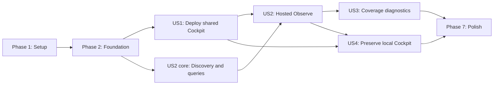

---

description: "Implementation tasks for issue #433: Deploy Hosted Cockpit"
---

# Tasks: Deploy Hosted Cockpit

**Input**: Design documents from `/specs/011-deploy-hosted-cockpit/`

**Prerequisites**: `plan.md`, `spec.md`, `research.md`, `data-model.md`, `contracts/`, `quickstart.md`

**Tests**: Automated tests are required by the specification and constitution. Within each user story, write the listed tests first and confirm they fail for the intended missing behavior before implementation.

**Organization**: Tasks are grouped by user story so deployment, Observe, coverage diagnostics, and local compatibility can each be implemented and validated as independent increments.

## Format: `[ID] [P?] [Story] Description`

- **[P]**: Can run in parallel because it targets different files and has no dependency on incomplete tasks in the same phase.
- **[Story]**: Maps the task to one of the four prioritized user stories in `spec.md`.
- Every task names the exact repository path it changes.

## Phase 1: Setup (Shared Infrastructure)

**Purpose**: Establish the planned package, template, and test structure without changing runtime behavior.

- [X] T001 Create the Observe package skeleton and exports in `src/agentops/agent/observe/__init__.py`, `src/agentops/agent/observe/auth.py`, `src/agentops/agent/observe/cache.py`, `src/agentops/agent/observe/discovery.py`, `src/agentops/agent/observe/queries.py`, `src/agentops/agent/observe/service.py`, and `src/agentops/agent/observe/ui.py`
- [X] T002 [P] Create the hosted deployment template skeleton in `src/agentops/templates/cockpit-hosted/azure.yaml`, `src/agentops/templates/cockpit-hosted/app/main.py`, `src/agentops/templates/cockpit-hosted/app/requirements.txt.tmpl`, `src/agentops/templates/cockpit-hosted/infra/main.bicep`, and `src/agentops/templates/cockpit-hosted/infra/main.parameters.json`
- [X] T003 [P] Register the hosted Cockpit template assets for wheel and source distributions in `pyproject.toml`
- [X] T004 [P] Add reusable fake Resource Graph, Foundry connection, Logs Query, Easy Auth, OBO, Azure CLI, and azd fixtures in `tests/fixtures/observe.py` and `tests/fixtures/cockpit_deployment.py`

---

## Phase 2: Foundational (Blocking Prerequisites)

**Purpose**: Implement shared pure contracts, cache primitives, Azure discovery helpers, and composition seams required by every user story.

**CRITICAL**: No user story implementation begins until this phase is complete.

- [X] T005 [P] Add failing contract tests for `ObserveScope`, deployment preview/journal models, inventory, filters, normalized telemetry, coverage, and protected content in `tests/unit/test_observe_models.py`
- [X] T006 Implement the pure Pydantic v2 contracts, canonical ARM ID validation, scope containment, deployment journal, and serialization rules in `src/agentops/core/observe.py`
- [X] T007 [P] Add JSON Schema parity tests for every scope mode and invalid cross-mode combination in `tests/unit/test_observe_scope_contract.py`
- [X] T008 [P] Add failing TTL, identity-keying, refresh-bypass, eviction, and sensitive-value rejection tests in `tests/unit/test_observe_cache.py`
- [X] T009 Implement bounded in-process discovery and result TTL caches with explicit raw-content rejection in `src/agentops/agent/observe/cache.py`
- [X] T010 [P] Add failing tests for credential-free Foundry connection metadata resolution and workspace-based Application Insights mapping in `tests/unit/test_foundry_discovery.py`
- [X] T011 Extend existing Foundry connection discovery to return resource IDs without secrets in `src/agentops/utils/foundry_discovery.py`
- [X] T012 Define injectable Azure client, clock, cache, and runtime-context protocols shared by Observe services in `src/agentops/agent/observe/service.py`
- [X] T013 Add hosted/local mode configuration loading for `AGENTOPS_COCKPIT_MODE` and versioned `AGENTOPS_OBSERVE_SCOPE` in `src/agentops/agent/cockpit.py`

**Checkpoint**: Pure contracts validate against the published scope schema, caches cannot accept raw content, and runtime composition is injectable without Azure credentials.

---

## Phase 3: User Story 1 - Deploy a Shared Cockpit (Priority: P1) MVP

**Goal**: Provide a guided, preview-first, secretless, rerunnable `agentops cockpit deploy` flow that deploys an authenticated read-only App Service for the current workspace project.

**Independent Test**: From a configured workspace with mocked Azure and Graph dependencies, run preview and deployment, validate the existing app registration and default project scope, inspect every planned mutation, verify hosted authentication and health, then rerun after success and after a partial failure without duplicate resources, roles, or federation.

### Tests for User Story 1

- [X] T014 [P] [US1] Add failing CLI tests for local callback compatibility, deploy help/options, guided defaults, explicit scope expansion, `--preview`, guarded `--yes`, warnings, output, and exit codes in `tests/unit/test_cli_cockpit_deploy.py`
- [X] T015 [P] [US1] Add failing deployment-service tests for project resolution, prerequisites, app-registration validation, preview-before-mutation, deterministic naming/RBAC, FIC reuse/conflict, stage failures, journaling, resume, and rerun stability in `tests/unit/test_cockpit_deployment.py`
- [X] T016 [P] [US1] Add failing hosted authentication tests for missing or malformed Easy Auth headers, tenant/audience/group enforcement, group overage guidance, UAMI selection, and token redaction in `tests/unit/test_observe_auth.py`
- [X] T017 [P] [US1] Add failing IaC contract tests for the resource allowlist, authsettingsV2, UAMI retention, non-secret settings, read-only roles, deterministic assignment IDs, and prohibited telemetry mutations in `tests/unit/test_cockpit_hosted_templates.py`
- [X] T018 [P] [US1] Add a failing hosted deployment integration test covering liveness, authenticated context, denied anonymous data routes, stable URLs, partial deployment recovery, and idempotent rerun in `tests/integration/test_cockpit_hosted.py`

### Implementation for User Story 1

- [X] T019 [P] [US1] Implement workspace, active azd environment, current Foundry project, subscription, resource-group, and linked-telemetry resolution in `src/agentops/services/cockpit_deployment.py`
- [X] T020 [US1] Implement Azure CLI, azd, tenant, app-registration, redirect URI, consent, group, ARM permission, and Graph permission preflight validation in `src/agentops/services/cockpit_deployment.py`
- [X] T021 [US1] Implement project-default scope selection, explicit Foundry/resource-group/subscription expansion, refreshed preview requirements, and subscription warnings in `src/agentops/services/cockpit_deployment.py`
- [X] T022 [US1] Implement deterministic App Service, UAMI, role-assignment, FIC, non-secret setting, and combined azd/Bicep preview planning in `src/agentops/services/cockpit_deployment.py`
- [X] T023 [US1] Implement versioned deployment journal persistence, pre-existing target tracking, failure diagnostics, preservation-by-default recovery, live ARM/Graph reconciliation, and resume semantics in `src/agentops/services/cockpit_deployment.py`
- [X] T024 [US1] Implement version-matched hosted bundle materialization and local-only deployment state under `.agentops/deploy/cockpit/` from `src/agentops/services/cockpit_deployment.py`
- [X] T025 [P] [US1] Implement the Linux App Service plan, Web App, dedicated UAMI, authsettingsV2, non-secret settings, deterministic Reader/Log Analytics Reader assignments, and outputs in `src/agentops/templates/cockpit-hosted/infra/main.bicep`
- [X] T026 [P] [US1] Define azd service packaging, provisioning, and deployment metadata in `src/agentops/templates/cockpit-hosted/azure.yaml` and `src/agentops/templates/cockpit-hosted/infra/main.parameters.json`
- [X] T027 [P] [US1] Implement the minimal hosted FastAPI/Uvicorn entrypoint and version-pinned package installation in `src/agentops/templates/cockpit-hosted/app/main.py` and `src/agentops/templates/cockpit-hosted/app/requirements.txt.tmpl`
- [X] T028 [US1] Implement idempotent UAMI federated-credential inspection, creation, exact-match reuse, and conflict rejection through Azure CLI in `src/agentops/services/cockpit_deployment.py`
- [X] T029 [US1] Implement ordered `azd provision --preview`, confirmation, `azd provision`, FIC configuration, `azd deploy`, and bounded RBAC propagation handling in `src/agentops/services/cockpit_deployment.py`
- [X] T030 [US1] Convert `cockpit` to a Typer group with a no-subcommand local callback and add the thin `cockpit deploy` command in `src/agentops/cli/app.py`
- [X] T031 [US1] Implement Easy Auth principal parsing, tenant/audience/group defense-in-depth, managed-identity credential creation with Windows-compatible timeout, and safe user context in `src/agentops/agent/observe/auth.py`
- [X] T032 [US1] Add `/healthz`, `/api/runtime`, and `/api/auth/context` with hosted authorization boundaries and no token exposure in `src/agentops/agent/cockpit.py`
- [X] T033 [US1] Implement post-deployment liveness, authenticated context, effective scope, and UAMI aggregate-read verification with truthful `healthy`, `auth_pending`, `rbac_pending`, and `failed` outcomes in `src/agentops/services/cockpit_deployment.py`
- [X] T034 [US1] Render the effective scope, exact resource IDs, stable Cockpit URL, Azure resource link, health, preserved-state recovery, and actionable failure output in `src/agentops/cli/app.py`
- [X] T035 [US1] Make all User Story 1 unit and integration tests pass without Azure credentials in `tests/unit/test_cli_cockpit_deploy.py`, `tests/unit/test_cockpit_deployment.py`, `tests/unit/test_observe_auth.py`, `tests/unit/test_cockpit_hosted_templates.py`, and `tests/integration/test_cockpit_hosted.py`

**Checkpoint**: The hosted Cockpit can be securely previewed, deployed, authenticated, recovered, and rerun independently; no monitored resource is mutated.

---

## Phase 4: User Story 2 - Observe Operations Across an Azure Scope (Priority: P2)

**Goal**: Present one authenticated Observe experience across readable Foundry resources, projects, agents, models, and telemetry sources, with shared filters and delegated access to explicit raw trace detail.

**Independent Test**: With fake telemetry from at least two Foundry resources, two projects, a shared workspace, and an external agent, query all four views using common filters, inspect agent and trace detail, and prove that only a delegated authorized user receives `AppGenAIContent`.

### Tests for User Story 2

- [X] T036 [P] [US2] Add failing multi-resource/project discovery, scope containment, shared-workspace deduplication, connection-state, attribution, and 15-minute cache tests in `tests/unit/test_observe_discovery.py`
- [X] T037 [P] [US2] Add failing KQL/request tests for overview, agents, models, filters, 24-hour defaults, 10-source bounds, 30-second source timeout, aggregation, and external-agent semantic conventions in `tests/unit/test_observe_queries.py`
- [X] T038 [P] [US2] Add failing service tests for normalization, source attribution, metric semantics, two-minute result caching, refresh bypass, agent detail, and protected-content cache exclusion in `tests/unit/test_observe_service.py`
- [X] T039 [P] [US2] Add failing OBO and trace-content tests for UAMI client assertions, delegated Azure Monitor scope, correlation keys, no legacy fallback, omitted denied fields, `no-store`, and zero-row ambiguity in `tests/unit/test_observe_auth.py` and `tests/unit/test_observe_queries.py`
- [X] T040 [P] [US2] Add failing OpenAPI response and end-to-end UI/API tests for discovery, all Observe views, filters, agent detail, and trace content in `tests/integration/test_observe_end_to_end.py`

### Implementation for User Story 2

- [X] T041 [US2] Implement scope-bounded Azure Resource Graph discovery for Foundry accounts and projects with partial source failures in `src/agentops/agent/observe/discovery.py`
- [X] T042 [US2] Resolve project connection metadata to Application Insights and backing Log Analytics workspaces, deduplicate shared workspaces, and preserve every project/resource origin in `src/agentops/agent/observe/discovery.py`
- [X] T043 [P] [US2] Implement bounded KQL builders for overview, agents, models, usage, trends, and agent detail with early filters and bounded result sets in `src/agentops/agent/observe/queries.py`
- [X] T044 [US2] Implement async `LogsQueryClient.query_batch()` execution, per-source response classification, source timeout, request deadline, and up-to-10-source enforcement in `src/agentops/agent/observe/queries.py`
- [X] T045 [P] [US2] Implement normalized `ObservedAgent`, `ModelUsage`, aggregate metric, source attribution, last-seen, token-label, and external-agent transformations in `src/agentops/agent/observe/service.py`
- [X] T046 [US2] Orchestrate discovery, filter validation, cache keys, query execution, normalization, refresh bypass, and agent detail in `src/agentops/agent/observe/service.py`
- [X] T047 [US2] Implement the UAMI-federated `OnBehalfOfCredential` chain using the Easy Auth user assertion only for delegated Azure Monitor Logs access in `src/agentops/agent/observe/auth.py`
- [X] T048 [US2] Implement explicit `AppGenAIContent` queries by `TraceId`, `SpanId`, and source scope with no legacy fallback and `protected_or_unavailable` zero-row handling in `src/agentops/agent/observe/queries.py`
- [X] T049 [US2] Add `/api/observe/discovery`, `/api/observe/query`, `/api/observe/agent-detail`, and `/api/observe/trace-content` with OpenAPI-compatible errors and `Cache-Control: no-store` in `src/agentops/agent/cockpit.py`
- [X] T050 [P] [US2] Build accessible Observe navigation, shared filter bar, Overview cards, Agents table, Models and usage view, and trace-detail shell in `src/agentops/agent/observe/ui.py`
- [X] T051 [US2] Implement draft/applied filter state, URL persistence, explicit Apply, default 24-hour range, five-minute refresh, manual refresh, abortable fetches, and stale-response suppression in `src/agentops/agent/observe/ui.py`
- [X] T052 [US2] Implement source labels, refresh timestamps, observed-usage wording, last-seen semantics, responsive light/dark charts, non-color series distinction, and exact-value tooltips in `src/agentops/agent/observe/ui.py`
- [X] T053 [US2] Implement bounded agent trends and documented Foundry/Azure Monitor links with best-effort labeling for undocumented portal targets in `src/agentops/agent/observe/service.py` and `src/agentops/agent/observe/ui.py`
- [X] T054 [US2] Implement explicit protected-content loading, protection-state messaging, field omission, and prevention of raw content in URLs or browser persistence in `src/agentops/agent/observe/ui.py`
- [X] T055 [US2] Make all User Story 2 unit and integration tests pass with available aggregates or actionable partial results inside the designed 10-second deadline in `tests/unit/test_observe_discovery.py`, `tests/unit/test_observe_queries.py`, `tests/unit/test_observe_service.py`, and `tests/integration/test_observe_end_to_end.py`

**Checkpoint**: Observe independently aggregates all readable sources in scope, preserves attribution and filter state, and exposes raw content only through per-user delegated authorization.

---

## Phase 5: User Story 3 - Diagnose Missing and Partial Telemetry (Priority: P3)

**Goal**: Explain incomplete evidence with source-specific states, safe reasons, and next actions while keeping available results usable.

**Independent Test**: Feed available, denied, unconfigured, empty, unattributed, protected, throttled, timed-out, and superseded sources into Observe and verify distinct truthful states without converting absence to zero or blocking successful sources.

### Tests for User Story 3

- [X] T056 [P] [US3] Add failing coverage classification tests for inaccessible, not configured, no data, not reported, partial, error, and protected-or-unavailable states in `tests/unit/test_observe_service.py`
- [X] T057 [P] [US3] Add failing mixed-source, timeout, throttle, partial-table, missing-dimension, and superseded-request tests in `tests/unit/test_observe_queries.py`
- [X] T058 [P] [US3] Add failing UI tests for coverage reasons, recommended actions, source detail, partial-result rendering, and zero-versus-missing semantics in `tests/unit/test_observe_ui.py`

### Implementation for User Story 3

- [X] T059 [US3] Implement deterministic source and dimension coverage classification without inferred success or numeric zero in `src/agentops/agent/observe/service.py`
- [X] T060 [US3] Map Azure discovery/query errors, empty results, missing fields, protected ambiguity, throttling, and timeouts to safe actionable reasons and next actions in `src/agentops/agent/observe/service.py`
- [X] T061 [US3] Return query duration, source counts, partial failures, coverage, and last refresh for every Observe response in `src/agentops/agent/cockpit.py`
- [X] T062 [US3] Render Telemetry coverage and source troubleshooting detail while preserving successful data from other sources in `src/agentops/agent/observe/ui.py`
- [X] T063 [US3] Make all User Story 3 tests pass and enforce distinct coverage states for every quickstart scenario in `tests/unit/test_observe_queries.py`, `tests/unit/test_observe_service.py`, and `tests/unit/test_observe_ui.py`

**Checkpoint**: Every unavailable dimension has a distinct, safe, actionable explanation and partial failures never erase available evidence.

---

## Phase 6: User Story 4 - Preserve the Local Cockpit Experience (Priority: P4)

**Goal**: Keep established local workspace, Doctor, evaluation history, startup, preflight, browser, and port behavior while sharing normalized Observe logic with hosted mode.

**Independent Test**: Start local and hosted Cockpits against identical fake Azure sources, verify identical normalized Observe metrics, confirm local history remains available only locally, and run all existing Cockpit regression tests unchanged.

### Tests for User Story 4

- [X] T064 [P] [US4] Extend local CLI regression coverage for callback invocation, options, help, preflight, browser launch, port reuse, and port conflict behavior in `tests/unit/test_cli_cockpit_port_conflict.py` and `tests/unit/test_cli_cockpit_connection_summary.py`
- [X] T065 [P] [US4] Add failing local-versus-hosted normalized metric equivalence and startup-without-Azure-query tests in `tests/integration/test_observe_end_to_end.py`
- [X] T066 [P] [US4] Add failing hosted-without-workspace and local-history-isolation tests in `tests/integration/test_cockpit_hosted.py` and `tests/unit/test_cockpit.py`

### Implementation for User Story 4

- [X] T067 [US4] Refactor `create_app` to compose local history plus Observe in local mode and cloud-safe navigation plus Observe in hosted mode without querying Azure during shell startup in `src/agentops/agent/cockpit.py`
- [X] T068 [US4] Preserve the existing local `agentops cockpit` host, port, workspace, preflight, browser, and port-reuse behavior through the Typer group callback in `src/agentops/cli/app.py`
- [X] T069 [US4] Make all User Story 4 integration and existing Cockpit regression tests pass without displaying absent local history as hosted cloud data in `tests/unit/test_cockpit.py`, `tests/unit/test_cli_cockpit_port_conflict.py`, `tests/unit/test_cli_cockpit_connection_summary.py`, `tests/integration/test_cockpit_hosted.py`, and `tests/integration/test_observe_end_to_end.py`

**Checkpoint**: Existing local behavior remains unchanged and local/hosted Observe normalization is equivalent under identical inputs.

---

## Phase 7: Polish & Cross-Cutting Concerns

**Purpose**: Complete public documentation, release validation, packaging, governance, and repository-wide regression coverage.

- [X] T070 [P] Write the complete hosted deployment, prerequisite, identity, RBAC, preview, recovery, rollback-boundary, rerun, protected-table, migration, and troubleshooting guide in `docs/deploy-hosted-cockpit.md`
- [X] T071 [P] Add the hosted Cockpit and sensitive generative-AI content subsection with `AppGenAIContent`, feature routing, `protectionLevel`, standard/privileged access, OBO, UAMI, zero-row behavior, and migration timelines in `docs/operate.md`
- [X] T072 [P] Document multi-project Observe behavior, shared filters, source attribution, coverage states, local/hosted boundaries, and protected detail links in `docs/observe.md` and `docs/how-it-works.md`
- [X] T073 [P] Add the user-visible hosted Cockpit and Observe changes, preview dependencies, and migration caveats to `CHANGELOG.md`
- [X] T074 Synchronize the implemented API and scope models with `specs/011-deploy-hosted-cockpit/contracts/observe-api.openapi.yaml` and `specs/011-deploy-hosted-cockpit/contracts/observe-scope.schema.json`
- [X] T075 Revalidate current public-preview APIs, role names, feature flags, migration dates, and same-UAMI Easy Auth plus OBO behavior and record the release result in `specs/011-deploy-hosted-cockpit/research.md`
- [X] T076 Build and lint `src/agentops/templates/cockpit-hosted/infra/main.bicep`, inspect `agentops cockpit deploy --preview`, and execute the scenarios in `specs/011-deploy-hosted-cockpit/quickstart.md`
- [X] T077 Run the focused hosted Cockpit/Observe tests and then the complete regression suite with `python -m pytest tests/ -x -q`, resolving only failures caused by this feature in `tests/`

---

## Dependencies & Execution Order

### Phase Dependencies

- **Phase 1 - Setup**: Starts immediately.
- **Phase 2 - Foundational**: Depends on Phase 1 and blocks all user stories.
- **Phase 3 - User Story 1**: Depends on Phase 2 and is the recommended MVP.
- **Phase 4 - User Story 2**: Depends on Phase 2 contracts and on the hosted auth/runtime seams delivered by US1 for a deployed demonstration; its discovery/query core can begin in parallel with later US1 deployment orchestration.
- **Phase 5 - User Story 3**: Depends on US2 query and normalization services.
- **Phase 6 - User Story 4**: Depends on US1 CLI composition and US2 shared Observe service.
- **Phase 7 - Polish**: Depends on all user stories selected for release.

### User Story Dependency Graph



### Within Each User Story

- Write the story's tests first and confirm they fail for the intended missing behavior.
- Implement pure models and transformations before Azure services.
- Implement services before API routes and UI integration.
- Keep aggregate UAMI access separate from delegated raw-content access.
- Complete the story checkpoint before treating the increment as deliverable.

### Parallel Opportunities

- T002, T003, and T004 can run in parallel after T001 establishes paths.
- T005, T007, T008, and T010 are independent foundational test tasks.
- T014-T018 can be authored in parallel before US1 implementation.
- T025-T027 can run in parallel after T022 fixes the preview/resource contract.
- T036-T040 can be authored in parallel before US2 implementation.
- T043, T045, and T050 target independent query, normalization, and UI files.
- T056-T058 can be authored in parallel before US3 implementation.
- T064-T066 can be authored in parallel before US4 integration.
- T070-T073 can run in parallel after behavior and terminology stabilize.

---

## Parallel Example: User Story 1

```text
Task T014: Add CLI contract tests in tests/unit/test_cli_cockpit_deploy.py
Task T015: Add deployment state-machine tests in tests/unit/test_cockpit_deployment.py
Task T016: Add hosted authentication tests in tests/unit/test_observe_auth.py
Task T017: Add IaC allowlist tests in tests/unit/test_cockpit_hosted_templates.py
Task T018: Add hosted integration tests in tests/integration/test_cockpit_hosted.py
```

## Parallel Example: User Story 2

```text
Task T036: Add discovery tests in tests/unit/test_observe_discovery.py
Task T037: Add query tests in tests/unit/test_observe_queries.py
Task T038: Add service/cache tests in tests/unit/test_observe_service.py
Task T039: Add OBO and protected-content tests in auth/query test files
Task T040: Add API/UI integration tests in tests/integration/test_observe_end_to_end.py
```

## Parallel Example: User Story 3

```text
Task T056: Add coverage classification tests in tests/unit/test_observe_service.py
Task T057: Add partial-query tests in tests/unit/test_observe_queries.py
Task T058: Add coverage UI tests in tests/unit/test_observe_ui.py
```

## Parallel Example: User Story 4

```text
Task T064: Extend existing local CLI regression tests
Task T065: Add local/hosted Observe equivalence tests
Task T066: Add workspace-history isolation tests
```

---

## Implementation Strategy

### MVP First: User Story 1

1. Complete Setup and Foundational phases.
2. Deliver preview-only mode before enabling mutation.
3. Deliver project-default deployment with existing app registration and UAMI federation.
4. Prove authentication, health, recovery, and idempotent rerun.
5. Stop and review the MVP before adding cross-project Observe.

### Incremental Delivery

1. **Foundation**: Pure contracts, caches, discovery seam, and runtime composition.
2. **US1**: Secure shared hosted Cockpit deployment.
3. **US2**: Unified multi-resource/project Observe plus protected trace detail.
4. **US3**: Honest coverage and partial-failure diagnostics.
5. **US4**: Full local compatibility and normalized parity.
6. **Release**: Public docs, preview revalidation, Bicep checks, and full regression suite.

### Parallel Team Strategy

After Phase 2:

- **Deployment track**: T014-T035.
- **Observe data track**: T036-T049, beginning with discovery/query core.
- **Observe UI track**: T050-T054 after contracts are stable.
- **Documentation track**: T070-T073 after terminology and behavior stabilize.

---

## Notes

- `[P]` means the task targets separate files and can proceed without an incomplete same-phase dependency.
- `[US1]` through `[US4]` provide requirement-to-task traceability.
- Azure SDK imports remain lazy and all `DefaultAzureCredential` construction preserves `process_timeout=30`.
- The running Cockpit remains read-only; only the explicit deployment service may mutate the Cockpit's own hosting, federation, settings, and read-only role assignments.
- The UAMI never receives `Privileged Monitoring Data Reader`; raw `AppGenAIContent` uses per-user OBO and is never cached.
- Cloud resources are preserved after partial deployment by default; rerun reconciles and resumes after a renewed preview.

## Phase 8: Convergence

- [X] T078 Make hosted deployment health verification raise a deployment failure and preserve exit code `1` unless every required post-deploy signal is healthy after bounded RBAC propagation retries per FR-009, FR-066, FR-071, and US1/AC2 (contradicts)
- [X] T079 Validate deployer RBAC rights at every planned assignment scope and prove the required Graph application mutation, ownership or administrator, and group-read capabilities before confirmation per FR-055 and FR-067 (partial)
- [X] T080 Validate the existing app registration's exact redirect URI, delegated consent, Easy Auth token-store readiness, federated-credential capacity, and unique reusable credential match before mutation per FR-058 and FR-059 (partial)
- [X] T081 Resolve every explicitly selected project ARM ID against live Azure and reject missing, unreadable, wrong-type, cross-tenant, or unintended-subscription targets before preview per FR-068 (missing)
- [X] T082 Implement concrete post-deploy probes for `/healthz`, anonymous protected-route denial, authenticated tenant/audience/group/scope enforcement, UAMI Resource Graph discovery, and aggregate telemetry access per FR-071 (missing)
- [X] T083 Invoke live ARM and Graph drift reconciliation before trusting completed journal stages, and repair or fail deterministically for missing resources, settings, role assignments, or federated credentials per FR-072 and FR-073 (missing)
- [X] T084 Detect the active Azure cloud and reject every non-public-cloud deployment before preview confirmation per FR-075 (missing)
- [X] T085 Persist the initiating actor and explicit preview approval metadata in the deployment journal without storing tokens or secrets per FR-077 (partial)
- [X] T086 Populate incomplete, uncertain, rollback, preserved-resource, and usability failure details from the actual failed mutation stage so reruns have actionable recovery state per FR-010E (partial)
- [X] T087 Check App Service hostname availability during preview preparation and deterministically revise or reject unavailable names before mutation per FR-078 (partial)
