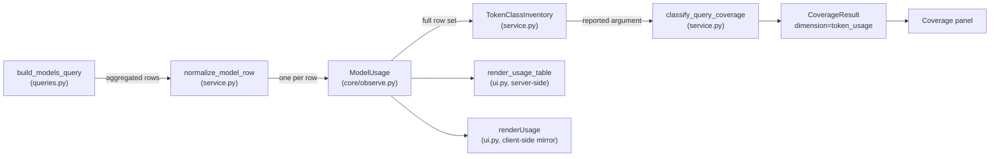

# Phase 1 Data Model: Granular Token Classes in the Models View

**Feature**: `012-granular-token-dimensions` | **Date**: 2026-08-24
**Inputs**: [spec.md](./spec.md), [research.md](./research.md) | **Plan**: [plan.md](./plan.md)

All changes below are **additive**: every new field is optional with a default, so existing
producers and consumers of these contracts keep working unchanged (Constitution I). Every
contract model inherits `ContractModel`, which sets `extra="forbid"` — therefore the
unnormalized passthrough **must** be an explicitly typed field, never loose extra keys.

---

## 1. `ModelUsage` (extended)

**Location**: `src/agentops/core/observe.py`
**Change type**: additive — six new optional fields, no existing field altered or removed.

### Existing fields (unchanged)

| Field | Type | Notes |
|---|---|---|
| `project_resource_id` | `str \| None` | |
| `agent_id` | `str \| None` | |
| `deployment` | `str \| None` | |
| `model` | `str \| None` | |
| `requests` | `int` | `ge=0` |
| `failures` | `int` | `ge=0` |
| `p95_latency_ms` | `float \| None` | `ge=0` |
| `input_tokens` | `int \| None` | `ge=0`; `None` means not reported |
| `output_tokens` | `int \| None` | `ge=0`; `None` means not reported |
| `last_seen` | `datetime \| None` | |

### New fields

| Field | Type | Default | Constraint | Requirement |
|---|---|---|---|---|
| `cache_read_tokens` | `int \| None` | `None` | `ge=0` | FR-001, FR-007 |
| `cache_write_tokens` | `int \| None` | `None` | `ge=0` | FR-001, FR-007 |
| `reasoning_tokens` | `int \| None` | `None` | `ge=0` | FR-001, FR-007 |
| `additional_token_classes` | `dict[str, int]` | `{}` | values `ge=0`; at most 5 entries | FR-004, FR-010, FR-021 |
| `additional_token_classes_truncated` | `bool` | `False` | — | FR-021 |
| `token_classes_partial` | `bool` | `False` | — | FR-022 |

### Field semantics

**`cache_read_tokens` / `cache_write_tokens` / `reasoning_tokens`**

- `None` — **not reported**. The telemetry carried no accepted source attribute for this class.
- `0` — **reported as zero**. An accepted attribute was present and its value was zero.
- `n > 0` — reported count.

The `None` versus `0` distinction is load-bearing (FR-007) and is why these are
`int | None` rather than `int` with a zero default. Per [research.md D4](./research.md), `None`
is the expected value for Foundry-native workloads and must never be presented as a defect.

**`additional_token_classes`**

Keys are **source attribute names carried verbatim**, exactly as they appeared in telemetry
(for example `gen_ai.usage.some_vendor_tokens`). Values are the summed non-negative counts for
that attribute within the aggregation group. Entries are the eligible `gen_ai.usage.*`
attributes that did **not** map to any normalized class
([research.md D1, D2](./research.md)).

**`additional_token_classes_truncated`**

`True` when more than five eligible unmapped attributes were present and the record retains only
the first five by ascending attribute name ([research.md D6](./research.md)). This flag exists
because the count of discarded attributes is not recoverable from the retained set.

**`token_classes_partial`**

`True` when at least one of the three normalized class fields is non-`None` **and** at least one
is `None`. Computed once during normalization so that both renderers read a single value rather
than each re-deriving the rule ([research.md D9](./research.md)).

### Validation rules

| Rule | Source |
|---|---|
| No class value is ever produced by subtracting one token count from another | FR-006 |
| A source attribute consumed by a normalized class is excluded from `additional_token_classes` | FR-005, FR-009 |
| When several accepted aliases of one class are present, the first in declared order supplies the value and the rest are discarded — never summed | research.md D2 |
| Only `gen_ai.usage.*` attributes with non-negative numeric values are admitted | FR-004, research.md D1 |
| `len(additional_token_classes) <= 5` | FR-021 |
| Retained passthrough entries are the first five by ascending attribute name | FR-021, research.md D6 |
| `input_tokens` and `output_tokens` semantics are unchanged | FR-015 |

### Relationships

`ModelUsage` rows are produced by `normalize_model_row` in
`src/agentops/agent/observe/service.py` from one aggregated telemetry row, and are rendered by
`render_usage_table` (Python) and `renderUsage` (JavaScript) in
`src/agentops/agent/observe/ui.py`. The set of rows for a view also feeds the token-class
inventory that drives the `token_usage` coverage entry described in section 3.

---

## 2. `TokenClassInventory` (new, internal)

**Location**: `src/agentops/agent/observe/service.py`
**Change type**: new internal helper value — **not** a public contract model.

A three-valued classification computed over the **token-reporting** `ModelUsage` rows for a
telemetry source. A row that carries no token counter at all — neither `input_tokens` /
`output_tokens` nor any granular class — carries no evidence about granular instrumentation and is
**excluded from the fold entirely**. This is what keeps an out-of-scope source whose rows carry no
token attributes (Copilot Studio) from degrading the coverage signal for in-scope sources that do
report tokens (FR-019). When no row qualifies, the inventory is `not_reported`.

| Value | Condition (over qualifying rows only) |
|---|---|
| `not_reported` | No qualifying row reports any of the three normalized classes |
| `partial` | At least one qualifying row reports at least one class, and at least one class is absent across the qualifying set |
| `reported` | All three normalized classes are reported across the qualifying set |

This value is passed into `classify_query_coverage` as the `reported` argument
([research.md D7](./research.md)). It is deliberately kept out of `core/observe.py` because it
is an intermediate computation, not a rendered or serialized contract.

**Relationship to `token_reporting_state`**: the existing two-state helper
(`service.py:151-155`) is **left untouched** so the agents view keeps its current behavior and
its existing test. `TokenClassInventory` is a sibling, not a replacement.

---

## 3. `CoverageResult` for `dimension="token_usage"` on the models view

**Location**: `src/agentops/core/observe.py` (model), populated in
`src/agentops/agent/observe/service.py` (models branch)
**Change type**: **no schema change** — `CoverageResult.dimension` already permits
`"token_usage"`, and `CoverageState` already contains `"partial"`. This is a **new call site**
only ([research.md D8](./research.md)).

### State transitions

Evaluated in strict order; the first matching arm wins.

| Order | Condition | State | Meaning |
|---|---|---|---|
| 1 | query `status != "success"` | `partial` or `error` | Source-level query degradation — **existing behavior, unchanged** |
| 2 | `row_count == 0` | `no_data` | No matching telemetry in the window |
| 3 | inventory is `not_reported` | `not_reported` | Rows exist but carry no granular class |
| 4 | inventory is `partial` | `partial` | **New arm** — rows carry some classes but not all |
| 5 | otherwise | `available` | All three classes reported |

Arm 1 is checked first because a degraded query means the class inventory is computed over an
incomplete result set and cannot be trusted to describe the workload
([research.md D7](./research.md)).

### The overloaded `partial` state

`CoverageState.partial` now carries two distinct meanings, disambiguated by the `reason` and
`next_action` text that the coverage panel actually renders:

| Origin | `reason` describes | `next_action` directs the operator to |
|---|---|---|
| Arm 1 (query degradation) | The query returned incomplete results | Retry or check source access — existing text, unchanged |
| Arm 4 (class inventory) | Some granular token classes are reported and some are not | Instrumentation, not access |

Widening the public `CoverageState` literal with a new member was rejected as a breaking
contract change (Constitution I) for a distinction the existing text fields already carry.

### Wording constraints

The `reason` and `next_action` text for arm 4 **must not** contain monetary, cost, price, rate,
spend, charge, or billing language (FR-017), and **must not** frame `not_reported` or `partial`
as a failure — per [research.md D4](./research.md) these are the expected states for
Foundry-native telemetry.

---

## 4. Entity relationship overview

---

## 5. Explicitly unchanged

The following are frozen by the spec's Out of Scope section and must not be modified:

| Entity | Reason |
|---|---|
| `ObservedAgent` | Agents view is out of scope (FR-015) |
| `token_reporting_state` | Agents view behavior and its existing test are preserved |
| `_agent_extend_clauses()` | Shared by three queries; models-only extends are appended separately ([research.md D5](./research.md)) |
| `build_agents_query`, `build_usage_query` | Agents view and combined usage view token rendering unchanged |
| `_render_token_totals` | The `(observed usage, not billing data)` label is preserved verbatim (FR-016) |
| `CoverageState`, `CoverageResult` schemas | New call site only, no field or literal changes |
